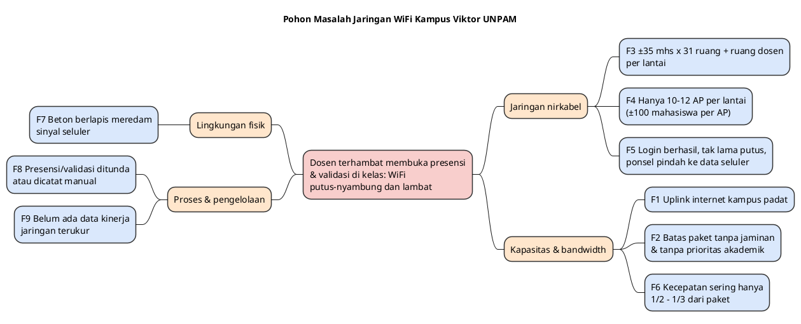
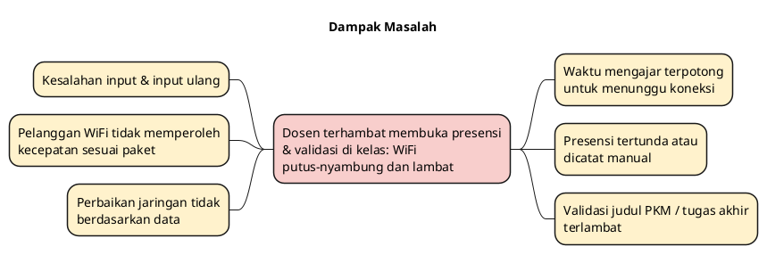

# BAB 1 — ANALISIS MASALAH

|                   |                                                                                                                                                                                                  |
| ----------------- | ------------------------------------------------------------------------------------------------------------------------------------------------------------------------------------------------ |
| **Judul Proyek**  | Perancangan Optimasi Jaringan WiFi melalui Perencanaan Kapasitas _Access Point_ dan Manajemen Bandwidth Berbasis QoS Menggunakan Metode NDLC pada Kampus Viktor UNPAM **[SEMENTARA]**           |
| **Kelompok**      | Kelompok 2                                                                                                                                                                                       |
| **Anggota**       | 1. Dzaky Alfareza 2. Rizky Zehan's Onassis 3. Muhammad Zirlda Prairi 4. Vigie Afrilza Wibowo                                                                                            |
| **Program Studi** | Teknik Informatika, Fakultas Ilmu Komputer, Universitas Pamulang                                                                                                                                 |
| **Tahun**         | 2026                                                                                                                                                                                             |

> **Keterangan penanda**
>
> - **[FAKTA-L]** = fakta lapangan, hasil pengamatan langsung anggota kelompok di Kampus Viktor UNPAM.
> - **[FAKTA-D]** = berasal dari dokumen identifikasi masalah Kelompok 2.
> - **[USULAN]** = usulan atau penafsiran penyusun, perlu disetujui tim.
> - **[ASUMSI]** = hal yang belum dapat dipastikan dan menjadi risiko proyek.
> - **[MENUNGGU DATA]** = diisi setelah Pra-Tugas pengukuran (lihat `00_Kerangka_dan_Progres.md`).
>
> _Catatan: bab ini menggantikan Bab 1 pada `../proposal/` (aplikasi web intranet). Fakta lapangan yang masih berlaku dipakai ulang; bagian yang berkaitan dengan pembangunan aplikasi baru dan sinkronisasi data dihapus._

---

## 1.1 Latar Belakang

Dosen di Kampus Viktor UNPAM menjalankan banyak tugas administrasi akademik melalui layanan daring. Dua tugas yang paling sering dilakukan dosen di kelas adalah **presensi perkuliahan** dan **validasi kegiatan mahasiswa**, misalnya menyetujui judul pengabdian kepada masyarakat dan judul tugas akhir **[FAKTA-L]**. Kedua tugas tersebut **sudah tersedia** di portal **satu.unpam.ac.id** dan **portal FTI UNPAM** **[FAKTA-L]**. Jadi yang dibutuhkan dosen bukan aplikasi baru, melainkan **koneksi yang stabil dan lancar** ke portal yang sudah ada.

Kenyataannya, koneksi tersebut sering terhambat pada jam kuliah. Saat gangguan terjadi, ada dosen yang **menunda** presensi atau validasi, dan ada pula yang **mencatatnya secara manual** lalu menginput ulang ke portal **[FAKTA-L]**. Kondisi ini menimbulkan kesalahan input dan rekapitulasi yang terlambat **[FAKTA-D]**.

Dosen membuka portal dari dalam ruang kelas, sehingga dosen **berbagi jaringan WiFi yang sama** dengan mahasiswa di sekitarnya. Kepadatan pengguna di Kampus Viktor tinggi. Satu lantai berisi **31 ruang kelas** dengan sekitar **35 mahasiswa** per ruang, ditambah **1 ruang dosen** **[FAKTA-L]**, sehingga ada sekitar **1.085 mahasiswa per lantai** pada jam kuliah penuh. Lantai tersebut dilayani **10–12 _access point_ (AP)** dengan sinyal yang kuat **[FAKTA-L]**. Artinya, satu AP rata-rata menanggung **±90–110 mahasiswa**, atau **±90–220 perangkat** bila tiap mahasiswa membawa 1–2 perangkat **[ASUMSI]**. Sinyal yang kuat hanya menunjukkan jangkauan yang baik, bukan kapasitas yang cukup. Perangkat yang tersambung ke satu AP bergantian memakai waktu siar (_airtime_) yang sama, sehingga semakin banyak perangkat, semakin kecil bagian masing-masing. Selain itu, 10–12 AP yang berdekatan dalam satu lantai dapat saling mengganggu bila memakai kanal frekuensi yang sama.

Gejala di lapangan sejalan dengan kondisi tersebut **[FAKTA-L]**:

1. **Koneksi putus-nyambung.** Pengguna berhasil login hotspot dan tersambung, tetapi tidak lama kemudian koneksi terputus dan ponsel otomatis berpindah ke data seluler. Pola ini dialami banyak pengguna, termasuk pelanggan berbayar.
2. **Kecepatan jauh di bawah paket.** WiFi UNPAM menyediakan paket langganan **silver (tertulis 2 MB/s ≈ 16 Mbps)** dan **gold (tertulis 5 MB/s ≈ 40 Mbps)** **[FAKTA-L]**. Kenyataannya, kecepatan yang diperoleh sering hanya **½ hingga ⅓** dari kecepatan paket, dan pelanggan gold pun tetap merasakan koneksi lambat pada jam sibuk **[FAKTA-L]**. Angka terukurnya ditetapkan melalui pengukuran baseline **[MENUNGGU DATA]**.
3. **Akses portal lambat pada jam sibuk**, ketika ribuan pengguna memakai jalur internet kampus (uplink) yang sama.

Keberadaan paket silver dan gold menunjukkan bahwa **pembatasan bandwidth per pengguna sudah diterapkan**. Namun, batas paket umumnya berupa **batas maksimum, bukan jaminan**. Jika sumber daya bersama (_airtime_ AP atau uplink) sudah penuh, semua pengguna turun di bawah batas paketnya, apa pun paketnya **[USULAN]**. Dosen yang membuka presensi di kelas ikut terkena dampak yang sama karena belum terlihat adanya prioritas bagi lalu lintas akademik **[ASUMSI]**.

Pengguna juga tidak punya jalur cadangan yang andal. Gedung Kampus Viktor tersusun dari **beton berlapis** yang meredam sinyal seluler, sehingga data 4G+/5G tetap sering _lag_ di dalam ruang kelas **[FAKTA-L]**. Dengan demikian, **WiFi kampus adalah satu-satunya jalur utama** bagi dosen di dalam gedung.

Masalah ini termasuk ranah **jaringan komputer**, bukan pengembangan perangkat lunak. Lingkup Teknik Informatika mencakup perangkat lunak, jaringan, dan perangkat keras. Sesuai prinsip bahwa solusi dibuat sebesar masalah yang ada, Kelompok 2 mengusulkan **optimasi jaringan WiFi yang sudah ada** dengan dua pendekatan **[USULAN]**:

- **Utama — perencanaan kapasitas dan kanal AP**, agar koneksi tetap stabil pada kepadatan ±100 mahasiswa per AP.
- **Pendukung — manajemen bandwidth dan Quality of Service (QoS)**, agar lalu lintas portal akademik (`*.unpam.ac.id`) diprioritaskan dan pembagian bandwidth lebih adil saat jalur padat.

Proyek menggunakan metode **NDLC (Network Development Life Cycle)**: _Analysis_ → _Design_ → _Simulation Prototyping_ → _Implementation_ → _Monitoring_ → _Management_. Karena kelompok tidak berwenang mengubah perangkat jaringan produksi UNPAM, tahap 1–3 dikerjakan penuh, sedangkan tahap 4–6 disusun sebagai rancangan dan rekomendasi kepada pengelola jaringan **[USULAN]**.

---

## 1.2 Identifikasi Masalah

Faktor penyebab masalah:

| Kode | Faktor Penyebab                                                                                                                                                     | Sumber                      |
| ---- | ------------------------------------------------------------------------------------------------------------------------------------------------------------------- | --------------------------- |
| F1   | Jalur internet kampus (uplink) padat karena banyak pengguna serentak pada jam kuliah.                                                                                | [FAKTA-L]                   |
| F2   | Pembatasan bandwidth per paket (silver/gold) sudah ada, tetapi berupa batas maksimum tanpa jaminan; belum terlihat prioritas bagi lalu lintas akademik.              | [FAKTA-L] + [ASUMSI]        |
| F3   | Kepadatan pengguna tinggi: ±35 mahasiswa × 31 ruang kelas + 1 ruang dosen per lantai (±1.085 mahasiswa).                                                             | [FAKTA-L]                   |
| F4   | Hanya 10–12 AP per lantai, sehingga satu AP menanggung ±90–110 mahasiswa; model, kapasitas, dan pengaturan kanal AP belum diketahui.                                  | [FAKTA-L] + [MENUNGGU DATA] |
| F5   | Login hotspot berhasil dan perangkat tersambung, lalu tak lama terputus; ponsel otomatis berpindah ke data seluler. Dialami banyak pengguna, termasuk pelanggan.       | [FAKTA-L]                   |
| F6   | Kecepatan yang diperoleh sering hanya ½–⅓ dari paket silver (2 MB/s ≈ 16 Mbps) dan gold (5 MB/s ≈ 40 Mbps); pelanggan gold tetap lambat pada jam sibuk.              | [FAKTA-L]                   |
| F7   | Gedung beton berlapis meredam sinyal seluler, sehingga 4G+/5G tidak dapat menjadi jalur cadangan di dalam ruangan.                                                    | [FAKTA-L]                   |
| F8   | Saat gangguan, presensi dan validasi ditunda atau dicatat manual lalu diinput ulang, sehingga rawan salah catat dan rekap terlambat.                                   | [FAKTA-L] + [FAKTA-D]       |
| F9   | Belum ada data terukur (throughput, _delay_, _jitter_, _packet loss_) tentang kinerja jaringan pada jam sibuk sebagai dasar perbaikan.                                | [ASUMSI]                    |

**Catatan tentang F5 [USULAN].** Ponsel modern memiliki fitur yang otomatis berpindah ke data seluler ketika WiFi **tersambung tetapi internetnya tidak berjalan atau terlalu lambat** (Android: "Beralih ke data seluler"/"Adaptive Wi-Fi"; iPhone: "Wi-Fi Assist"). Karena itu, gejala F5 dapat berasal dari dua sumber berbeda:

| Gejala sebenarnya                                                | Titik hambatan     | Kemungkinan penyebab                                                                                           |
| ---------------------------------------------------------------- | ------------------ | -------------------------------------------------------------------------------------------------------------- |
| AP benar-benar memutus perangkat (ikon WiFi hilang)              | Nirkabel           | AP kelebihan klien; interferensi kanal antar-AP (_co-channel interference_); perpindahan AP (_roaming_) buruk |
| WiFi tersambung tetapi tanpa internet (IP `169.254.x.x`)         | Jaringan lokal     | Kumpulan alamat IP DHCP habis atau masa sewa (_lease_) tidak sesuai jumlah perangkat                           |
| Diarahkan kembali ke halaman login hotspot                       | Layanan hotspot    | Batas waktu sesi/idle atau batas jumlah perangkat per akun langganan                                           |
| WiFi tersambung, tetapi sangat lambat sehingga ponsel pindah sendiri | Nirkabel atau uplink | _Airtime_ AP penuh (F4) atau uplink padat (F1)                                                               |

Untuk membedakannya, pengukuran dilakukan dengan fitur perpindahan otomatis dimatikan, serta membandingkan _ping_ ke _default gateway_ (hanya melewati jaringan nirkabel) dengan _ping_ ke internet (melewati uplink) **[USULAN]**.

Pengelompokan faktor penyebab **[USULAN]**:

| Kelompok              | Uraian                                                                              | Faktor     |
| --------------------- | ----------------------------------------------------------------------------------- | ---------- |
| Jaringan nirkabel     | Kepadatan tinggi; AP kelebihan beban; kanal belum terencana; putus-nyambung          | F3, F4, F5 |
| Kapasitas & bandwidth | Uplink padat; batas paket tanpa jaminan & tanpa prioritas akademik; kecepatan rendah | F1, F2, F6 |
| Lingkungan fisik      | Beton meredam sinyal seluler; tidak ada jalur cadangan                              | F7         |
| Proses & pengelolaan  | Pekerjaan dosen ditunda/dicatat manual; belum ada data kinerja jaringan             | F8, F9     |

---

## 1.3 Prioritas Masalah

Aktor utama proyek adalah **Dosen**, karena dosen yang membuka presensi dan memvalidasi kegiatan mahasiswa di kelas **[FAKTA-L]**.

| No  | Prioritas | Masalah                                                                                                                                                       | Faktor             |
| --- | --------- | ------------------------------------------------------------------------------------------------------------------------------------------------------------- | ------------------ |
| M1  | Tinggi    | Dosen tidak dapat membuka presensi dan validasi kegiatan mahasiswa dengan lancar di kelas karena koneksi putus-nyambung dan lambat, sehingga waktu mengajar terpotong. | F4, F5, F6, F8 |
| M2  | Tinggi    | AP kelebihan beban (±100 mahasiswa per AP), sehingga koneksi seluruh pengguna di lantai tersebut, termasuk dosen, tidak stabil.                                  | F3, F4, F5         |
| M3  | Sedang    | Bandwidth terbagi tanpa jaminan dan tanpa prioritas akademik; pada jam sibuk kecepatan jauh di bawah paket dan lalu lintas portal bersaing dengan lalu lintas umum. | F1, F2, F6         |
| M4  | Sedang    | Belum ada data kinerja jaringan yang terukur, sehingga perbaikan tidak dapat direncanakan dan hasilnya tidak dapat dibuktikan.                                    | F9                 |
| M5  | Rendah    | Pengguna di dalam gedung tidak memiliki jalur cadangan selain WiFi kampus.                                                                                       | F7                 |

Makna prioritas untuk proyek **[USULAN]**:

- **M1** adalah tujuan akhir proyek: dosen dapat menyelesaikan presensi dan validasi di kelas tanpa hambatan. M1 dicapai melalui M2 dan M3.
- **M2** dijawab dengan **perencanaan kapasitas dan kanal AP** (pendekatan utama), ditambah peninjauan konfigurasi DHCP dan sesi hotspot sesuai hasil pengukuran.
- **M3** dijawab dengan **manajemen bandwidth dan QoS** (pendekatan pendukung): prioritas bagi domain akademik dan jaminan bandwidth minimum, bukan hanya batas maksimum.
- **M4** dijawab dengan **pengukuran baseline** (tahap _Analysis_) dan **pengukuran pembanding** (tahap _Monitoring_). M4 menjadi prasyarat M2 dan M3, sehingga berada di awal jalur kritis.
- **M5** tidak diselesaikan langsung, karena sinyal seluler adalah wewenang operator. M5 menjadi alasan mengapa WiFi kampus harus andal.

---

## 1.4 Analisis Kesenjangan (Gap Analysis)

Kesenjangan utama: Kampus Viktor UNPAM sudah memiliki jaringan WiFi dengan 10–12 AP per lantai, paket langganan dengan pembatasan bandwidth, dan portal akademik yang lengkap **[FAKTA-L]**, tetapi **jumlah dan pengaturan AP belum sebanding dengan kepadatan ±1.085 mahasiswa per lantai, dan pembagian bandwidth belum memprioritaskan layanan akademik**. Akibatnya, dosen terhambat saat membuka presensi dan validasi di kelas, dan pelanggan WiFi tidak memperoleh kecepatan sesuai paketnya.

| Aspek                              | Kondisi Saat Ini (As-Is)                                                   | Kondisi Harapan (To-Be) **[USULAN]**                                       |
| ---------------------------------- | -------------------------------------------------------------------------- | -------------------------------------------------------------------------- |
| Beban per AP                       | ±90–110 mahasiswa per AP                                                   | Sesuai kapasitas AP hasil perhitungan (Bab 3)                              |
| Pengaturan kanal                   | Belum diketahui **[MENUNGGU DATA]**                                        | Kanal antar-AP tidak saling tumpang tindih; pemanfaatan pita 5 GHz         |
| Stabilitas koneksi                 | Login berhasil, tak lama putus, ponsel pindah ke data seluler              | Tidak ada pemutusan pada kepadatan normal jam kuliah                       |
| Kecepatan pelanggan (jam sibuk)    | Sering hanya ½–⅓ paket (gold ±40 Mbps, silver ±16 Mbps); angka terukur **[MENUNGGU DATA]** | Mendekati kecepatan paket; target ditetapkan di Bab 2                      |
| Pembagian bandwidth                | Batas maksimum per paket, tanpa jaminan minimum                            | Batas maksimum **dan** jaminan minimum per pengguna/kelompok pengguna      |
| Prioritas lalu lintas              | Portal akademik bersaing setara dengan video dan unduhan **[ASUMSI]**      | Lalu lintas `*.unpam.ac.id` mendapat prioritas tertinggi                   |
| Waktu muat portal (jam sibuk)      | **[MENUNGGU DATA]** detik                                                  | Target ditetapkan di Bab 2                                                 |
| _Delay_ / _jitter_ / _packet loss_ | **[MENUNGGU DATA]**                                                        | Kategori "baik" menurut acuan standar QoS yang ditetapkan di Bab 2         |
| Data kinerja jaringan              | Tidak ada                                                                  | Ada baseline dan pembanding sebelum–sesudah                                |
| Pekerjaan dosen saat gangguan      | Ditunda atau dicatat manual, lalu input ulang                              | Presensi dan validasi langsung di portal saat jam kuliah                   |

---

## 1.5 Rumusan Masalah

**[USULAN, diturunkan dari M1–M5]**

1. **RM1.** Bagaimana kinerja jaringan WiFi Kampus Viktor saat ini, diukur dari throughput, _delay_, _jitter_, _packet loss_, waktu muat portal, dan frekuensi putus koneksi, pada jam sibuk dan jam sepi, serta di titik mana hambatan terbesar terjadi (nirkabel atau uplink)? _(M4)_
2. **RM2.** Bagaimana merancang kapasitas, penempatan, dan pengaturan kanal AP untuk satu lantai berisi 31 ruang kelas dan 1 ruang dosen agar koneksi dosen dan mahasiswa tetap stabil? _(M1, M2)_
3. **RM3.** Bagaimana merancang manajemen bandwidth dan QoS yang memberi jaminan bandwidth minimum dan memprioritaskan lalu lintas portal akademik saat jaringan padat? _(M1, M3)_
4. **RM4.** Bagaimana membuktikan bahwa rancangan tersebut memperbaiki kinerja jaringan melalui simulasi dan perbandingan sebelum–sesudah? _(M1–M4)_
5. **RM5.** Berapa estimasi waktu dan biaya yang layak untuk proyek ini dengan metode NDLC? _(kebutuhan manajemen proyek)_

---

## 1.6 Tujuan

1. **T1.** Menghasilkan data baseline kinerja jaringan WiFi Kampus Viktor pada jam sibuk dan jam sepi, termasuk penentuan titik hambatan utama.
2. **T2.** Menghasilkan rancangan kapasitas dan kanal AP untuk satu lantai, beserta rekomendasi konfigurasi DHCP dan sesi hotspot.
3. **T3.** Menghasilkan rancangan manajemen bandwidth dan QoS dengan jaminan bandwidth minimum dan prioritas lalu lintas portal akademik.
4. **T4.** Membuktikan rancangan melalui simulasi dan perbandingan sebelum–sesudah terhadap baseline.
5. **T5.** Menyusun estimasi waktu dan biaya proyek dengan beberapa teknik estimasi, lengkap dengan cost baseline dan S-Curve.

---

## 1.7 Batasan Masalah (Ruang Lingkup)

**Termasuk dalam lingkup:**

- **B1.** Lokasi: **satu lantai sampel** di Kampus Viktor UNPAM (31 ruang kelas + 1 ruang dosen, 10–12 AP) **[FAKTA-L]**. Lantai dan gedung yang dipilih: **[MENUNGGU DATA]**. Hasilnya dirancang agar dapat diterapkan ke lantai lain **[USULAN]**.
- **B2.** Pengguna yang diperhatikan **[USULAN]**:
  - **Dosen (aktor utama)**: koneksi stabil dan prioritas akses portal untuk presensi dan validasi kegiatan mahasiswa di kelas.
  - **Mahasiswa pelanggan WiFi (silver/gold)**: berbagi AP dan uplink yang sama dengan dosen; kecepatan dan stabilitas sesuai paket.
  - **Mahasiswa pengguna WiFi publik**: akses portal akademik (sudah tersedia tanpa langganan **[FAKTA-L]**).
  - **Pengelola jaringan UNPAM**: penerima rancangan dan rekomendasi.
- **B3.** Lingkup teknis: pengukuran parameter QoS; perencanaan kapasitas dan kanal AP; peninjauan konfigurasi DHCP dan sesi hotspot; manajemen bandwidth dengan jaminan minimum dan prioritas lalu lintas akademik **[USULAN]**.
- **B4.** Metode NDLC. Tahap _Analysis_, _Design_, dan _Simulation Prototyping_ dikerjakan penuh. Tahap _Implementation_, _Monitoring_, dan _Management_ berupa rancangan dan rekomendasi **[USULAN]**.
- **B5.** Pembuktian rancangan memakai tiga lapis uji **[USULAN]**:
  - **simulasi** dengan perangkat lunak gratis (MikroTik CHR di GNS3, Cisco Packet Tracer) untuk logika QoS dan antrean;
  - **purwarupa** di perangkat milik tim, **MikroTik hAP ax²** (router + AP WiFi 6 dua pita), dengan SSID uji tersendiri untuk pengaturan nirkabel dan hotspot;
  - **uji lapangan** bersama mahasiswa relawan di jaringan WiFi UNPAM tanpa mengubah konfigurasinya.

**Asumsi yang menjadi risiko [ASUMSI]:**

- **A1.** Pengelola jaringan UNPAM mengizinkan pengukuran dan bersedia memberi informasi topologi (model AP, perangkat router, kapasitas uplink, konfigurasi hotspot dan paket).
- **A2.** Jika informasi topologi tidak diberikan, topologi saat ini disusun dari pengamatan (aplikasi pemindai WiFi dan perintah jaringan di laptop) dan seluruh angkanya ditandai **[ASUMSI]**.
- **A3.** Setiap mahasiswa memakai 1–2 perangkat yang tersambung ke WiFi.
- **A4.** Portal satu.unpam.ac.id menyimpan sesi login di peramban, sehingga dosen tidak perlu login ulang; login pertama memerlukan internet untuk OTP Telegram/email **[FAKTA-L]**. Perilaku sesi portal FTI **[MENUNGGU DATA]**.
- **A5.** Kecepatan paket tertulis 2 MB/s (silver) dan 5 MB/s (gold), yaitu megabyte per detik (±16 dan ±40 Mbps) **[FAKTA-L]**. Perbandingan "½–⅓ paket" adalah pengamatan pengguna dan dipastikan melalui speedtest pada pengukuran baseline.

**Di luar lingkup [USULAN, perlu disetujui tim]:**

- **B6.** Tidak mengubah konfigurasi perangkat jaringan produksi UNPAM tanpa izin pengelola.
- **B7.** Tidak membangun aplikasi baru dan tidak mengubah portal satu.unpam.ac.id maupun portal FTI.
- **B8.** Tidak menambah kapasitas langganan internet dan tidak mengadakan perangkat baru. Perangkat uji yang dipakai adalah **milik tim** (MikroTik hAP ax²), sehingga tidak ada pengadaan. AP, switch, dan server UNPAM sudah ada sejak awal **[FAKTA-L]** dan tidak diganti. Bila perhitungan kapasitas menunjukkan kekurangan AP, hasilnya disampaikan sebagai rekomendasi.
- **B8a.** Hasil uji di hAP ax² menunjukkan **pola dan arah perbaikan**, bukan angka kinerja persis AP UNPAM, karena kelas dan model perangkatnya dapat berbeda. Menyalakan AP uji di gedung kampus dilakukan dengan izin pengelola, pada kanal yang tidak dipakai AP sekitar, dan dengan daya rendah **[USULAN]**.
- **B9.** Tidak menangani sinyal seluler di dalam gedung (wewenang operator seluler).
- **B10.** Tidak mengubah skema atau tarif paket langganan WiFi UNPAM; rancangan hanya mengatur cara bandwidth dibagi.
- **B11.** Pengalihan jalur lokal portal FTI dengan _split-horizon DNS_ hanya dimasukkan bila servernya terbukti berada di jaringan Kampus Viktor **[MENUNGGU DATA]**. Jika tidak, hal ini menjadi pengembangan lanjutan.

---

## 1.8 Manfaat

| Pihak                 | Manfaat                                                                                                                    |
| --------------------- | -------------------------------------------------------------------------------------------------------------------------- |
| Dosen                 | Koneksi stabil di kelas; presensi dan validasi selesai saat jam kuliah tanpa perlu ditunda atau dicatat manual.             |
| Mahasiswa pelanggan   | Koneksi stabil dan kecepatan mendekati paket yang sudah dibayar.                                                           |
| Mahasiswa umum        | Akses portal akademik lebih lancar lewat WiFi publik.                                                                      |
| Pengelola jaringan    | Memperoleh data kinerja terukur, titik hambatan yang jelas, serta rancangan yang sudah diuji dalam simulasi.               |
| Kampus                | Memaksimalkan AP dan bandwidth yang sudah ada, dan memiliki dasar data sebelum memutuskan penambahan biaya infrastruktur.  |

---

## 1.9 Diagram Pohon Masalah (PlantUML)

> **Cara generate:** buka file ini di VS Code dengan ekstensi PlantUML, letakkan kursor di dalam blok kode, lalu tekan `Alt+D`. Alternatif: salin kode ke <https://www.plantuml.com/plantuml>.

### 1.9.1 Pohon Masalah (Penyebab)

### 1.9.2 Dampak Masalah (Akibat)

---

## 1.10 Kesimpulan Bab

Presensi dan validasi kegiatan mahasiswa sudah tersedia di portal satu.unpam.ac.id dan portal FTI, sehingga masalah dosen di Kampus Viktor bukan ketiadaan aplikasi, melainkan **koneksi WiFi yang putus-nyambung dan lambat** di dalam kelas. Penyebab utamanya ada di **jaringan nirkabel**: sekitar 1.085 mahasiswa per lantai dilayani hanya 10–12 AP, sehingga satu AP menanggung sekitar 100 mahasiswa (M2). Penyebab pendukungnya adalah **pembagian bandwidth** yang hanya berupa batas maksimum per paket, tanpa jaminan minimum dan tanpa prioritas bagi layanan akademik, sehingga pelanggan gold pun sering hanya memperoleh ½–⅓ dari kecepatan paketnya pada jam sibuk (M3). Karena sinyal seluler teredam beton berlapis, WiFi kampus menjadi satu-satunya jalur utama bagi dosen di dalam gedung. Solusi yang diusulkan adalah **optimasi jaringan WiFi yang sudah ada** melalui perencanaan kapasitas dan kanal AP sebagai pendekatan utama, serta manajemen bandwidth dan QoS sebagai pendekatan pendukung, dengan metode **NDLC**. Perbaikan didasarkan pada pengukuran baseline (M4) dan dibuktikan melalui simulasi serta perbandingan sebelum–sesudah. Rincian kebutuhan jaringan, target kinerja, serta perangkat keras dan perangkat lunak dibahas pada **Bab 2 (Analisis Kebutuhan)**.
