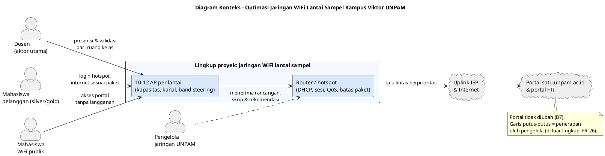

# BAB 2 — ANALISIS KEBUTUHAN

> **Keterangan penanda** (sama dengan Bab 1)
>
> - **[FAKTA-L]** = fakta lapangan, hasil pengamatan langsung anggota kelompok di Kampus Viktor UNPAM.
> - **[FAKTA-D]** = berasal dari dokumen identifikasi masalah Kelompok 2.
> - **[USULAN]** = usulan penyusun, perlu disetujui tim.
> - **[ASUMSI]** = belum dapat dipastikan; perlu data dari tim atau kampus.
> - **[MENUNGGU DATA]** = diisi setelah Pra-Tugas pengukuran (lihat `00_Kerangka_dan_Progres.md`).

Bab ini menerjemahkan masalah pada Bab 1 (M1–M5) menjadi kebutuhan jaringan yang **dapat diukur dan diuji**. Setiap kebutuhan diberi kode agar dapat ditelusuri ke masalah asalnya (Subbab 2.9), dipakai sebagai dasar perancangan pada Bab 3, dan menjadi kriteria lulus pada skenario uji sebelum–sesudah.

Prioritas kebutuhan memakai **MoSCoW**: **M** = wajib (_must_), **S** = sebaiknya ada (_should_), **C** = boleh ada (_could_), **W** = tidak dikerjakan sekarang (_won't, this time_).

---

## 2.1 Sumber dan Cara Pengumpulan Kebutuhan

| Sumber                                          | Cara                                     | Hasil                                                                                                                       |
| ----------------------------------------------- | ---------------------------------------- | --------------------------------------------------------------------------------------------------------------------------- |
| Pengalaman anggota kelompok di Kampus Viktor    | Observasi lapangan                       | Kepadatan ruang, jumlah AP per lantai, pola putus-nyambung, kecepatan di bawah paket, sinyal seluler teredam **[FAKTA-L]** |
| Dokumen identifikasi masalah Kelompok 2         | Studi dokumen                            | Dampak pencatatan manual: salah input, rekap terlambat **[FAKTA-D]**                                                        |
| Jaringan WiFi UNPAM di lantai sampel            | Pengukuran (Pra-Tugas No. 1–16)          | Baseline throughput, _delay_, _jitter_, _packet loss_, waktu muat portal, peta AP & kanal **[MENUNGGU DATA]**               |
| Dosen pengampu (2–3 orang)                       | Wawancara singkat **[USULAN]**           | Kapan dan dari mana presensi/validasi dibuka, gejala yang dialami, batas waktu tunggu yang masih dapat diterima             |
| Pengelola jaringan UNPAM                        | Permintaan data **[ASUMSI A1]**          | Model AP, router/hotspot, kapasitas uplink, konfigurasi paket silver/gold                                                   |
| Literatur standar                               | Studi pustaka                            | Acuan kategori QoS (TIPHON), standar WiFi IEEE 802.11, pedoman kapasitas AP dari produsen perangkat                         |

> **Saran [USULAN]:** hasil wawancara dosen dipakai untuk menyepakati target NFR-04 (waktu muat portal) sebelum tahap _Design_, karena target inilah yang paling langsung dirasakan aktor utama.

---

## 2.2 Pemangku Kepentingan dan Aktor

| Aktor / Pihak                        | Jenis                        | Kepentingan terhadap jaringan                                                                                       | Sumber                |
| ------------------------------------ | ---------------------------- | ------------------------------------------------------------------------------------------------------------------- | --------------------- |
| **Dosen**                            | **Aktor utama**              | Membuka presensi dan memvalidasi kegiatan mahasiswa di portal dari dalam kelas; memakai AP yang sama dengan mahasiswa | [FAKTA-L]             |
| Mahasiswa pelanggan WiFi (silver/gold) | Aktor pendukung            | Koneksi stabil dan kecepatan sesuai paket (2 MB/s / 5 MB/s); berbagi AP dan uplink dengan dosen                      | [FAKTA-L]             |
| Mahasiswa pengguna WiFi publik       | Aktor pendukung              | Akses portal akademik tanpa langganan (sudah tersedia)                                                               | [FAKTA-L]             |
| Pengelola jaringan UNPAM             | Pemangku kepentingan         | Pemilik dan pengelola AP, router, hotspot, dan uplink; penerima rancangan dan rekomendasi; pemberi izin              | [ASUMSI]              |
| Kelompok 2                           | Pelaksana proyek             | Mengukur, merancang, mensimulasikan, dan menyusun rekomendasi                                                        | [FAKTA-D]             |

**Jumlah pengguna per lantai sampel:** 31 ruang kelas × ±35 mahasiswa = **±1.085 mahasiswa**, ditambah dosen pengampu di setiap ruang dan 1 ruang dosen **[FAKTA-L]**. Dengan 1–2 perangkat per orang, jumlah perangkat diperkirakan **±1.100–2.200** **[ASUMSI A3]**. Rincian beban ada di Subbab 2.6.

---

## 2.3 Kebutuhan Pengguna (User Requirements)

Kebutuhan dinyatakan dalam bentuk _user story_ sederhana: "Sebagai …, saya ingin …, agar …".

### 2.3.1 Dosen (aktor utama)

| Kode  | Kebutuhan                                                                                                                                                    |
| ----- | ------------------------------------------------------------------------------------------------------------------------------------------------------------ |
| UR-D1 | Sebagai dosen, saya ingin halaman presensi di portal terbuka dengan cepat dari dalam kelas pada jam sibuk, agar waktu mengajar tidak terpotong. **[FAKTA-L]** |
| UR-D2 | Sebagai dosen, saya ingin koneksi WiFi tidak terputus selama sesi kuliah, agar presensi dan validasi tidak gagal di tengah proses. **[FAKTA-L]**            |
| UR-D3 | Sebagai dosen, saya ingin dapat memvalidasi kegiatan mahasiswa (judul PKM, tugas akhir) langsung saat itu juga, tanpa menunggu koneksi pulih. **[FAKTA-L]**  |
| UR-D4 | Sebagai dosen, saya ingin tidak perlu mencatat presensi secara manual lalu menginput ulang. **[FAKTA-L] + [FAKTA-D]**                                        |

### 2.3.2 Mahasiswa

| Kode  | Kebutuhan                                                                                                                                         |
| ----- | ------------------------------------------------------------------------------------------------------------------------------------------------- |
| UR-M1 | Sebagai mahasiswa pelanggan, saya ingin koneksi tetap tersambung setelah login hotspot, agar ponsel tidak berpindah sendiri ke data seluler. **[FAKTA-L]** |
| UR-M2 | Sebagai mahasiswa pelanggan, saya ingin kecepatan mendekati paket yang sudah saya bayar, juga pada jam sibuk. **[FAKTA-L]**                         |
| UR-M3 | Sebagai mahasiswa pengguna WiFi publik, saya ingin tetap dapat membuka portal akademik dengan lancar tanpa langganan. **[FAKTA-L]**              |

### 2.3.3 Pengelola Jaringan

| Kode  | Kebutuhan                                                                                                                                                   |
| ----- | ----------------------------------------------------------------------------------------------------------------------------------------------------------- |
| UR-P1 | Sebagai pengelola jaringan, saya ingin data kinerja yang terukur, agar keputusan perbaikan dan pengadaan berdasarkan bukti. **[USULAN]**                   |
| UR-P2 | Sebagai pengelola jaringan, saya ingin rancangan yang sudah diuji dalam simulasi dan disertai skrip konfigurasi, agar penerapannya aman dan dapat dibatalkan. **[USULAN]** |
| UR-P3 | Sebagai pengelola jaringan, saya ingin rancangan tidak mengubah skema dan tarif paket langganan yang sudah berjalan. **[USULAN]**                          |

---

## 2.4 Kebutuhan Fungsional (Functional Requirements)

Kebutuhan fungsional di sini adalah **fungsi yang harus dilakukan oleh rancangan jaringan** dan oleh kegiatan proyek (pengukuran dan simulasi).

### 2.4.1 Pengukuran dan Pemetaan (tahap _Analysis_)

| Kode  | Kebutuhan                                                                                                                                                       | Prioritas | Sumber               |
| ----- | --------------------------------------------------------------------------------------------------------------------------------------------------------------- | --------- | -------------------- |
| FR-01 | Mengukur throughput, _delay_, _jitter_, dan _packet loss_ ke _default gateway_ dan ke internet, pada jam sibuk dan jam sepi.                                     | M         | [USULAN]             |
| FR-02 | Mengukur waktu muat halaman portal satu.unpam.ac.id dan portal FTI dari ruang kelas.                                                                             | M         | [FAKTA-L] + [USULAN] |
| FR-03 | Memetakan AP di lantai sampel: jumlah, perkiraan posisi, SSID, BSSID, kanal, pita frekuensi (2,4/5 GHz), dan kekuatan sinyal per ruang (survei lokasi).          | M         | [FAKTA-L] + [USULAN] |
| FR-04 | Mencatat setiap kejadian putus koneksi beserta jenisnya (AP memutus / tanpa internet / kembali ke halaman login / terlalu lambat).                              | M         | [FAKTA-L]            |
| FR-05 | Mengukur kapasitas jaringan nirkabel saja (tanpa uplink) dengan `iperf3` antara dua laptop yang tersambung ke AP yang sama.                                     | S         | [USULAN]             |
| FR-06 | Mengukur kecepatan akun silver dan akun gold di lokasi dan waktu yang sama.                                                                                      | S         | [FAKTA-L] + [USULAN] |

### 2.4.2 Jaringan Nirkabel (pendekatan utama)

| Kode  | Kebutuhan                                                                                                                                                       | Prioritas | Sumber               |
| ----- | --------------------------------------------------------------------------------------------------------------------------------------------------------------- | --------- | -------------------- |
| FR-07 | Menghitung kebutuhan jumlah AP per lantai berdasarkan jumlah perangkat dan kapasitas AP (rumus di Subbab 2.6).                                                   | M         | [FAKTA-L] + [USULAN] |
| FR-08 | Menyusun rencana kanal tanpa tumpang tindih antar-AP yang berdekatan: kanal 1/6/11 lebar 20 MHz pada 2,4 GHz, dan kanal 5 GHz yang tidak saling tumpang tindih. | M         | [USULAN]             |
| FR-09 | Mengarahkan perangkat yang mendukung dua pita ke 5 GHz (_band steering_), agar pita 2,4 GHz tidak penuh.                                                        | S         | [USULAN]             |
| FR-10 | Membatasi jumlah klien per AP/radio sesuai kapasitas hasil perhitungan, agar AP tidak kelebihan beban.                                                          | S         | [USULAN]             |
| FR-11 | Menetapkan ambang sinyal minimum, agar perangkat berpindah ke AP terdekat (_roaming_) dan tidak bertahan di AP yang jauh.                                        | S         | [USULAN]             |
| FR-12 | Mengatur daya pancar AP agar cakupan antar-AP tidak tumpang tindih berlebihan.                                                                                   | C         | [USULAN]             |

### 2.4.3 Alamat IP dan Layanan Hotspot

| Kode  | Kebutuhan                                                                                                                                                       | Prioritas | Sumber               |
| ----- | --------------------------------------------------------------------------------------------------------------------------------------------------------------- | --------- | -------------------- |
| FR-13 | Menyediakan kumpulan alamat IP DHCP yang mencukupi jumlah perangkat maksimum ditambah cadangan, dengan masa sewa (_lease_) yang sesuai pergantian kelas.         | M         | [USULAN]             |
| FR-14 | Meninjau batas waktu sesi, _idle_, dan _keepalive_ hotspot agar pengguna yang masih aktif (termasuk ponsel dengan layar mati sementara) tidak dikeluarkan.        | S         | [FAKTA-L] + [USULAN] |
| FR-15 | Meninjau batas jumlah perangkat per akun langganan, agar login perangkat kedua tidak memutus perangkat pertama tanpa pemberitahuan.                             | S         | [USULAN]             |

### 2.4.4 Manajemen Bandwidth dan QoS (pendekatan pendukung)

| Kode  | Kebutuhan                                                                                                                                                       | Prioritas | Sumber               |
| ----- | --------------------------------------------------------------------------------------------------------------------------------------------------------------- | --------- | -------------------- |
| FR-16 | Mengklasifikasikan lalu lintas akademik (`*.unpam.ac.id`, portal FTI) dan DNS sebagai kelas tersendiri.                                                          | M         | [USULAN]             |
| FR-17 | Memberi prioritas tertinggi kepada kelas lalu lintas akademik saat jaringan padat.                                                                               | M         | [USULAN]             |
| FR-18 | Mempertahankan batas maksimum paket silver dan gold, dan menambahkan **jaminan bandwidth minimum** per pengguna aktif.                                           | M         | [FAKTA-L] + [USULAN] |
| FR-19 | Membagi bandwidth secara adil antar-pengguna dalam paket yang sama, agar satu pengguna tidak menghabiskan jatah pengguna lain.                                  | S         | [USULAN]             |
| FR-20 | Menurunkan prioritas lalu lintas berat (unduhan besar, pembaruan sistem, video) pada jam kuliah.                                                                 | S         | [USULAN]             |
| FR-21 | Menyediakan profil hotspot atau SSID khusus dosen dengan prioritas lebih tinggi.                                                                                 | C         | [USULAN]             |

### 2.4.5 Simulasi, Pembuktian, dan Rekomendasi

| Kode  | Kebutuhan                                                                                                                                                       | Prioritas | Sumber               |
| ----- | --------------------------------------------------------------------------------------------------------------------------------------------------------------- | --------- | -------------------- |
| FR-22 | Membangun topologi saat ini (_as-is_) dan topologi usulan (_to-be_) di simulator.                                                                               | M         | [USULAN]             |
| FR-23 | Menjalankan skenario uji sebelum–sesudah dengan parameter, beban, dan alat ukur yang sama.                                                                      | M         | [USULAN]             |
| FR-27 | Menguji pengaturan nirkabel, hotspot, dan QoS usulan pada purwarupa **MikroTik hAP ax²** milik tim dengan SSID uji tersendiri: kurva kapasitas (jumlah klien vs throughput & _delay_), lebar kanal & pita, batas klien, ambang sinyal, serta batas _idle_/_keepalive_ hotspot. | M | [USULAN] |
| FR-24 | Menghasilkan skrip konfigurasi siap pakai beserta langkah pembatalan (_rollback_) dan dokumen rekomendasi untuk pengelola jaringan.                             | M         | [USULAN]             |
| FR-25 | Mengarahkan domain portal FTI ke IP lokal (_split-horizon DNS_) bila servernya berada di jaringan Kampus Viktor.                                                | W         | [MENUNGGU DATA]      |
| FR-26 | Menerapkan rancangan ke jaringan produksi dan memantau hasilnya secara langsung (tahap _Implementation_ dan _Monitoring_ NDLC).                                  | W         | [USULAN] — butuh izin (B6) |

Ringkasan: **27 kebutuhan fungsional**, terdiri dari 14 wajib (M), 9 sebaiknya ada (S), 2 boleh ada (C), dan 2 tidak dikerjakan sekarang (W). _FR-27 ditambahkan setelah keputusan memakai hAP ax²; nomornya tidak disisipkan agar rujukan FR lain tetap sama._

---

## 2.5 Kebutuhan Non-Fungsional (Target Kinerja)

Target kinerja disusun **[USULAN]** dengan acuan kategori QoS TIPHON yang umum dipakai pada penelitian jaringan di Indonesia. Nilai batas kategori wajib dicocokkan dengan sumber primer sebelum Bab 2 disetujui. Semua target diuji **pada jam sibuk di lantai sampel**.

| Kode   | Kategori        | Kebutuhan                                                                                                                                                    | Sumber               |
| ------ | --------------- | ------------------------------------------------------------------------------------------------------------------------------------------------------------ | -------------------- |
| NFR-01 | _Delay_         | Rata-rata _delay_ ke portal akademik **≤ 150 ms** (kategori "sangat bagus" TIPHON).                                                                          | [USULAN] target      |
| NFR-02 | _Jitter_        | Rata-rata _jitter_ **≤ 75 ms** (kategori "bagus" TIPHON).                                                                                                    | [USULAN] target      |
| NFR-03 | _Packet loss_   | _Packet loss_ **≤ 3%** (kategori "bagus" TIPHON), baik ke _gateway_ maupun ke internet.                                                                       | [USULAN] target      |
| NFR-04 | Waktu muat      | Halaman presensi portal terbuka **≤ 3 detik** dari ruang kelas (setelah login). Target final disepakati dari wawancara dosen.                                 | [USULAN] target      |
| NFR-05 | Stabilitas      | **Tidak ada pemutusan** koneksi oleh jaringan selama satu sesi kuliah pada perangkat yang diam di kelas.                                                    | [FAKTA-L] + [USULAN] |
| NFR-06 | Kapasitas       | Rancangan melayani **±2.200 perangkat** per lantai (±1.085 mahasiswa + dosen, 1–2 perangkat per orang) tanpa melampaui kapasitas klien per AP.               | [FAKTA-L] + [ASUMSI] |
| NFR-07 | Jaminan minimum | Throughput setiap pengguna aktif **tidak turun di bawah jaminan minimum** yang dihitung dari kapasitas uplink (Subbab 2.6).                                   | [USULAN] — angka **[MENUNGGU DATA]** |
| NFR-08 | Prioritas       | Pada simulasi beban penuh, lalu lintas portal akademik tetap memenuhi NFR-01 s.d. NFR-04 walaupun lalu lintas umum memenuhi jalur.                           | [USULAN]             |
| NFR-09 | Kompatibilitas  | Tidak mengubah skema/tarif paket, tidak mengubah portal, dan tidak mewajibkan aplikasi tambahan di perangkat pengguna.                                      | [USULAN] (B7, B10)   |
| NFR-10 | Keamanan        | Isolasi antar-klien (_client isolation_) pada SSID publik; SSID khusus dosen (bila FR-21 dipakai) memakai enkripsi WPA2/WPA3.                               | [USULAN]             |
| NFR-11 | Skalabilitas    | Rancangan satu lantai dapat diterapkan ke lantai lain cukup dengan mengubah parameter (jumlah ruang, jumlah AP, pool IP).                                    | [USULAN]             |
| NFR-12 | Keterterapan    | Seluruh konfigurasi berupa skrip yang dapat ditinjau, diterapkan bertahap, dan dibatalkan oleh pengelola jaringan.                                           | [USULAN]             |
| NFR-13 | Waktu penerapan | Penerapan dan pengujian di jaringan nyata direkomendasikan di luar jam kuliah, agar tidak mengganggu perkuliahan.                                           | [USULAN]             |
| NFR-14 | Dokumentasi     | Topologi, rencana kanal, kebijakan QoS, dan hasil uji terdokumentasi dalam format yang dapat dibaca pengelola jaringan.                                      | [USULAN]             |

---

## 2.6 Kebutuhan Data Pengukuran dan Asumsi Beban

### 2.6.1 Data yang harus dikumpulkan

| No  | Data                                                    | Alat / cara                                              | Dipakai untuk          |
| --- | ------------------------------------------------------- | -------------------------------------------------------- | ---------------------- |
| 1   | Throughput, _delay_, _jitter_, _packet loss_            | `ping`, speedtest, `iperf3`                              | FR-01, FR-05, NFR-01–03 |
| 2   | Waktu muat portal                                       | DevTools peramban (tab _Network_)                        | FR-02, NFR-04          |
| 3   | Peta AP: SSID, BSSID, kanal, pita, sinyal per ruang     | `netsh wlan show interfaces`, aplikasi WiFi Analyzer     | FR-03, FR-07, FR-08    |
| 4   | Kejadian & jenis putus koneksi                          | Catatan manual + `ipconfig /all`                         | FR-04, NFR-05          |
| 5   | Kecepatan akun silver vs gold                           | Speedtest pada lokasi & waktu yang sama                  | FR-06, NFR-07          |
| 6   | Model AP, router, kapasitas uplink, konfigurasi hotspot | Permintaan ke pengelola jaringan **[ASUMSI A1]**         | FR-07, FR-13–FR-18     |

### 2.6.2 Asumsi beban satu lantai [ASUMSI]

Angka di bawah adalah **asumsi kerja** untuk perancangan. Angka ini diganti dengan hasil pengukuran bila tersedia.

| Parameter                          | Nilai                      | Keterangan                                                    |
| ---------------------------------- | -------------------------- | ------------------------------------------------------------- |
| Ruang kelas per lantai             | 31 + 1 ruang dosen         | **[FAKTA-L]**                                                 |
| Mahasiswa per ruang                | ±35                        | **[FAKTA-L]**                                                 |
| Mahasiswa per lantai               | ±1.085                     | 31 × 35                                                       |
| Perangkat per orang                | 1–2                        | **[ASUMSI A3]**                                               |
| Perangkat per lantai               | ±1.100–2.200               | Termasuk dosen; dibulatkan                                    |
| AP per lantai saat ini             | 10–12                      | **[FAKTA-L]**                                                 |
| **Perangkat per AP saat ini**      | **±90–220**                | 1.100 ÷ 12 hingga 2.200 ÷ 10                                  |

### 2.6.3 Rumus yang dipakai pada Bab 3

**Kebutuhan jumlah AP (FR-07):**

```
Jumlah AP = ⌈ Jumlah perangkat ÷ Kapasitas klien per AP ⌉
```

Kapasitas klien per AP diambil dari spesifikasi model AP dan pedoman produsen untuk lingkungan padat **[MENUNGGU DATA: model AP]**. Sebagai ilustrasi saja: bila satu AP nyaman melayani 50 perangkat, lantai dengan 2.200 perangkat membutuhkan ⌈2.200 ÷ 50⌉ = **44 AP**, jauh di atas 10–12 AP saat ini. Angka final ditetapkan di Bab 3.

**Jaminan bandwidth minimum (FR-18, NFR-07):**

```
Jaminan minimum per pengguna = (Kapasitas uplink × porsi untuk pengguna) ÷ Pengguna aktif serentak
```

Kapasitas uplink dan jumlah pengguna aktif serentak **[MENUNGGU DATA]**. Rumus ini juga menunjukkan apakah kecepatan paket (16/40 Mbps) memang dapat dipenuhi oleh uplink yang ada, atau hanya dapat dicapai saat jaringan sepi.

---

## 2.7 Kebijakan Prioritas Lalu Lintas [USULAN]

Kebijakan ini menggantikan "aturan bisnis" pada proposal perangkat lunak. Rincian teknis (antrean, penanda paket, perangkat) dibahas di Bab 3.

| Kelas | Nama                  | Contoh lalu lintas                                         | Perlakuan                                                     |
| ----- | --------------------- | ---------------------------------------------------------- | ------------------------------------------------------------- |
| 1     | Kontrol jaringan      | DNS, DHCP                                                  | Prioritas tertinggi; volume kecil                             |
| 2     | Akademik              | `*.unpam.ac.id`, portal FTI                                | Prioritas tinggi untuk semua pengguna; jaminan bandwidth      |
| 3     | Interaktif umum       | Penjelajahan web, pesan instan                              | Prioritas normal; dibagi adil dalam batas paket               |
| 4     | Berat                 | Video, unduhan besar, pembaruan sistem                      | Prioritas terendah pada jam kuliah; tetap dalam batas paket   |

Aturan pendukung:

- **KP-01.** Batas maksimum paket silver dan gold **tetap berlaku**. Prioritas hanya mengatur urutan saat jalur penuh, bukan menambah kuota.
- **KP-02.** Kelas 2 (akademik) berlaku untuk **semua pengguna**, termasuk WiFi publik, karena dosen dan mahasiswa sama-sama membutuhkan portal.
- **KP-03.** Kebijakan jam kuliah (kelas 4) berlaku sesuai jadwal perkuliahan Kampus Viktor **[MENUNGGU DATA]**.
- **KP-04.** Lalu lintas portal memakai HTTPS. Klasifikasi dilakukan berdasarkan nama domain atau alamat IP tujuan, bukan isi paket.

---

## 2.8 Kebutuhan Pendukung (Perangkat Keras dan Perangkat Lunak)

Harga dan jumlah dihitung pada Bab 6 (Estimasi Biaya).

### 2.8.1 Perangkat Keras

| Komponen                          | Spesifikasi minimum usulan                                    | Keterangan                                                          | Sumber    |
| --------------------------------- | ------------------------------------------------------------- | ------------------------------------------------------------------- | --------- |
| Laptop pengukuran & simulasi      | Milik setiap anggota (4 unit); RAM ≥ 8 GB, WiFi dual-band (2,4/5 GHz) | Dipakai untuk `ping`, `iperf3`, dan simulator; tidak dibebankan ke biaya proyek | [FAKTA-L] |
| Ponsel Android                    | 1–2 unit                                                       | Aplikasi WiFi Analyzer; uji gejala putus-nyambung                    | [USULAN]  |
| **MikroTik hAP ax²**              | 1 unit **milik Zirlda** (anggota tim); router + AP WiFi 6 dua pita, RouterOS v7  | Purwarupa jaringan uji (FR-27): SSID uji, hotspot, DHCP, antrean/QoS; tanpa pengadaan (B8) | [FAKTA-L] |
| Kabel LAN                         | 1–2 buah                                                        | Laptop server `iperf3` disambung kabel ke hAP, agar uji kapasitas murni nirkabel dan tidak butuh internet | [USULAN]  |
| Perangkat mahasiswa relawan       | Ponsel/laptop milik relawan pada jam kelas padat                | Beban nyata untuk uji purwarupa (WP 3.4) dan uji lapangan (WP 3.5); tanpa pengadaan | [USULAN]  |
| AP, switch, router/server kampus, uplink | Sudah ada                                               | Tidak diganti dan tidak ada pengadaan (B8); hanya diukur dan dioptimalkan konfigurasinya | [FAKTA-L] |

### 2.8.2 Perangkat Lunak

| Komponen                     | Usulan                                         | Alasan                                                                 | Sumber   |
| ---------------------------- | ---------------------------------------------- | ---------------------------------------------------------------------- | -------- |
| Simulasi router & QoS        | MikroTik CHR di GNS3 atau VirtualBox           | Gratis; konfigurasi sama dengan RouterOS yang umum dipakai di kampus  | [USULAN] |
| Konfigurasi purwarupa        | RouterOS v7 di hAP ax², Winbox / WebFig        | Gratis; skrip yang sama diuji di CHR dan di perangkat nyata           | [USULAN] |
| Gambar topologi              | Cisco Packet Tracer / PlantUML                 | Gratis; topologi _as-is_ dan _to-be_                                    | [USULAN] |
| Pengukuran kinerja           | `ping`, `tracert`, `iperf3`, speedtest         | Gratis; hasil dapat diulang dengan cara yang sama                      | [USULAN] |
| Survei WiFi                  | WiFi Analyzer (Android), `netsh wlan` (Windows) | Gratis; kanal, sinyal, dan BSSID per lokasi                           | [USULAN] |
| Analisis lalu lintas (opsional) | Wireshark                                   | Gratis; memeriksa jenis lalu lintas yang paling banyak                 | [USULAN] |
| Pengolahan data & grafik     | Python (matplotlib) / spreadsheet              | Grafik sebelum–sesudah dan S-Curve                                     | [USULAN] |

> **Asumsi perangkat kampus [ASUMSI]:** router hotspot kampus diduga berbasis MikroTik RouterOS, karena paket silver/gold dengan login hotspot umum diterapkan dengan perangkat ini. Bila ternyata berbeda, simulator disesuaikan dengan perangkat yang dipakai.

---

## 2.9 Matriks Keterlacakan (Masalah → Kebutuhan)

| Masalah (Bab 1)                                             | Prioritas | Kebutuhan Fungsional           | Kebutuhan Non-Fungsional    |
| ----------------------------------------------------------- | --------- | ------------------------------ | --------------------------- |
| M1 Dosen terhambat membuka presensi & validasi di kelas     | Tinggi    | FR-02, 16, 17, 21, 25, 27      | NFR-01, 02, 03, 04, 05, 08  |
| M2 AP kelebihan beban, koneksi putus-nyambung               | Tinggi    | FR-03, 04, 07–15, 27           | NFR-05, 06, 10, 11          |
| M3 Bandwidth tanpa jaminan & tanpa prioritas akademik       | Sedang    | FR-06, 16–20                   | NFR-07, 08, 09              |
| M4 Belum ada data kinerja jaringan                          | Sedang    | FR-01–06, 22, 23               | NFR-12, 14                  |
| M5 Tidak ada jalur cadangan selain WiFi kampus              | Rendah    | (tidak langsung; dijawab lewat M1–M2) | NFR-05                |

Setiap masalah prioritas tinggi dan sedang memiliki minimal satu kebutuhan fungsional dan satu kebutuhan non-fungsional. FR-24 dan FR-26 (rekomendasi dan penerapan) mendukung seluruh masalah.

---

## 2.10 Diagram Konteks Jaringan (PlantUML)

Diagram ini menunjukkan batas lingkup proyek dan pihak yang berinteraksi dengannya. Topologi rinci (_as-is_ dan _to-be_) dibuat di Bab 3.

> **Cara generate:** letakkan kursor di dalam blok kode lalu tekan `Alt+D` di VS Code.



---

## 2.11 Kesimpulan Bab

Kebutuhan proyek dirumuskan menjadi **27 kebutuhan fungsional** (14 wajib, 9 sebaiknya ada, 2 boleh ada, 2 tidak dikerjakan sekarang) dan **14 kebutuhan non-fungsional**. Inti kebutuhannya adalah:

1. **Pengukuran baseline** yang membedakan hambatan nirkabel dan hambatan uplink, sebagai dasar perancangan dan pembanding hasil.
2. **Perencanaan kapasitas dan kanal AP** untuk ±2.200 perangkat per lantai, ditambah peninjauan DHCP dan sesi hotspot, agar koneksi dosen tidak terputus selama sesi kuliah.
3. **Manajemen bandwidth dan QoS** yang mempertahankan batas paket silver/gold, menambahkan jaminan minimum, dan memprioritaskan lalu lintas portal akademik.
4. **Target kinerja terukur**: _delay_ ≤ 150 ms, _jitter_ ≤ 75 ms, _packet loss_ ≤ 3%, waktu muat portal ≤ 3 detik, dan tanpa pemutusan selama satu sesi kuliah.
5. **Pembuktian tiga lapis**: simulasi (CHR/GNS3), purwarupa di **hAP ax²** milik tim, dan uji lapangan bersama relawan di WiFi UNPAM.

Kebutuhan ini menjadi masukan **Bab 3 (Perancangan Solusi)**, dimulai dari **topologi jaringan saat ini (_as-is_)**.

**Data yang perlu dipastikan sebelum Bab 3:**

- Hasil Pra-Tugas pengukuran No. 1–16 di lantai sampel.
- Model AP dan kapasitas uplink kampus (dari pengelola jaringan, atau ditandai **[ASUMSI]**).
- Nilai batas kategori TIPHON dari sumber primer, untuk mengunci NFR-01 s.d. NFR-03.
- Target waktu muat portal (NFR-04) dari wawancara 2–3 dosen.
