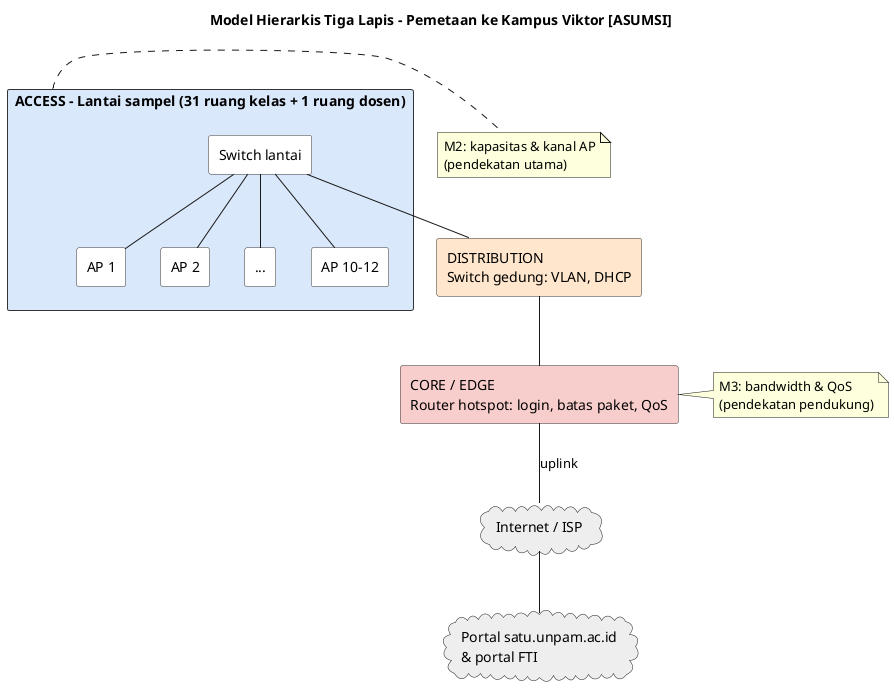
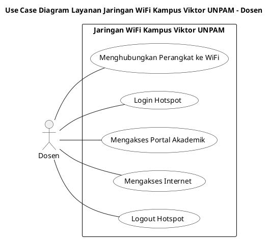
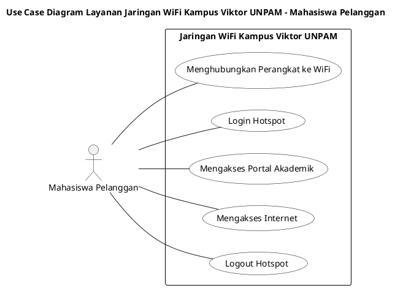
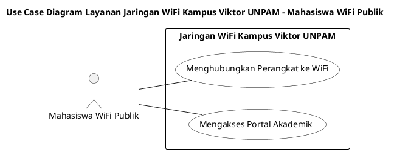
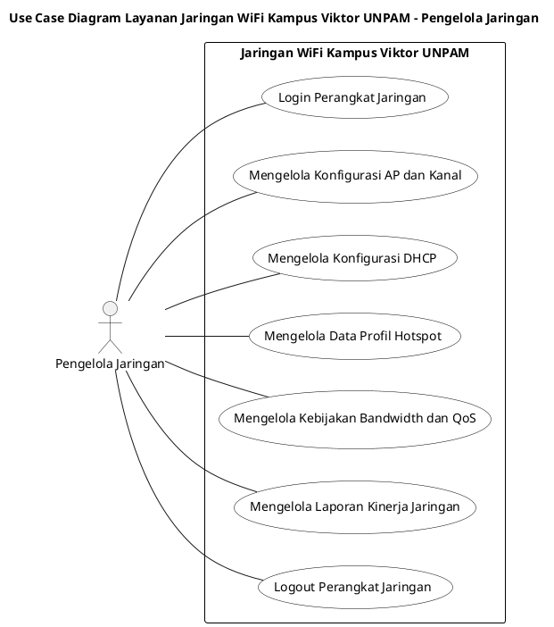
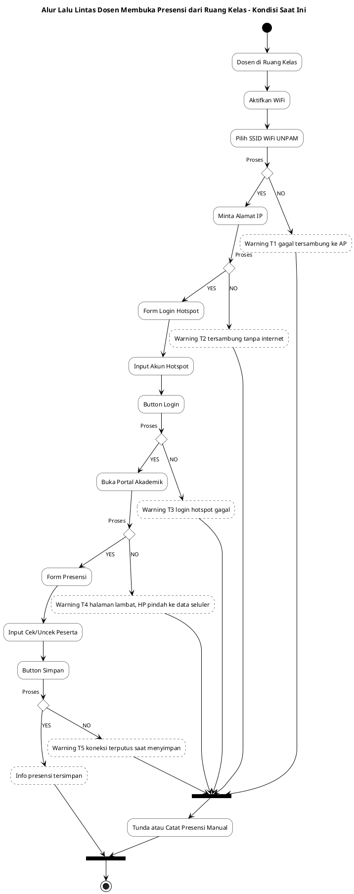

# BAB 3 — PERANCANGAN SOLUSI

> **Keterangan penanda** (sama dengan Bab 1 dan Bab 2)
>
> - **[FAKTA-L]** = fakta lapangan, hasil pengamatan langsung anggota kelompok di Kampus Viktor UNPAM.
> - **[USULAN]** = usulan penyusun, perlu disetujui tim.
> - **[ASUMSI]** = belum dapat dipastikan; perlu data dari tim atau kampus.
> - **[MENUNGGU DATA]** = diisi setelah Pra-Tugas pengukuran (lihat `00_Kerangka_dan_Progres.md`).

Bab ini adalah tahap **_Design_** dan persiapan **_Simulation Prototyping_** pada metode NDLC. Masukannya adalah kebutuhan pada Bab 2 (FR-01 s.d. FR-27, NFR-01 s.d. NFR-14). Keluarannya adalah rancangan jaringan yang dapat disimulasikan, diuji terhadap target Bab 2, dan diserahkan kepada pengelola jaringan sebagai rekomendasi.

Bab ini dikerjakan **bertahap**. Setiap subbab diperiksa tim sebelum lanjut ke subbab berikutnya.

## Urutan Pengerjaan

- [ ] **3.1 Dasar Perancangan Jaringan** ← _sedang diperiksa_
- [ ] **3.2 Skenario Penggunaan: Use Case dan Alur Lalu Lintas** ← _sedang diperiksa_
- [ ] 3.3 Topologi Saat Ini (_as-is_) **[MENUNGGU DATA]**
- [ ] 3.4 Perhitungan Kapasitas AP **[MENUNGGU DATA: model AP]**
- [ ] 3.5 Denah dan Rencana Kanal Satu Lantai
- [ ] 3.6 Rancangan DHCP dan Sesi Hotspot
- [ ] 3.7 Rancangan Manajemen Bandwidth dan QoS
- [ ] 3.8 Topologi Usulan (_to-be_)
- [ ] 3.9 Skenario Simulasi dan Skenario Uji Sebelum–Sesudah

---

## 3.1 Dasar Perancangan Jaringan

Subbab ini menetapkan **prinsip, model acuan, dan aturan penggambaran** yang dipakai di seluruh Bab 3, agar setiap keputusan rancangan dapat dijelaskan alasannya.

### 3.1.1 Prinsip Perancangan [USULAN]

| Kode | Prinsip                                   | Penjelasan                                                                                                                                                                  | Dasar               |
| ---- | ----------------------------------------- | --------------------------------------------------------------------------------------------------------------------------------------------------------------------------- | ------------------- |
| P1   | **Ukur dulu, rancang kemudian**           | Setiap angka rancangan (jumlah AP, pool IP, jaminan bandwidth) berasal dari pengukuran atau spesifikasi perangkat. Angka yang belum ada ditandai, bukan ditebak.             | M4, FR-01–06        |
| P2   | **Perbaiki dari lapisan bawah ke atas**   | Prioritas QoS tidak berguna bila perangkat sudah terputus dari AP. Urutan perbaikan: nirkabel → alamat IP → hotspot → QoS.                                                 | M2 sebelum M3       |
| P3   | **Kapasitas, bukan sekadar jangkauan**    | Di ruang padat, ukuran keberhasilan adalah jumlah perangkat yang terlayani dengan baik, bukan kuatnya sinyal. Lebih banyak AP berdaya rendah lebih baik daripada sedikit AP berdaya tinggi. | F4, FR-07, FR-12   |
| P4   | **Optimalkan yang ada sebelum menambah**  | Konfigurasi (kanal, _band steering_, DHCP, QoS) dioptimalkan lebih dulu. Penambahan AP hanya direkomendasikan bila perhitungan membuktikan kekurangan.                      | B8                  |
| P5   | **Adil, lalu prioritas**                  | Setiap pengguna mendapat bagian yang adil dan jaminan minimum; lalu lintas akademik didahulukan saat jalur penuh. Batas paket silver/gold tetap berlaku.                    | KP-01, FR-18–19     |
| P6   | **Bertahap dan dapat dibatalkan**         | Setiap perubahan berupa skrip yang dapat diterapkan per langkah dan dibatalkan (_rollback_).                                                                                | NFR-12, NFR-13      |
| P7   | **Satu lantai sebagai pola**              | Rancangan lantai sampel dibuat berparameter, sehingga dapat diulang ke lantai lain.                                                                                        | NFR-11              |

### 3.1.2 Model Acuan: Jaringan Hierarkis Tiga Lapis

Perancangan memakai model jaringan kampus **hierarkis tiga lapis** (_core – distribution – access_). Model ini memisahkan tanggung jawab tiap lapis, sehingga masalah dan solusinya dapat ditempatkan dengan jelas. Pemetaan ke Kampus Viktor di bawah ini adalah **[ASUMSI]** sampai topologi sebenarnya diketahui (3.3).

| Lapis              | Fungsi umum                                              | Perangkat di Kampus Viktor **[ASUMSI]**              | Masalah & kebutuhan yang ditangani                        |
| ------------------ | -------------------------------------------------------- | ---------------------------------------------------- | --------------------------------------------------------- |
| **Core / edge**    | Jalur keluar ke internet, kebijakan lalu lintas          | Router hotspot + uplink ISP                          | Batas paket, QoS, prioritas akademik (M3: FR-16–21)       |
| **Distribution**   | Penghubung antar-lantai, pemisahan jaringan (VLAN), DHCP | Switch gedung / router                               | Pool IP, _lease_, pemisahan SSID dosen (FR-13, FR-21)     |
| **Access**         | Titik sambung pengguna                                   | 10–12 AP per lantai **[FAKTA-L]** + switch lantai    | Kapasitas klien, kanal, _band steering_, _roaming_ (M2: FR-07–12) |

### 3.1.3 Pemetaan Lapisan OSI → Masalah → Kebutuhan

Prinsip P2 diterapkan dengan memetakan setiap gejala ke lapisan tempat terjadinya.

| Lapisan OSI                    | Yang terjadi di Kampus Viktor                                                         | Kebutuhan (Bab 2)              | Subbab rancangan |
| ------------------------------ | ------------------------------------------------------------------------------------- | ------------------------------ | ---------------- |
| L1 Fisik (radio)               | Interferensi kanal antar-AP; beton meredam seluler (bukan WiFi)                       | FR-08, FR-12                   | 3.5              |
| L2 Data Link (802.11)          | ±90–220 perangkat per AP berebut waktu siar; pemutusan oleh AP; _roaming_ buruk       | FR-07, FR-09, FR-10, FR-11     | 3.4, 3.5         |
| L3 Jaringan                    | Kemungkinan pool IP DHCP habis (gejala IP `169.254.x.x`)                              | FR-13                          | 3.6              |
| L4–L7 Layanan                  | Sesi hotspot berakhir; batas perangkat per akun; lalu lintas akademik tanpa prioritas | FR-14–FR-21                    | 3.6, 3.7         |

### 3.1.4 Konsep Kunci yang Dipakai

Konsep berikut dipakai berulang pada subbab 3.4–3.7. Penjelasannya sengaja singkat; rujukan lengkap dicantumkan di daftar pustaka.

| Konsep                                  | Penjelasan singkat                                                                                                                                                                                       | Kaitan dengan proyek                                              |
| --------------------------------------- | -------------------------------------------------------------------------------------------------------------------------------------------------------------------------------------------------------- | ----------------------------------------------------------------- |
| **Waktu siar (_airtime_) bersama**      | WiFi adalah media bersama: dalam satu kanal, hanya satu perangkat yang mengirim pada satu waktu (CSMA/CA). Kapasitas satu radio AP **dibagi** ke semua perangkat yang tersambung.                     | Menjelaskan mengapa pelanggan gold pun turun ke ½–⅓ paket (F6)    |
| **Perangkat lambat menghabiskan waktu siar** | Perangkat dengan sinyal lemah atau standar lama mengirim lebih lambat, sehingga memakai waktu siar lebih lama dan memperlambat perangkat lain di AP yang sama.                                    | Dasar ambang sinyal minimum & _roaming_ (FR-11)                   |
| **Interferensi kanal sama (_co-channel_)** | AP berdekatan pada kanal yang sama saling menunggu, seolah menjadi satu AP. Pita 2,4 GHz hanya punya **3 kanal yang tidak tumpang tindih (1, 6, 11)**; pita 5 GHz memiliki lebih banyak kanal.        | 10–12 AP dalam satu lantai berisiko tinggi (FR-08)                |
| **_Band steering_**                     | Mengarahkan perangkat dua pita ke 5 GHz, sehingga 2,4 GHz tersisa untuk perangkat lama.                                                                                                                  | FR-09                                                             |
| **QoS: klasifikasi → penandaan → antrean** | Lalu lintas dikenali (misalnya domain `*.unpam.ac.id`), diberi tanda kelas, lalu dimasukkan ke antrean dengan prioritas berbeda.                                                                    | Kebijakan 4 kelas (2.7), FR-16–17                                 |
| **Batas maksimum vs jaminan minimum**   | Batas maksimum (_maximum rate_) = paling cepat yang boleh dipakai. Jaminan minimum (_committed/guaranteed rate_) = paling lambat yang dijamin saat jalur penuh. Paket silver/gold saat ini hanya batas maksimum **[ASUMSI]**. | Inti FR-18 & NFR-07                                               |
| **Antrean adil per pengguna**           | Bandwidth satu kelas dibagi rata otomatis ke semua pengguna aktif (contoh di RouterOS: PCQ), sehingga satu pengunduh berat tidak menghabiskan jatah orang lain.                                         | FR-19                                                             |

> **Catatan regulasi [ASUMSI]:** kanal 5 GHz yang boleh dipakai di Indonesia dibatasi regulasi frekuensi. Daftar kanal yang diizinkan diverifikasi sebelum rencana kanal 3.5 disusun.

### 3.1.5 Aturan Penggambaran Diagram

| Jenis diagram                      | Alat                                    | Dipakai di       | Aturan                                                                                   |
| ---------------------------------- | --------------------------------------- | ---------------- | ---------------------------------------------------------------------------------------- |
| Model & topologi fisik             | PlantUML (_rectangle/cloud_)            | 3.1, 3.3, 3.8    | Lapis disusun atas–bawah: core → distribution → access                                   |
| Topologi logis (subnet, VLAN, IP)  | PlantUML **nwdiag**                     | 3.3, 3.6, 3.8    | Satu kotak jaringan = satu subnet/VLAN, alamat ditulis di label                          |
| Denah AP & rencana kanal           | Python (matplotlib)                     | 3.5              | Grid 31 ruang + 1 ruang dosen; warna = kanal; ukuran titik = jumlah klien                |
| Alur lalu lintas / skenario        | PlantUML _activity_ atau _sequence_     | 3.2, 3.9         | Mengikuti gaya Bab 3 proposal lama                                                       |
| Grafik hasil uji                   | Python (matplotlib)                     | 3.9              | Sebelum vs sesudah berdampingan, garis target NFR digambar                               |

Konvensi warna dan penanda di semua diagram:

- **Abu-abu** = di luar lingkup proyek (internet, portal, ISP).
- **Biru** = lapis access (fokus utama, M2). **Merah muda** = core/edge (QoS, M3). **Jingga** = distribution.
- Perangkat atau angka yang belum diketahui diberi label **[ASUMSI]** atau **[MENUNGGU DATA]** langsung di diagram.
- Diagram _as-is_ dan _to-be_ memakai tata letak yang sama, agar perbedaannya mudah dibandingkan.

### 3.1.6 Hasil yang Diharapkan dari Bab 3

| Keluaran                                         | Subbab | Memenuhi            |
| ------------------------------------------------ | ------ | ------------------- |
| Topologi _as-is_ dan _to-be_                     | 3.3, 3.8 | FR-22             |
| Jumlah AP yang dibutuhkan per lantai             | 3.4    | FR-07, NFR-06       |
| Denah dan rencana kanal                          | 3.5    | FR-08–FR-12         |
| Rancangan DHCP & sesi hotspot                    | 3.6    | FR-13–FR-15         |
| Kebijakan antrean & QoS dalam bentuk skrip       | 3.7    | FR-16–FR-21, FR-24  |
| Skenario simulasi & uji dengan kriteria lulus    | 3.9    | FR-23, NFR-01–NFR-08 |

### 3.1.7 Catatan Pemeriksaan

> _Diisi tim setelah pemeriksaan subbab 3.1: disetujui / perlu perbaikan, beserta catatannya._

---

## 3.2 Skenario Penggunaan: Use Case dan Alur Lalu Lintas

Subbab ini menunjukkan **siapa memakai layanan jaringan apa** (use case), lalu **jalur yang dilalui koneksi dosen saat membuka presensi** beserta titik-titik tempat koneksi dapat gagal (alur lalu lintas). Titik gagal inilah yang menjadi sasaran rancangan pada 3.4–3.7.

### 3.2.1 Aturan Penggambaran

Aturan mengikuti format use case dan activity diagram yang sudah disetujui tim pada proposal sebelumnya, dengan penyesuaian untuk sistem jaringan:

1. **Satu use case diagram per aktor**, satu halaman, dengan **satu kotak batas sistem**: _Jaringan WiFi Kampus Viktor UNPAM_.
2. Nama use case berbentuk **kata kerja + objek**. Aktor dihubungkan dengan **garis asosiasi biasa**, tanpa «include»/«extend».
3. Pengguna yang memakai akun memiliki **Login** dan **Logout** (hotspot atau perangkat jaringan).
4. **Fungsi portal** (membuka presensi, memvalidasi kegiatan) berada **di luar** batas sistem, karena portal tidak diubah (B7). Di dalam sistem, kebutuhan dosen diwakili use case **Mengakses Portal Akademik**.
5. Alur lalu lintas digambar sebagai **activity diagram** gaya Sparx EA: satu panah masuk dan satu panah keluar per aktivitas (lebih dari satu → bar), keputusan **Proses [YES]/[NO]**, dan pesan **Info/Warning** berupa kotak region bergaris putus-putus.

### 3.2.2 Aktor

| Aktor                      | Deskripsi                                                                                                                       |
| -------------------------- | ------------------------------------------------------------------------------------------------------------------------------- |
| **Dosen** (aktor utama)    | Menyambungkan perangkat di ruang kelas, login hotspot **[ASUMSI]**, lalu membuka portal untuk presensi dan validasi kegiatan.   |
| Mahasiswa Pelanggan        | Login hotspot dengan akun silver/gold untuk internet dan portal.                                                                |
| Mahasiswa WiFi Publik      | Menyambung tanpa langganan; hanya dapat membuka portal akademik **[FAKTA-L]**.                                                  |
| Pengelola Jaringan         | Mengatur AP, DHCP, profil hotspot, serta kebijakan bandwidth dan QoS sesuai rancangan dan rekomendasi proyek.                   |

- **Kelompok 2** bukan aktor, karena berperan sebagai pelaksana proyek (pengukuran, perancangan, simulasi), bukan pengguna jaringan.
- **ISP dan portal** bukan aktor; keduanya digambarkan di luar batas sistem pada diagram konteks (2.10).

### 3.2.3 Daftar Use Case

| Kode  | Use Case                                | Aktor                                   | Kebutuhan (FR)          | Rincian                                                                                                   |
| ----- | --------------------------------------- | --------------------------------------- | ----------------------- | --------------------------------------------------------------------------------------------------------- |
| UC-01 | Menghubungkan Perangkat ke WiFi         | Dosen, Mahasiswa Pelanggan, Mhs Publik  | FR-07–FR-13             | Memilih SSID, tersambung ke AP terdekat (kapasitas, kanal, _band steering_, _roaming_), memperoleh IP.    |
| UC-02 | Login Hotspot                           | Dosen **[ASUMSI]**, Mahasiswa Pelanggan | FR-14, FR-15, FR-21     | Masuk dengan akun; profil paket (silver/gold/dosen) diterapkan.                                           |
| UC-03 | Mengakses Portal Akademik               | Semua pengguna                          | FR-16, FR-17            | Lalu lintas `*.unpam.ac.id` dikenali dan diprioritaskan; untuk Mhs Publik tanpa login (walled garden).     |
| UC-04 | Mengakses Internet                      | Dosen, Mahasiswa Pelanggan              | FR-18–FR-20             | Internet umum dalam batas paket, dengan jaminan minimum dan pembagian adil.                               |
| UC-05 | Logout Hotspot                          | Dosen **[ASUMSI]**, Mahasiswa Pelanggan | FR-14                   | Keluar manual, atau sesi berakhir otomatis sesuai batas waktu sesi/_idle_.                                |
| UC-06 | Login Perangkat Jaringan                | Pengelola Jaringan                      | NFR-12                  | Masuk ke router/pengendali AP untuk menerapkan skrip.                                                     |
| UC-07 | Mengelola Konfigurasi AP dan Kanal      | Pengelola Jaringan                      | FR-08–FR-12             | Mengatur kanal, lebar kanal, daya pancar, _band steering_, batas klien, ambang sinyal minimum.            |
| UC-08 | Mengelola Konfigurasi DHCP              | Pengelola Jaringan                      | FR-13                   | Mengatur pool IP dan masa sewa.                                                                           |
| UC-09 | Mengelola Data Profil Hotspot           | Pengelola Jaringan                      | FR-14, FR-15, FR-21     | Mengatur paket silver/gold/dosen: batas kecepatan, batas sesi/_idle_/_keepalive_, batas perangkat per akun. |
| UC-10 | Mengelola Kebijakan Bandwidth dan QoS   | Pengelola Jaringan                      | FR-16–FR-20             | Mengatur kelas lalu lintas, prioritas, jaminan minimum, antrean adil, kebijakan jam kuliah.               |
| UC-11 | Mengelola Laporan Kinerja Jaringan      | Pengelola Jaringan                      | FR-23, FR-26, NFR-14    | Melihat hasil uji dan pemantauan (_delay_, _jitter_, _packet loss_, jumlah klien per AP).                 |
| UC-12 | Logout Perangkat Jaringan               | Pengelola Jaringan                      | NFR-12                  | Keluar dari router/pengendali AP.                                                                         |

**Kebutuhan yang tidak menjadi use case:**

| Kebutuhan          | Alasan                                                                                               |
| ------------------ | ---------------------------------------------------------------------------------------------------- |
| FR-01–FR-06        | Kegiatan pengukuran oleh Kelompok 2 (tahap _Analysis_), bukan layanan yang dipakai aktor.            |
| FR-22, FR-24, FR-27 | Keluaran proyek (simulasi, purwarupa hAP ax², skrip, dokumen), bukan interaksi aktor dengan jaringan. |
| FR-25, FR-26       | Prioritas **W** (tidak dikerjakan pada proyek ini).                                                  |

> **Cara generate:** letakkan kursor di dalam blok kode lalu tekan `Alt+D` di VS Code. Setiap blok menghasilkan satu gambar (satu halaman).

### 3.2.4 Use Case Diagram — Aktor Dosen

### 3.2.5 Use Case Diagram — Aktor Mahasiswa Pelanggan

### 3.2.6 Use Case Diagram — Aktor Mahasiswa WiFi Publik

### 3.2.7 Use Case Diagram — Aktor Pengelola Jaringan

### 3.2.8 Alur Lalu Lintas — Dosen Membuka Presensi dari Ruang Kelas (Kondisi Saat Ini)

Diagram ini menggambarkan **kondisi saat ini (_as-is_)**: jalur yang dilalui koneksi dosen sejak menyalakan WiFi hingga presensi tersimpan, beserta **lima titik gagal (T1–T5)**. Setiap kegagalan berakhir pada akibat yang sama di lapangan: presensi **ditunda atau dicatat manual** (F8).

**Kebutuhan:** UC-01, UC-02, UC-03; FR-07–FR-17; NFR-04, NFR-05

**Penjelasan alur:**

| Langkah | Aktivitas                                       | Keterangan                                                                                                                         |
| ------- | ----------------------------------------------- | ---------------------------------------------------------------------------------------------------------------------------------- |
| 1       | Dosen di Ruang Kelas → Aktifkan WiFi → Pilih SSID | Dosen memakai AP yang sama dengan ±35 mahasiswa di ruangannya dan ruang sekitarnya.                                              |
| 2       | **Proses** P1 (asosiasi ke AP)                  | AP menerima perangkat bila kapasitas klien dan sinyal mencukupi. **NO** → _Warning T1_.                                           |
| 3       | Minta Alamat IP → **Proses** P2 (DHCP)          | Router/DHCP memberi alamat IP. **NO** → _Warning T2_ (IP `169.254.x.x`, "tidak ada internet").                                    |
| 4       | Form Login Hotspot → Input Akun → Button Login → **Proses** P3 | Router hotspot memeriksa akun, paket, dan batas perangkat per akun. **NO** → _Warning T3_.                       |
| 5       | Buka Portal Akademik → **Proses** P4            | Permintaan melewati antrean router dan uplink menuju portal. **NO** (terlalu lambat) → ponsel menganggap WiFi tidak berfungsi dan pindah ke data seluler → _Warning T4_. |
| 6       | Form Presensi → Input Cek/Uncek → Button Simpan → **Proses** P5 | Koneksi dan sesi hotspot harus bertahan sampai data terkirim. **NO** → _Warning T5_.                              |
| 7       | Bar B1 → Tunda atau Catat Presensi Manual       | Semua kegagalan berakhir pada akibat yang sama (F8): presensi ditunda atau dicatat manual lalu diinput ulang.                      |
| 8       | Bar B2 → END                                    | Bar B2 menggabungkan jalur berhasil dan jalur gagal sebelum END.                                                                  |

**Pemeriksaan aturan:**

| Elemen                                                                                                                       | Panah masuk | Panah keluar | Sesuai aturan       |
| ---------------------------------------------------------------------------------------------------------------------------- | ----------- | ------------ | ------------------- |
| Dosen di Ruang Kelas, Aktifkan WiFi, Pilih SSID, Minta Alamat IP, Form Login Hotspot, Input Akun, Button Login, Buka Portal, Form Presensi, Input Cek/Uncek, Button Simpan, Tunda atau Catat Manual | 1 | 1 | Ya |
| Bar B1                                                                                                                       | 5           | 1            | Ya (bar penggabung) |
| Bar B2                                                                                                                       | 2           | 1            | Ya (bar penggabung) |
| Keputusan Proses P1–P5                                                                                                       | 1           | 2            | Ya (cabang YES/NO)  |

### 3.2.9 Titik Gagal → Lapisan → Rancangan Perbaikan

Tabel ini menghubungkan setiap titik gagal dengan lapisan (3.1.3), kebutuhan (Bab 2), dan subbab rancangan. Pengukuran No. 11–16 menentukan titik mana yang paling sering terjadi **[MENUNGGU DATA]**.

| Titik | Gejala di lapangan                                          | Lapisan          | Kemungkinan penyebab                                              | Kebutuhan            | Dirancang di |
| ----- | ----------------------------------------------------------- | ---------------- | ----------------------------------------------------------------- | -------------------- | ------------ |
| T1    | Gagal tersambung / ikon WiFi hilang                          | L1–L2 nirkabel   | AP kelebihan klien; interferensi kanal; sinyal lemah di tepi sel  | FR-07–FR-12          | 3.4, 3.5     |
| T2    | Tersambung tetapi "tidak ada internet" (`169.254.x.x`)       | L3 jaringan      | Pool IP DHCP habis; masa sewa terlalu panjang                     | FR-13                | 3.6          |
| T3    | Login hotspot gagal / perangkat lain terlempar               | L7 layanan       | Batas perangkat per akun; gangguan layanan hotspot                | FR-15, FR-21         | 3.6          |
| T4    | Portal lambat; ponsel pindah ke data seluler                 | L2 dan uplink    | _Airtime_ AP penuh; uplink padat; tanpa prioritas akademik        | FR-09, FR-16–FR-20   | 3.4, 3.7     |
| T5    | Terputus di tengah proses / kembali ke halaman login         | L2 dan L7        | _Roaming_ buruk; batas sesi, _idle_, atau _keepalive_ hotspot     | FR-11, FR-14         | 3.5, 3.6     |

> **Catatan [ASUMSI]:** langkah Login Hotspot (P3) berlaku bila dosen memakai akun hotspot. Jika dosen memakai WiFi publik, P3 dilewati dan dosen langsung membuka portal melalui walled garden. Hal ini perlu dipastikan ke tim.

### 3.2.10 Catatan Pemeriksaan

> _Diisi tim setelah pemeriksaan subbab 3.2: disetujui / perlu perbaikan, beserta catatannya._
