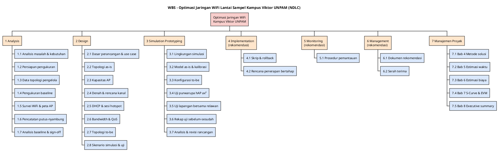

# BAB 4 — METODE SOLUSI

> **Keterangan penanda** (sama dengan bab sebelumnya)
>
> - **[FAKTA-L]** = fakta lapangan. **[USULAN]** = usulan penyusun, perlu disetujui tim.
> - **[ASUMSI]** = belum dapat dipastikan. **[MENUNGGU DATA]** = diisi setelah Pra-Tugas pengukuran.

Bab ini menjelaskan **cara** solusi pada Bab 3 dikerjakan: metode NDLC, pemecahan pekerjaan (WBS), titik kendali biaya (_control account_), pembagian tanggung jawab (RACI), dan risiko. WBS menjadi masukan langsung **Bab 5 (estimasi waktu PERT/CPM)** dan **Bab 6 (estimasi biaya PERT tiga titik)**.

Bab ini dikerjakan **bertahap**:

- [ ] **4.1 Metode NDLC** ← _sedang diperiksa_
- [ ] **4.2 Work Breakdown Structure (WBS)** ← _sedang diperiksa_
- [ ] **4.3 Control Account** ← _sedang diperiksa_
- [ ] **4.4 Matriks Tanggung Jawab (RACI)** ← _sedang diperiksa_
- [ ] **4.5 Manajemen Risiko** ← _sedang diperiksa_

---

## 4.1 Metode NDLC (Network Development Life Cycle)

NDLC adalah siklus pengembangan jaringan yang terdiri dari enam tahap. Metode ini dipilih karena keluaran proyek adalah **rancangan jaringan**, bukan perangkat lunak, sehingga tahapannya berpusat pada pengukuran, perancangan topologi, dan simulasi sebelum penerapan **[USULAN]**.

| Tahap | Nama                     | Kegiatan pada proyek ini                                                                                                                            | Lingkup proyek **[USULAN]**  | Keluaran utama                           |
| ----- | ------------------------ | --------------------------------------------------------------------------------------------------------------------------------------------------- | ---------------------------- | ---------------------------------------- |
| 1     | _Analysis_               | Analisis masalah & kebutuhan, pengukuran baseline, survei WiFi, pengumpulan data topologi                                                           | **Dikerjakan penuh**         | Bab 1–2, data baseline, peta AP          |
| 2     | _Design_                 | Topologi _as-is_/_to-be_, kapasitas AP, rencana kanal, DHCP & hotspot, QoS                                                                          | **Dikerjakan penuh**         | Bab 3                                    |
| 3     | _Simulation Prototyping_ | Tiga lapis uji: simulasi di GNS3/MikroTik CHR; purwarupa di MikroTik hAP ax² milik tim; uji lapangan bersama mahasiswa relawan pada jam kelas padat | **Dikerjakan penuh**         | Hasil simulasi, purwarupa & uji lapangan |
| 4     | _Implementation_         | Skrip konfigurasi dan rencana penerapan bertahap                                                                                                    | Rancangan & rekomendasi (B6) | Skrip + langkah _rollback_               |
| 5     | _Monitoring_             | Prosedur dan metrik pemantauan setelah penerapan                                                                                                    | Rancangan & rekomendasi      | Prosedur pemantauan                      |
| 6     | _Management_             | Kebijakan pemeliharaan, serah terima ke pengelola jaringan                                                                                          | Rancangan & rekomendasi      | Dokumen rekomendasi                      |

**Hubungan antartahap.** Tahap dikerjakan berurutan (_finish-to-start_), kecuali pekerjaan yang tidak saling bergantung, yang dapat berjalan paralel. Contohnya penyiapan lingkungan simulasi, yang dapat dimulai sebelum rancangan selesai. Bila hasil simulasi belum memenuhi target NFR, proyek kembali ke tahap _Design_ (iterasi), dan iterasi ini diberi satu paket kerja tersendiri (WP 3.7).

**Tiga lapis uji pada tahap 3 [USULAN].** Simulator CHR tidak memiliki radio WiFi, sehingga pengaturan nirkabel tidak dapat disimulasikan. Karena itu tahap 3 memakai tiga lapis uji yang saling melengkapi:

| Lapis uji | Alat                                               | Membuktikan                                                                     | WP      |
| --------- | -------------------------------------------------- | ------------------------------------------------------------------------------- | ------- |
| Simulasi  | MikroTik CHR di GNS3                               | Logika QoS dan antrean dalam skala besar (banyak klien virtual) — M3            | 3.1–3.3 |
| Purwarupa | **MikroTik hAP ax²** milik tim + relawan, SSID uji | Pengaturan nirkabel & hotspot usulan di perangkat nyata — M2, titik gagal T3/T5 | 3.4     |
| Lapangan  | AP UNPAM + relawan, tanpa mengubah konfigurasi     | Kondisi nyata _as-is_ dan validasi akhir                                        | 3.5     |

**Perbedaan dengan Waterfall pada proposal lama.** Waterfall cocok untuk membangun aplikasi. NDLC menambahkan tahap **simulasi** sebelum penerapan dan tahap **pemantauan** setelahnya. Kedua tahap ini penting karena perubahan jaringan produksi berdampak langsung ke ribuan pengguna.

---

## 4.2 Work Breakdown Structure (WBS)

### 4.2.1 Aturan Penyusunan [USULAN]

1. **Tiga level**:
   - Level 1 = proyek;
   - Level 2 = tahap NDLC (ditambah satu kelompok Manajemen Proyek);
   - Level 3 = **paket kerja** (_work package_, WP).

   Modul kuliah mencontohkan empat level. Proyek ini memakai tiga level karena timnya kecil (4 orang) dan durasinya pendek, sehingga level keempat hanya menambah beban administrasi tanpa menambah kendali (modul bagian 6: keseimbangan granularitas).

2. Setiap WP **menghasilkan keluaran yang dapat diperiksa** dan dapat diberi durasi O/M/P untuk PERT.
3. Ketergantungan memakai **FS** (_finish-to-start_): WP baru dimulai setelah WP pendahulunya selesai.
4. Penanggung jawab ditulis sebagai **peran**; nama anggota per peran ada di tabel berikut, dan rincian keterlibatan per WP ada pada matriks RACI (4.4).
5. Durasi dan biaya **tidak** ditulis di sini. Durasi O/M/P dihitung di Bab 5, sedangkan biaya di Bab 6.

**Peran dalam tim** (ditetapkan tim):

| Peran                       | Anggota                | Tugas utama                                                            |
| --------------------------- | ---------------------- | ---------------------------------------------------------------------- |
| Ketua / Manajer Proyek (PM) | Rizky Zehan's Onassis  | Jadwal, koordinasi, izin pengelola, estimasi, laporan                  |
| Analis Jaringan             | Dzaky Alfareza         | Pengukuran, survei WiFi, analisis data baseline                        |
| Perancang Jaringan          | Muhammad Zirlda Prairi | Topologi, kapasitas AP, rencana kanal, DHCP, QoS                       |
| Penguji                     | Vigie Afrilza Wibowo   | Lingkungan simulasi, uji lapangan bersama relawan, uji sebelum–sesudah |

### 4.2.2 Tabel WBS

**Proyek:** Optimasi Jaringan WiFi Lantai Sampel Kampus Viktor UNPAM (Metode NDLC)

| No. WBS | Level | Uraian Pekerjaan                                                                                                                                                                                                    | Keluaran                                                              | Dependensi         | Penanggung Jawab   | Kerja lapangan |
| ------- | ----- | ------------------------------------------------------------------------------------------------------------------------------------------------------------------------------------------------------------------- | --------------------------------------------------------------------- | ------------------ | ------------------ | :------------: |
| **1**   | 2     | **TAHAP 1 — ANALYSIS**                                                                                                                                                                                              | Data baseline & kebutuhan disetujui                                   | —                  | Analis Jaringan    |                |
| 1.1     | 3     | Analisis masalah dan analisis kebutuhan                                                                                                                                                                             | Bab 1 dan Bab 2                                                       | —                  | Analis Jaringan    |                |
| 1.2     | 3     | Persiapan pengukuran: izin pengelola, pemilihan lantai sampel, alat & lembar catat                                                                                                                                  | Surat/izin, lembar pengukuran                                         | 1.1                | PM                 |                |
| 1.3     | 3     | Pengumpulan data topologi dari pengelola jaringan (model AP, router, uplink, paket)                                                                                                                                 | Data topologi atau catatan **[ASUMSI]**                               | 1.2                | PM                 |                |
| 1.4     | 3     | Pengukuran baseline kinerja jam sibuk & sepi (Pra-Tugas No. 1–6, 16)                                                                                                                                                | Tabel throughput, _delay_, _jitter_, _loss_                           | 1.2                | Analis Jaringan    |       ✓        |
| 1.5     | 3     | Survei WiFi dan pemetaan AP per ruang (No. 12–13)                                                                                                                                                                   | Peta AP: SSID, BSSID, kanal, sinyal                                   | 1.2                | Analis Jaringan    |       ✓        |
| 1.6     | 3     | Pencatatan kejadian putus-nyambung dan uji akun silver/gold (No. 11, 14–15)                                                                                                                                         | Log kejadian putus per jenis (T1–T5)                                  | 1.2                | Analis Jaringan    |       ✓        |
| 1.7     | 3     | Analisis data baseline, penentuan titik hambatan, persetujuan kebutuhan                                                                                                                                             | Laporan baseline; Bab 1–2 final                                       | 1.3, 1.4, 1.5, 1.6 | Analis Jaringan    |                |
| **2**   | 2     | **TAHAP 2 — DESIGN**                                                                                                                                                                                                | Bab 3 lengkap                                                         | —                  | Perancang Jaringan |                |
| 2.1     | 3     | Dasar perancangan, use case, alur lalu lintas (3.1–3.2)                                                                                                                                                             | Subbab 3.1–3.2                                                        | 1.1                | Perancang Jaringan |                |
| 2.2     | 3     | Topologi saat ini / _as-is_ (3.3)                                                                                                                                                                                   | Diagram topologi fisik & logis                                        | 1.7, 2.1           | Perancang Jaringan |                |
| 2.3     | 3     | Perhitungan kapasitas AP (3.4)                                                                                                                                                                                      | Jumlah AP & klien per AP                                              | 2.2                | Perancang Jaringan |                |
| 2.4     | 3     | Denah dan rencana kanal satu lantai (3.5)                                                                                                                                                                           | Denah 32 ruang + rencana kanal                                        | 2.3                | Perancang Jaringan |                |
| 2.5     | 3     | Rancangan DHCP dan sesi hotspot (3.6)                                                                                                                                                                               | Rancangan pool IP, _lease_, profil hotspot                            | 2.2                | Perancang Jaringan |                |
| 2.6     | 3     | Rancangan manajemen bandwidth dan QoS (3.7)                                                                                                                                                                         | Kebijakan antrean 4 kelas                                             | 2.2                | Perancang Jaringan |                |
| 2.7     | 3     | Topologi usulan / _to-be_ (3.8)                                                                                                                                                                                     | Diagram topologi usulan                                               | 2.4, 2.5, 2.6      | Perancang Jaringan |                |
| 2.8     | 3     | Skenario simulasi dan skenario uji sebelum–sesudah (3.9)                                                                                                                                                            | Skenario uji + kriteria lulus NFR                                     | 2.7                | Penguji            |                |
| **3**   | 2     | **TAHAP 3 — SIMULATION PROTOTYPING**                                                                                                                                                                                | Bukti rancangan memenuhi target                                       | —                  | Penguji            |                |
| 3.1     | 3     | Penyiapan lingkungan simulasi (GNS3, MikroTik CHR, VirtualBox)                                                                                                                                                      | Lingkungan simulasi siap pakai                                        | 2.1                | Penguji            |                |
| 3.2     | 3     | Model _as-is_ di simulator dan kalibrasi dengan data baseline                                                                                                                                                       | Simulasi _as-is_ mendekati baseline                                   | 3.1, 2.2           | Penguji            |                |
| 3.3     | 3     | Penerapan konfigurasi _to-be_ di simulator (DHCP, hotspot, QoS)                                                                                                                                                     | Konfigurasi _to-be_ berjalan di simulator                             | 3.2, 2.7           | Penguji            |                |
| 3.4     | 3     | Uji purwarupa di **MikroTik hAP ax²** milik tim (SSID uji, hotspot, DHCP, antrean) bersama relawan: kurva kapasitas klien, lebar kanal & pita, batas klien, ambang sinyal, batas _idle_/_keepalive_ hotspot (FR-27) | Kurva kapasitas klien per AP; hasil uji pengaturan nirkabel & hotspot | 2.8                | Penguji            |       ✓        |
| 3.5     | 3     | Uji lapangan terkendali pada jam kelas padat: perangkat tim + mahasiswa relawan, memakai AP/switch/server UNPAM yang ada tanpa mengubah konfigurasinya                                                              | Data uji lapangan (beban nyata per AP, efek pita 5 GHz & sebaran AP)  | 2.8                | Penguji            |       ✓        |
| 3.6     | 3     | Uji skenario beban di simulator dan rekap sebelum–sesudah dari ketiga lapis uji                                                                                                                                     | Tabel & grafik hasil uji vs target NFR                                | 3.3, 3.4, 3.5      | Penguji            |                |
| 3.7     | 3     | Analisis hasil dan revisi rancangan (iterasi bila target belum tercapai)                                                                                                                                            | Rancangan final teruji                                                | 3.6                | Perancang Jaringan |                |
| **4**   | 2     | **TAHAP 4 — IMPLEMENTATION (rekomendasi)**                                                                                                                                                                          | Paket penerapan                                                       | —                  | Perancang Jaringan |                |
| 4.1     | 3     | Penyusunan skrip konfigurasi dan langkah _rollback_ (diuji di CHR dan hAP ax²)                                                                                                                                      | Skrip siap pakai (FR-24)                                              | 3.7                | Perancang Jaringan |                |
| 4.2     | 3     | Rencana penerapan bertahap di luar jam kuliah                                                                                                                                                                       | Jadwal & urutan penerapan (NFR-13)                                    | 3.7                | PM                 |                |
| **5**   | 2     | **TAHAP 5 — MONITORING (rekomendasi)**                                                                                                                                                                              | Prosedur pemantauan                                                   | —                  | Analis Jaringan    |                |
| 5.1     | 3     | Prosedur dan metrik pemantauan setelah penerapan                                                                                                                                                                    | Prosedur pengukuran ulang & ambang peringatan                         | 3.7                | Analis Jaringan    |                |
| **6**   | 2     | **TAHAP 6 — MANAGEMENT (rekomendasi)**                                                                                                                                                                              | Serah terima ke pengelola                                             | —                  | PM                 |                |
| 6.1     | 3     | Dokumen rekomendasi dan kebijakan pemeliharaan                                                                                                                                                                      | Dokumen rekomendasi (NFR-14)                                          | 4.1, 4.2, 5.1      | PM                 |                |
| 6.2     | 3     | Presentasi dan serah terima kepada pengelola jaringan                                                                                                                                                               | Berita acara serah terima                                             | 6.1                | PM                 |                |
| **7**   | 2     | **MANAJEMEN PROYEK**                                                                                                                                                                                                | Dokumen proposal lengkap                                              | —                  | PM                 |                |
| 7.1     | 3     | Metode solusi: WBS, control account, RACI, risiko (Bab 4)                                                                                                                                                           | Bab 4                                                                 | 1.1                | PM                 |                |
| 7.2     | 3     | Estimasi waktu: PERT tiga titik, CPM, probabilitas 40 hari (Bab 5)                                                                                                                                                  | Bab 5 + Gantt chart                                                   | 7.1                | PM                 |                |
| 7.3     | 3     | Estimasi biaya: PERT tiga titik, contingency, cost baseline (Bab 6)                                                                                                                                                 | Bab 6                                                                 | 7.2                | PM                 |                |
| 7.4     | 3     | S-Curve dan EVM (Bab 7)                                                                                                                                                                                             | Bab 7 + grafik S-Curve                                                | 7.3                | PM                 |                |
| 7.5     | 3     | Executive summary dan laporan akhir (Bab 8)                                                                                                                                                                         | Bab 8, laporan akhir                                                  | 6.2, 7.4           | PM                 |                |

**Ringkasan:** 7 kelompok level 2 dan **32 paket kerja**. Lima di antaranya adalah kerja lapangan atau fisik (1.4, 1.5, 1.6, 3.4, 3.5). Pemasangan atau penggantian perangkat di jaringan produksi tidak termasuk (B6, B8).

### 4.2.3 Diagram WBS (PlantUML)

> **Cara generate:** letakkan kursor di dalam blok kode lalu tekan `Alt+D` di VS Code.

### 4.2.4 Catatan untuk Bab 5–6

- **PERT dipakai untuk waktu dan biaya** (modul bagian 3: estimasi tiga titik berlaku untuk durasi maupun biaya). UCP dan COCOMO II tidak dipakai karena keduanya mengukur ukuran perangkat lunak (transaksi use case atau baris kode), sedangkan pekerjaan proyek ini didominasi pengukuran lapangan, perancangan, dan simulasi jaringan **[USULAN]**.
- Setiap WP level 3 diberi durasi **O/M/P** di Bab 5. Untuk WP lapangan (1.4–1.6), nilai P harus memperhitungkan risiko izin pengelola dan jadwal jam sibuk.
- WP 1.1 dan 2.1 **sudah berjalan** (draf Bab 1–2 dan subbab 3.1–3.2), sehingga progresnya dicatat saat penyusunan jadwal.
- WP 3.4 (**purwarupa hAP ax²**) memakai perangkat milik tim, sehingga tidak ada biaya pengadaan. Di Bab 6, pemakaiannya dicatat sebagai biaya peralatan (penyusutan/sewa wajar). Laptop server `iperf3` disambung kabel ke hAP, sehingga uji kapasitas murni mengukur jaringan nirkabel dan tidak memerlukan internet. Hasilnya menunjukkan **pola**, bukan angka persis AP UNPAM (B8a). Kurva kapasitas dari WP 3.4 dipakai WP 3.7 untuk memperbaiki perhitungan kapasitas AP (2.3) yang awalnya memakai spesifikasi atau asumsi.
- WP 3.5 (**uji lapangan bersama relawan**) memakai AP, switch, dan server UNPAM yang sudah ada **[FAKTA-L]**, tanpa mengubah konfigurasinya. Contohnya, kinerja AP saat relawan **dipusatkan pada satu AP** dibanding **disebar ke beberapa AP**, atau saat relawan dipindah **dari 2,4 GHz ke 5 GHz** secara manual. Uji ini meniru efek _band steering_ dan pemerataan beban pada jaringan sebenarnya **[USULAN]**.
- Nilai P untuk WP 3.4 dan 3.5 memperhitungkan ketersediaan relawan, jadwal kelas padat, dan izin pengelola. Identitas relawan tidak dicatat; yang dicatat hanya data jaringan (jenis perangkat, pita, AP, hasil ukur).

### 4.2.5 Catatan Pemeriksaan

> _Diisi tim setelah pemeriksaan 4.1–4.2: disetujui / perlu perbaikan, beserta catatannya._

---

## 4.3 Control Account

_Control account_ (CA) adalah titik kendali pada WBS tempat **ruang lingkup, jadwal, dan biaya digabungkan** untuk mengukur kinerja dengan EVM (PV, EV, AC, CPI, SPI) (modul bagian 6). Setiap CA memiliki satu penanggung jawab, kumpulan paket kerja, anggaran, jadwal, dan kriteria penerimaan.

### 4.3.1 Penetapan Control Account [USULAN]

CA ditempatkan pada **level 2 WBS** (tahap NDLC), karena level 3 sudah berupa paket kerja. Tahap 4, 5, dan 6 digabung menjadi satu CA. Ketiganya berupa rekomendasi, kecil, dan berurutan, sehingga bila dipisah hanya menambah beban pelaporan tanpa menambah kendali (modul bagian 6: keseimbangan granularitas).

| Kode  | Control Account                                      | Paket kerja (WP)        | Jumlah WP | Penanggung jawab CA                | Kriteria penerimaan                                                                                                                    |
| ----- | ---------------------------------------------------- | ----------------------- | --------- | ---------------------------------- | -------------------------------------------------------------------------------------------------------------------------------------- |
| CA-01 | Analysis                                             | 1.1–1.7                 | 7         | Dzaky Alfareza (Analis)            | Pengukuran No. 1–16 terisi pada jam sibuk & sepi (min. 3 kali per kondisi); titik hambatan ditetapkan; Bab 1–2 disetujui tim           |
| CA-02 | Design                                               | 2.1–2.8                 | 8         | Muhammad Zirlda Prairi (Perancang) | Subbab 3.1–3.9 disetujui tim; setiap FR prioritas M memiliki rancangan; skenario uji memiliki kriteria lulus NFR                       |
| CA-03 | Simulation Prototyping                               | 3.1–3.7                 | 7         | Vigie Afrilza Wibowo (Penguji)     | Ketiga lapis uji (CHR, hAP ax², lapangan) selesai; hasil sebelum–sesudah dibandingkan dengan NFR-01–NFR-08; rancangan final ditetapkan |
| CA-04 | Rekomendasi (Implementation, Monitoring, Management) | 4.1, 4.2, 5.1, 6.1, 6.2 | 5         | Rizky Zehan's Onassis (PM)         | Skrip teruji di CHR & hAP ax² beserta _rollback_; prosedur pemantauan; berita acara serah terima ke pengelola                          |
| CA-05 | Manajemen Proyek                                     | 7.1–7.5                 | 5         | Rizky Zehan's Onassis (PM)         | Bab 4–8 selesai, termasuk PERT/CPM, cost baseline, dan S-Curve                                                                         |
|       | **Jumlah**                                           |                         | **32**    |                                    |                                                                                                                                        |

### 4.3.2 Aturan Pengukuran Kinerja (EVM) [USULAN]

| Aspek                              | Aturan                                                                                                                                                                                                                                                                                                 |
| ---------------------------------- | ------------------------------------------------------------------------------------------------------------------------------------------------------------------------------------------------------------------------------------------------------------------------------------------------------ |
| Periode pelaporan                  | **Mingguan**, cocok untuk proyek berdurasi ±40 hari (sekitar 6 titik ukur pada S-Curve)                                                                                                                                                                                                                |
| Anggaran per CA (BAC)              | Jumlah biaya WP di dalamnya, dihitung dengan PERT tiga titik di **Bab 6**                                                                                                                                                                                                                              |
| Jadwal per CA                      | Tanggal mulai–selesai dari jaringan PERT/CPM di **Bab 5**                                                                                                                                                                                                                                              |
| Teknik nilai hasil (EV) per WP     | **0/100** untuk WP yang selesai dalam satu periode laporan (EV diakui saat selesai); **50/50** untuk WP yang melewati lebih dari satu periode (50% saat mulai, 50% saat selesai)                                                                                                                       |
| Bukti selesai WP                   | Keluaran WP (kolom "Keluaran" di 4.2.2) sudah diperiksa penanggung jawab CA                                                                                                                                                                                                                            |
| Indikator                          | CPI = EV ÷ AC (efisiensi biaya); SPI = EV ÷ PV (efisiensi jadwal). Nilai 1 = sesuai rencana; > 1 = lebih baik; < 1 = lebih buruk                                                                                                                                                                       |
| Batas toleransi (kebijakan proyek) | **CPI/SPI ≥ 1,0**: sesuai rencana. **0,9 ≤ CPI/SPI < 1,0**: dipantau; penanggung jawab CA melaporkan penyebabnya pada laporan mingguan. **CPI/SPI < 0,9**: tindakan korektif oleh penanggung jawab CA bersama PM (menambah orang pada WP, menggeser WP non-kritis, atau memakai _contingency reserve_) |
| Biaya aktual (AC)                  | Dicatat per WP oleh penanggung jawab CA: transportasi ke lokasi, konsumsi relawan, pemakaian peralatan, dan jam kerja anggota                                                                                                                                                                          |

> **Dasar aturan.**
>
> - **0/100 dan 50/50** adalah teknik _fixed formula_ dalam standar EVM PMI (_Project Management Institute_). Teknik ini dianjurkan untuk paket kerja pendek yang selesai dalam satu hingga dua periode laporan, sesuai dengan WP proyek ini. Bila Bab 5 menunjukkan ada WP yang lebih dari dua minggu, teknik pengukurannya diganti dengan _weighted milestone_ (milestone berbobot), yang juga termasuk teknik standar.
> - **Batas toleransi 0,9** dan **periode mingguan** adalah **kebijakan proyek**, bukan angka baku. Standar EVM tidak menetapkan angka tunggal; setiap proyek menetapkannya sesuai ukuran dan durasinya. Batas 0,9 berarti penyimpangan sampai 10% masih dipantau, dan penyimpangan di atas 10% langsung ditangani.

---

## 4.4 Matriks Tanggung Jawab (RACI)

**Keterangan:** **R** = _Responsible_ (mengerjakan), **A** = _Accountable_ (penanggung jawab akhir, tepat satu per WP), **C** = _Consulted_ (dimintai masukan), **I** = _Informed_ (diberi tahu hasilnya), **A/R** = penanggung jawab sekaligus pengerja, **–** = tidak terlibat.

Kolom **Pengelola** adalah pengelola jaringan UNPAM (pihak luar tim), dicantumkan pada WP yang membutuhkan izin, data, atau persetujuannya.

| WP  | Uraian singkat                          | Rizky (PM) | Dzaky (Analis) | Zirlda (Perancang) | Vigie (Penguji) | Pengelola |
| --- | --------------------------------------- | :--------: | :------------: | :----------------: | :-------------: | :-------: |
| 1.1 | Analisis masalah & kebutuhan            |     C      |      A/R       |         R          |        C        |     –     |
| 1.2 | Persiapan pengukuran & izin             |    A/R     |       R        |         I          |        I        |     C     |
| 1.3 | Data topologi dari pengelola            |    A/R     |       C        |         C          |        I        |     C     |
| 1.4 | Pengukuran baseline                     |     I      |      A/R       |         I          |        R        |     I     |
| 1.5 | Survei WiFi & peta AP                   |     I      |      A/R       |         R          |        I        |     –     |
| 1.6 | Pencatatan putus-nyambung               |     I      |      A/R       |         I          |        R        |     –     |
| 1.7 | Analisis baseline & sign-off            |     C      |      A/R       |         C          |        C        |     –     |
| 2.1 | Dasar perancangan & use case            |     I      |       C        |        A/R         |        C        |     –     |
| 2.2 | Topologi as-is                          |     I      |       C        |        A/R         |        I        |     –     |
| 2.3 | Kapasitas AP                            |     I      |       C        |        A/R         |        I        |     –     |
| 2.4 | Denah & rencana kanal                   |     I      |       C        |        A/R         |        I        |     –     |
| 2.5 | DHCP & sesi hotspot                     |     I      |       R        |         A          |        C        |     –     |
| 2.6 | Bandwidth & QoS                         |     I      |       I        |         A          |        R        |     –     |
| 2.7 | Topologi to-be                          |     I      |       C        |        A/R         |        C        |     –     |
| 2.8 | Skenario simulasi & uji                 |     I      |       C        |         C          |       A/R       |     –     |
| 3.1 | Lingkungan simulasi                     |     I      |       –        |         I          |       A/R       |     –     |
| 3.2 | Model as-is & kalibrasi                 |     I      |       C        |         C          |       A/R       |     –     |
| 3.3 | Konfigurasi to-be di simulator          |     I      |       –        |         R          |        A        |     –     |
| 3.4 | Purwarupa hAP ax² + relawan             |     R      |       R        |         C          |       A/R       |     C     |
| 3.5 | Uji lapangan + relawan                  |     R      |       R        |         I          |       A/R       |     I     |
| 3.6 | Rekap uji sebelum–sesudah               |     I      |       C        |         I          |       A/R       |     –     |
| 3.7 | Analisis & revisi rancangan             |     I      |       C        |        A/R         |        C        |     –     |
| 4.1 | Skrip & rollback                        |     I      |       –        |        A/R         |        R        |     I     |
| 4.2 | Rencana penerapan bertahap              |    A/R     |       I        |         C          |        I        |     C     |
| 5.1 | Prosedur pemantauan                     |     I      |      A/R       |         I          |        C        |     –     |
| 6.1 | Dokumen rekomendasi                     |    A/R     |       C        |         R          |        C        |     I     |
| 6.2 | Presentasi & serah terima               |    A/R     |       R        |         R          |        R        |     I     |
| 7.1 | Bab 4 Metode solusi                     |    A/R     |       C        |         C          |        C        |     –     |
| 7.2 | Bab 5 Estimasi waktu                    |    A/R     |       C        |         C          |        C        |     –     |
| 7.3 | Bab 6 Estimasi biaya                    |    A/R     |       C        |         C          |        C        |     –     |
| 7.4 | Bab 7 S-Curve & EVM                     |    A/R     |       I        |         C          |        I        |     –     |
| 7.5 | Bab 8 Executive summary & laporan akhir |    A/R     |       C        |         C          |        C        |     –     |

**Penjelasan pembagian [USULAN]:**

- **WP lapangan (1.4, 1.6, 3.4, 3.5)** dikerjakan lebih dari satu orang, karena pengukuran jam sibuk, jam sepi, dan beberapa kondisi perlu dilakukan bersamaan. Pada 3.4 dan 3.5, PM ikut **R** untuk mengoordinasikan mahasiswa relawan.
- Pada **WP 7.2–7.3** semua anggota **C**, karena setiap penanggung jawab WP memberi nilai O/M/P untuk pekerjaannya sendiri. Estimasi dari orang yang mengerjakan lebih realistis.
- **Pengelola** dikonsultasikan (C) pada WP yang membutuhkan izin atau data (1.2, 1.3, 3.4, 4.2), dan diberi tahu (I) pada hasil yang menyangkut jaringannya.

**Beban kerja per anggota** (jumlah WP; A/R dihitung sebagai A dan R):

| Anggota                | Peran     | A (penanggung jawab) | R (mengerjakan) |
| ---------------------- | --------- | :------------------: | :-------------: |
| Rizky Zehan's Onassis  | PM        |          10          |       12        |
| Dzaky Alfareza         | Analis    |          6           |       11        |
| Muhammad Zirlda Prairi | Perancang |          9           |       12        |
| Vigie Afrilza Wibowo   | Penguji   |          7           |       11        |
| **Jumlah**             |           |        **32**        |                 |

**Alih tugas hasil perataan sumber daya (Bab 5.5, opsi B — disetujui tim).** Pembagian awal membuat Perancang dijadwalkan pada 2.3, 2.5, dan 2.6 sekaligus, serta Penguji pada 3.3, 3.4, dan 3.5 sekaligus. Akibatnya proyek molor ke ±47 hari kerja. Karena itu, empat WP dialihkan sesuai mitigasi R-12, tanpa mengubah penanggung jawab (A):

| WP  | Sebelum                 | Sesudah                                   | Alasan                                                           |
| --- | ----------------------- | ----------------------------------------- | ---------------------------------------------------------------- |
| 2.5 | Zirlda A/R              | Zirlda **A**, Dzaky **R**                 | Dzaky mengolah temuan putus-nyambung (T2/T3) dari lapangan       |
| 2.6 | Zirlda A/R              | Zirlda **A**, Vigie **R**                 | Vigie yang akan menerapkan QoS di simulator dan purwarupa        |
| 3.3 | Vigie A/R, Zirlda C     | Vigie **A**, Zirlda **R**                 | Perancang menulis konfigurasi hasil rancangannya sendiri         |
| 3.4 | Zirlda R                | Zirlda **C**                              | Zirlda sedang mengerjakan 3.3 pada waktu yang sama               |

Setelah alih tugas, beban R merata (11–12 WP per orang) dan durasi proyek menjadi ±39 hari kerja (Bab 5).

### 4.4.1 Catatan Pemeriksaan

> _Diisi tim setelah pemeriksaan 4.3–4.4: disetujui / perlu perbaikan, beserta catatannya._

---

## 4.5 Manajemen Risiko

Risiko adalah kejadian yang **belum pasti terjadi** tetapi, bila terjadi, memengaruhi waktu, biaya, atau kualitas proyek (_triple constraint_). Register risiko di bawah ini disusun dari fakta dan asumsi pada Bab 1–4.

### 4.5.1 Skala Penilaian [USULAN]

| Nilai | Probabilitas (P)                   | Dampak (D)                                                                   |
| :---: | ---------------------------------- | ---------------------------------------------------------------------------- |
|   1   | Rendah — kecil kemungkinan terjadi | Kecil — tertangani di dalam WP, tanpa menggeser jadwal                       |
|   2   | Sedang — mungkin terjadi           | Sedang — menunda WP atau menambah biaya, tetapi tanggal selesai proyek tetap |
|   3   | Tinggi — besar kemungkinan terjadi | Besar — menggeser jalur kritis atau menurunkan kualitas hasil                |

**Skor = P × D.** Tingkat risiko: **1–2 = Rendah**, **3–4 = Sedang**, **6–9 = Tinggi**.

Strategi respons memakai istilah standar manajemen risiko:

- **Hindari**: mengubah rencana agar risiko tidak terjadi.
- **Mitigasi**: menurunkan probabilitas atau dampak.
- **Alihkan**: memindahkan dampak ke pihak lain.
- **Terima**: menyiapkan cadangan tanpa tindakan khusus.

### 4.5.2 Register Risiko

Diurutkan dari skor tertinggi.

| Kode | Risiko                                                                                     | Kategori    | P   | D   | Skor | Tingkat | Strategi & tindakan **[USULAN]**                                                                                                                  | Pemicu (tanda awal)                                     | WP                | Pemilik |
| ---- | ------------------------------------------------------------------------------------------ | ----------- | --- | --- | ---- | ------- | ------------------------------------------------------------------------------------------------------------------------------------------------- | ------------------------------------------------------- | ----------------- | ------- |
| R-04 | Pengelola jaringan tidak memberi data topologi (model AP, router, kapasitas uplink, paket) | Eksternal   | 3   | 2   | 6    | Tinggi  | **Mitigasi:** ajukan permintaan data sejak WP 1.2; cadangan A2: topologi disusun dari survei & pengukuran, angka ditandai [ASUMSI]                | Belum ada jawaban 1 minggu setelah permintaan           | 1.3, 2.2, 2.3     | Rizky   |
| R-05 | Izin pengukuran di lantai sampel pada jam sibuk ditolak atau terlambat                     | Eksternal   | 2   | 3   | 6    | Tinggi  | **Mitigasi:** ajukan izin di hari pertama proyek, sertakan jadwal & cara ukur yang tidak mengganggu; siapkan dua alternatif lantai                | Izin belum keluar saat WP 1.2 selesai                   | 1.2, 1.4–1.6      | Rizky   |
| R-11 | Target NFR belum tercapai setelah simulasi & uji, sehingga iterasi berulang                | Teknis      | 2   | 3   | 6    | Tinggi  | **Mitigasi:** batasi iterasi **satu kali** dalam jadwal (WP 3.7); target yang belum tercapai dicatat sebagai rekomendasi lanjutan                 | Hasil WP 3.6 di bawah kategori "bagus" pada ≥ 2 NFR     | 3.6, 3.7          | Zirlda  |
| R-01 | Izin menyalakan AP uji (hAP ax²) di gedung kampus tidak diberikan atau terlambat           | Eksternal   | 2   | 2   | 4    | Sedang  | **Mitigasi:** ajukan bersama izin pengukuran (WP 1.2); cadangan: uji di luar jam kuliah atau di luar gedung kampus                                | Pengelola meminta syarat tambahan                       | 3.4               | Rizky   |
| R-02 | AP uji mengganggu (interferensi) WiFi UNPAM di sekitarnya pada jam sibuk                   | Teknis      | 2   | 2   | 4    | Sedang  | **Mitigasi:** kanal yang tidak dipakai AP sekitar (dari WP 1.5), daya pancar rendah, SSID uji tersembunyi, durasi uji singkat                     | Keluhan pengguna atau sinyal AP UNPAM turun saat uji    | 3.4               | Vigie   |
| R-03 | Hasil hAP ax² dianggap mewakili angka persis AP UNPAM                                      | Teknis      | 2   | 2   | 4    | Sedang  | **Mitigasi:** tulis sebagai pola/tren (B8a); bandingkan dengan data uji lapangan WP 3.5 sebelum menyimpulkan                                      | Selisih besar antara hasil hAP dan hasil lapangan       | 2.3, 3.7          | Zirlda  |
| R-06 | Mahasiswa relawan kurang atau tidak hadir pada jadwal uji                                  | Sumber daya | 2   | 2   | 4    | Sedang  | **Mitigasi:** rekrut 30% lebih banyak dari kebutuhan; jadwal uji fleksibel; konsumsi sederhana sebagai bentuk terima kasih (Bab 6)                | Konfirmasi kehadiran < 80% sehari sebelum uji           | 3.4, 3.5          | Rizky   |
| R-07 | Kalender akademik (UTS, libur, kelas pengganti) membuat jam sibuk tidak representatif      | Jadwal      | 2   | 2   | 4    | Sedang  | **Hindari:** cocokkan jadwal pengukuran dengan kalender akademik sebelum Bab 5 dikunci; ukur pada minggu kuliah normal                            | Pengumuman perubahan jadwal kuliah                      | 1.4, 3.5          | Dzaky   |
| R-12 | Anggota berhalangan; beban Perancang tinggi pada tahap Design yang berurutan               | Sumber daya | 2   | 2   | 4    | Sedang  | **Mitigasi:** tetapkan pengganti per peran (Vigie untuk QoS 2.6, Dzaky untuk denah 2.4); jangan jadwalkan WP Perancang paralel dengan WP lapangan | WP Perancang terlambat > 1 hari                         | 2.1–2.7           | Rizky   |
| R-15 | Ruang lingkup bertambah (menambah lantai, memasang AP, membangun aplikasi)                 | Manajemen   | 2   | 2   | 4    | Sedang  | **Hindari:** perubahan lingkup hanya lewat persetujuan PM dan tim, dengan dampaknya ke waktu & biaya dicatat (_triple constraint_)                | Permintaan tambahan dari pihak mana pun                 | Semua             | Rizky   |
| R-08 | Hasil pengukuran sangat bervariasi antarwaktu, sehingga baseline tidak stabil              | Teknis      | 3   | 1   | 3    | Sedang  | **Mitigasi:** minimal 3 ulangan per kondisi, catat jam & jumlah perangkat terlihat, pakai median selain rata-rata                                 | Selisih antarulangan > 50%                              | 1.4, 1.7          | Dzaky   |
| R-13 | Data pengukuran memuat informasi pribadi pengguna (identitas relawan, alamat MAC)          | Etika/hukum | 1   | 3   | 3    | Sedang  | **Hindari:** hanya mencatat data jaringan; Wireshark hanya untuk lalu lintas perangkat tim; identitas relawan tidak dicatat                       | Ada lembar ukur yang memuat nama atau MAC pengguna lain | 1.4–1.6, 3.4, 3.5 | Dzaky   |
| R-09 | Model _as-is_ di simulator CHR tidak dapat mendekati data baseline                         | Teknis      | 2   | 1   | 2    | Rendah  | **Terima:** simulator dipakai untuk logika QoS saja; bukti nirkabel diambil dari hAP ax² dan uji lapangan; keterbatasan ditulis                   | Hasil kalibrasi WP 3.2 jauh dari baseline               | 3.2               | Vigie   |
| R-10 | Perangkat kampus bukan MikroTik, sehingga skrip RouterOS tidak langsung terpakai           | Teknis      | 2   | 1   | 2    | Rendah  | **Mitigasi:** rekomendasi ditulis sebagai pengaturan umum (vendor-netral), dan skrip RouterOS menjadi contoh penerapan                            | Data WP 1.3 menunjukkan vendor lain                     | 4.1, 6.1          | Zirlda  |
| R-14 | hAP ax² atau laptop uji rusak atau hilang                                                  | Sumber daya | 1   | 2   | 2    | Rendah  | **Mitigasi:** cadangkan konfigurasi (_export_) setiap selesai uji; laptop anggota lain sebagai cadangan                                           | Perangkat gagal menyala atau konfigurasi hilang         | 3.4, 4.1          | Vigie   |

### 4.5.3 Matriks Risiko

Kode risiko per sel (Probabilitas × Dampak):

| Probabilitas ↓ / Dampak → | D = 1 (Kecil) | D = 2 (Sedang)                           | D = 3 (Besar) |
| ------------------------- | ------------- | ---------------------------------------- | ------------- |
| **P = 3 (Tinggi)**        | R-08          | R-04                                     | —             |
| **P = 2 (Sedang)**        | R-09, R-10    | R-01, R-02, R-03, R-06, R-07, R-12, R-15 | R-05, R-11    |
| **P = 1 (Rendah)**        | —             | R-14                                     | R-13          |

Ringkasan: **15 risiko**, terdiri dari 3 Tinggi (R-04, R-05, R-11), 9 Sedang, dan 3 Rendah. Ketiga risiko tinggi berasal dari **ketergantungan pada pihak luar** (data dan izin pengelola) serta **ketidakpastian hasil uji**. Karena itu, permintaan izin dan data dimajukan ke awal proyek (WP 1.2).

### 4.5.4 Hubungan dengan Bab 5 dan Bab 6

- **Bab 5 (PERT):** WP yang terkena risiko Tinggi atau Sedang (1.2–1.6, 3.4–3.7) diberi nilai **P (pesimis)** yang memperhitungkan risiko tersebut, sehingga ketidakpastiannya tercermin pada σ dan probabilitas selesai 40 hari.
- **Bab 6 (biaya):** risiko yang sudah teridentifikasi di register ini ditutup dengan **_contingency reserve_** di dalam cost baseline, sebesar **10%** mengikuti contoh modul. Risiko yang tidak terduga ditutup dengan **_management reserve_** di luar baseline (modul bagian 7).
- **Pemantauan:** register ini ditinjau PM pada setiap laporan mingguan bersama CPI/SPI (4.3.2). Risiko yang pemicunya muncul langsung ditangani pemiliknya.

### 4.5.5 Catatan Pemeriksaan

> _Diisi tim setelah pemeriksaan 4.5: disetujui / perlu perbaikan, beserta catatannya._
