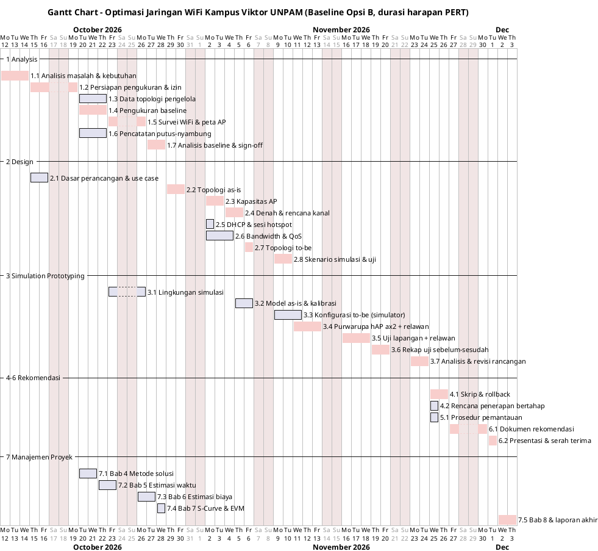

# BAB 5 — ESTIMASI WAKTU

> **Keterangan penanda** (sama dengan bab sebelumnya)
>
> - **[USULAN]** = usulan penyusun, perlu disetujui tim. **[ASUMSI]** = belum dapat dipastikan.

Bab ini menjawab pertanyaan "**kapan selesai, bisa dipercepat, dan seberapa besar peluang terlambat?**" dengan alur dari catatan kuliah:

> Data aktivitas (WBS) → durasi tiga titik (O/M/P) → _forward pass_ → _backward pass_ → _total float_ → **jalur kritis (CPM)** → z-score → **probabilitas selesai ≤ 40 hari**.

Masukannya adalah 32 paket kerja (WP) dan ketergantungannya pada WBS Bab 4 (4.2.2), serta pembagian tugas pada RACI (4.4). Seluruh perhitungan dijalankan dengan skrip dan diperiksa ulang, bukan diperkirakan.

---

## 5.1 Dasar dan Asumsi Estimasi

| Aspek                  | Ketentuan                                                                                                                                                                                 |
| ---------------------- | ----------------------------------------------------------------------------------------------------------------------------------------------------------------------------------------- |
| Satuan durasi          | **Hari kerja** (Senin–Jumat). Target "40 hari" dibaca sebagai **40 hari kerja** **[ASUMSI]**                                                                                              |
| Skala tenaga           | Mahasiswa yang **juga kuliah**: ±3–4 jam kerja proyek per hari, bukan 8 jam penuh **[ASUMSI]**                                                                                            |
| Sumber angka O/M/P     | **Usulan awal penyusun** untuk skala mahasiswa rata-rata **[ASUMSI]**. Penanggung jawab WP (RACI 4.4) mengoreksi angkanya bila berbeda dengan kenyataan                                   |
| Pertimbangan risiko    | Nilai **P (pesimis)** dinaikkan pada WP yang terkena risiko di 4.5, antara lain 1.2 (izin, R-05), 1.3 (data pengelola, R-04), 3.4 (izin AP uji & relawan, R-01/R-06), 3.7 (iterasi, R-11) |
| WP yang sudah berjalan | 1.1, 2.1, dan 7.1 sudah memiliki draf. Durasinya tetap dihitung penuh agar jadwal tidak terlalu optimis; progresnya diakui sebagai EV pada Bab 7                                          |
| Tanggal mulai          | **Senin, 12 Oktober 2026** **[ASUMSI]**                                                                                                                                                   |

**Rumus** (modul bagian 3 dan catatan kuliah):

```
TE  = (O + 4M + P) / 6          durasi harapan
σ   = (P − O) / 6               simpangan baku
Var = σ²                        varians
ES  = maks(EF pendahulu)        mulai paling awal      (forward pass)
EF  = ES + TE                   selesai paling awal
LF  = min(LS penerus)           selesai paling lambat  (backward pass)
LS  = LF − TE                   mulai paling lambat
TF  = LS − ES                   total float; TF = 0 → aktivitas kritis
Z   = (T_target − TE_jalur) / √(Σ Var jalur kritis)
```

---

## 5.2 Tabel Aktivitas (Data O/M/P)

Satuan: hari kerja. O = optimis, M = paling mungkin, P = pesimis.

| Kode | Aktivitas                     | Pendahulu          | O   | M   | P   | TE   | σ    | Var    |
| ---- | ----------------------------- | ------------------ | --- | --- | --- | ---- | ---- | ------ |
| 1.1  | Analisis masalah & kebutuhan  | —                  | 2   | 3   | 5   | 3,17 | 0,50 | 0,2500 |
| 1.2  | Persiapan pengukuran & izin   | 1.1                | 1   | 2   | 5   | 2,33 | 0,67 | 0,4444 |
| 1.3  | Data topologi pengelola       | 1.2                | 1   | 3   | 7   | 3,33 | 1,00 | 1,0000 |
| 1.4  | Pengukuran baseline           | 1.2                | 2   | 3   | 5   | 3,17 | 0,50 | 0,2500 |
| 1.5  | Survei WiFi & peta AP         | 1.2                | 1   | 2   | 3   | 2,00 | 0,33 | 0,1111 |
| 1.6  | Pencatatan putus-nyambung     | 1.2                | 2   | 3   | 5   | 3,17 | 0,50 | 0,2500 |
| 1.7  | Analisis baseline & sign-off  | 1.3, 1.4, 1.5, 1.6 | 1   | 2   | 3   | 2,00 | 0,33 | 0,1111 |
| 2.1  | Dasar perancangan & use case  | 1.1                | 1   | 2   | 3   | 2,00 | 0,33 | 0,1111 |
| 2.2  | Topologi as-is                | 1.7, 2.1           | 1   | 2   | 3   | 2,00 | 0,33 | 0,1111 |
| 2.3  | Kapasitas AP                  | 2.2                | 1   | 2   | 3   | 2,00 | 0,33 | 0,1111 |
| 2.4  | Denah & rencana kanal         | 2.3                | 1   | 2   | 4   | 2,17 | 0,50 | 0,2500 |
| 2.5  | DHCP & sesi hotspot           | 2.2                | 1   | 1   | 2   | 1,17 | 0,17 | 0,0278 |
| 2.6  | Bandwidth & QoS               | 2.2                | 2   | 3   | 5   | 3,17 | 0,50 | 0,2500 |
| 2.7  | Topologi to-be                | 2.4, 2.5, 2.6      | 1   | 1   | 2   | 1,17 | 0,17 | 0,0278 |
| 2.8  | Skenario simulasi & uji       | 2.7                | 1   | 2   | 3   | 2,00 | 0,33 | 0,1111 |
| 3.1  | Lingkungan simulasi           | 2.1                | 1   | 2   | 3   | 2,00 | 0,33 | 0,1111 |
| 3.2  | Model as-is & kalibrasi       | 3.1, 2.2           | 1   | 2   | 4   | 2,17 | 0,50 | 0,2500 |
| 3.3  | Konfigurasi to-be (simulator) | 3.2, 2.7           | 2   | 3   | 5   | 3,17 | 0,50 | 0,2500 |
| 3.4  | Purwarupa hAP ax2 + relawan   | 2.8                | 2   | 3   | 6   | 3,33 | 0,67 | 0,4444 |
| 3.5  | Uji lapangan + relawan        | 2.8                | 1   | 2   | 5   | 2,33 | 0,67 | 0,4444 |
| 3.6  | Rekap uji sebelum-sesudah     | 3.3, 3.4, 3.5      | 1   | 2   | 3   | 2,00 | 0,33 | 0,1111 |
| 3.7  | Analisis & revisi rancangan   | 3.6                | 1   | 2   | 4   | 2,17 | 0,50 | 0,2500 |
| 4.1  | Skrip & rollback              | 3.7                | 1   | 2   | 3   | 2,00 | 0,33 | 0,1111 |
| 4.2  | Rencana penerapan bertahap    | 3.7                | 1   | 1   | 2   | 1,17 | 0,17 | 0,0278 |
| 5.1  | Prosedur pemantauan           | 3.7                | 1   | 1   | 2   | 1,17 | 0,17 | 0,0278 |
| 6.1  | Dokumen rekomendasi           | 4.1, 4.2, 5.1      | 1   | 2   | 3   | 2,00 | 0,33 | 0,1111 |
| 6.2  | Presentasi & serah terima     | 6.1                | 1   | 1   | 3   | 1,33 | 0,33 | 0,1111 |
| 7.1  | Bab 4 Metode solusi           | 1.1                | 1   | 2   | 3   | 2,00 | 0,33 | 0,1111 |
| 7.2  | Bab 5 Estimasi waktu          | 7.1                | 1   | 2   | 3   | 2,00 | 0,33 | 0,1111 |
| 7.3  | Bab 6 Estimasi biaya          | 7.2                | 1   | 2   | 3   | 2,00 | 0,33 | 0,1111 |
| 7.4  | Bab 7 S-Curve & EVM           | 7.3                | 1   | 1   | 2   | 1,17 | 0,17 | 0,0278 |
| 7.5  | Bab 8 & laporan akhir         | 6.2, 7.4           | 1   | 2   | 3   | 2,00 | 0,33 | 0,1111 |

---

## 5.3 Forward Pass, Backward Pass, dan Total Float (CPM Murni)

Perhitungan ini hanya memakai ketergantungan logis dari WBS, dengan anggapan **tenaga kerja tidak terbatas** (asumsi dasar CPM).

| Kode | Aktivitas                     | TE   | ES    | EF    | LS    | LF    | TF    | Kritis |
| ---- | ----------------------------- | ---- | ----- | ----- | ----- | ----- | ----- | :----: |
| 1.1  | Analisis masalah & kebutuhan  | 3,17 | 0,00  | 3,17  | 0,00  | 3,17  | 0,00  | **Ya** |
| 1.2  | Persiapan pengukuran & izin   | 2,33 | 3,17  | 5,50  | 3,17  | 5,50  | 0,00  | **Ya** |
| 1.3  | Data topologi pengelola       | 3,33 | 5,50  | 8,83  | 5,50  | 8,83  | 0,00  | **Ya** |
| 1.4  | Pengukuran baseline           | 3,17 | 5,50  | 8,67  | 5,67  | 8,83  | 0,17  |   —    |
| 1.5  | Survei WiFi & peta AP         | 2,00 | 5,50  | 7,50  | 6,83  | 8,83  | 1,33  |   —    |
| 1.6  | Pencatatan putus-nyambung     | 3,17 | 5,50  | 8,67  | 5,67  | 8,83  | 0,17  |   —    |
| 1.7  | Analisis baseline & sign-off  | 2,00 | 8,83  | 10,83 | 8,83  | 10,83 | 0,00  | **Ya** |
| 2.1  | Dasar perancangan & use case  | 2,00 | 3,17  | 5,17  | 8,83  | 10,83 | 5,67  |   —    |
| 2.2  | Topologi as-is                | 2,00 | 10,83 | 12,83 | 10,83 | 12,83 | 0,00  | **Ya** |
| 2.3  | Kapasitas AP                  | 2,00 | 12,83 | 14,83 | 12,83 | 14,83 | 0,00  | **Ya** |
| 2.4  | Denah & rencana kanal         | 2,17 | 14,83 | 17,00 | 14,83 | 17,00 | 0,00  | **Ya** |
| 2.5  | DHCP & sesi hotspot           | 1,17 | 12,83 | 14,00 | 15,83 | 17,00 | 3,00  |   —    |
| 2.6  | Bandwidth & QoS               | 3,17 | 12,83 | 16,00 | 13,83 | 17,00 | 1,00  |   —    |
| 2.7  | Topologi to-be                | 1,17 | 17,00 | 18,17 | 17,00 | 18,17 | 0,00  | **Ya** |
| 2.8  | Skenario simulasi & uji       | 2,00 | 18,17 | 20,17 | 18,17 | 20,17 | 0,00  | **Ya** |
| 3.1  | Lingkungan simulasi           | 2,00 | 5,17  | 7,17  | 16,17 | 18,17 | 11,00 |   —    |
| 3.2  | Model as-is & kalibrasi       | 2,17 | 12,83 | 15,00 | 18,17 | 20,33 | 5,33  |   —    |
| 3.3  | Konfigurasi to-be (simulator) | 3,17 | 18,17 | 21,33 | 20,33 | 23,50 | 2,17  |   —    |
| 3.4  | Purwarupa hAP ax2 + relawan   | 3,33 | 20,17 | 23,50 | 20,17 | 23,50 | 0,00  | **Ya** |
| 3.5  | Uji lapangan + relawan        | 2,33 | 20,17 | 22,50 | 21,17 | 23,50 | 1,00  |   —    |
| 3.6  | Rekap uji sebelum-sesudah     | 2,00 | 23,50 | 25,50 | 23,50 | 25,50 | 0,00  | **Ya** |
| 3.7  | Analisis & revisi rancangan   | 2,17 | 25,50 | 27,67 | 25,50 | 27,67 | 0,00  | **Ya** |
| 4.1  | Skrip & rollback              | 2,00 | 27,67 | 29,67 | 27,67 | 29,67 | 0,00  | **Ya** |
| 4.2  | Rencana penerapan bertahap    | 1,17 | 27,67 | 28,83 | 28,50 | 29,67 | 0,83  |   —    |
| 5.1  | Prosedur pemantauan           | 1,17 | 27,67 | 28,83 | 28,50 | 29,67 | 0,83  |   —    |
| 6.1  | Dokumen rekomendasi           | 2,00 | 29,67 | 31,67 | 29,67 | 31,67 | 0,00  | **Ya** |
| 6.2  | Presentasi & serah terima     | 1,33 | 31,67 | 33,00 | 31,67 | 33,00 | 0,00  | **Ya** |
| 7.1  | Bab 4 Metode solusi           | 2,00 | 3,17  | 5,17  | 25,83 | 27,83 | 22,67 |   —    |
| 7.2  | Bab 5 Estimasi waktu          | 2,00 | 5,17  | 7,17  | 27,83 | 29,83 | 22,67 |   —    |
| 7.3  | Bab 6 Estimasi biaya          | 2,00 | 7,17  | 9,17  | 29,83 | 31,83 | 22,67 |   —    |
| 7.4  | Bab 7 S-Curve & EVM           | 1,17 | 9,17  | 10,33 | 31,83 | 33,00 | 22,67 |   —    |
| 7.5  | Bab 8 & laporan akhir         | 2,00 | 33,00 | 35,00 | 33,00 | 35,00 | 0,00  | **Ya** |

---

## 5.4 Jalur Kritis dan Probabilitas Selesai (CPM Murni)

**Jalur kritis** (semua WP dengan TF = 0, berurutan):

> 1.1 → 1.2 → 1.3 → 1.7 → 2.2 → 2.3 → 2.4 → 2.7 → 2.8 → 3.4 → 3.6 → 3.7 → 4.1 → 6.1 → 6.2 → 7.5

| Besaran                                   | Nilai                |
| ----------------------------------------- | -------------------- |
| Durasi harapan proyek (Σ TE jalur kritis) | **35,00 hari kerja** |
| Σ Varians jalur kritis                    | 3,6667               |
| σ jalur kritis = √Σ Var                   | 1,915 hari           |
| Target                                    | 40 hari kerja        |
| Z = (40 − 35,00) / 1,915                  | **2,611**            |
| Probabilitas selesai ≤ 40 hari, Φ(Z)      | **99,55%**           |

Nilai Φ(Z) dapat dicocokkan dengan tabel distribusi normal baku pada baris Z ≈ 2,61.

**Penafsiran:** bila **setiap anggota dapat mengerjakan beberapa WP sekaligus**, proyek hampir pasti selesai dalam 40 hari. Anggapan ini **tidak realistis** untuk tim 4 orang, sehingga diperiksa pada 5.5.

---

## 5.5 Pemeriksaan Sumber Daya (_Resource Leveling_)

Saat jadwal 5.3 dicocokkan dengan pembagian tugas awal di RACI, beberapa anggota ternyata dijadwalkan pada **dua atau tiga WP sekaligus**:

| Anggota | WP yang bertabrakan pada jadwal CPM murni                       |
| ------- | --------------------------------------------------------------- |
| Rizky   | 1.2 dengan 7.1–7.2; 3.4 dengan 3.5                              |
| Dzaky   | 1.4, 1.5, dan 1.6 bersamaan; 3.4 dengan 3.5                     |
| Zirlda  | 2.3, 2.5, dan 2.6 bersamaan; 2.6 dengan 2.4                     |
| Vigie   | 3.1 dengan 1.4/1.6; 2.8 dengan 3.3; 3.3, 3.4, dan 3.5 bersamaan |

Jadwal kemudian **diratakan**: setiap anggota hanya mengerjakan satu WP pada satu waktu, dan WP dengan _late start_ (LS) terkecil didahulukan. Dua kebijakan dipakai:

- **WP 1.3** adalah waktu menunggu jawaban pengelola, sehingga tidak memakai tenaga anggota.
- **WP 1.6** (pencatatan putus-nyambung) dilakukan **dalam sesi lapangan yang sama** dengan WP 1.4 (pengukuran baseline), sehingga tidak menambah beban.

| Opsi                                             | Pembagian tugas                                                                                                          | Durasi    | σ         | Z         | P(≤ 40 hari) |
| ------------------------------------------------ | ------------------------------------------------------------------------------------------------------------------------ | --------- | --------- | --------- | ------------ |
| CPM murni (5.4)                                  | Tanpa batas tenaga                                                                                                       | 35,00     | 1,915     | 2,611     | 99,55%       |
| A — pembagian awal                               | WP yang bertabrakan diurutkan saja                                                                                       | 46,67     | 2,000     | -3,333    | 0,04%        |
| **B — alih tugas (mitigasi R-12) — DIPILIH TIM** | 2.5 dikerjakan Dzaky; 2.6 dikerjakan Vigie; 3.3 dikerjakan Zirlda; Zirlda menjadi C pada 3.4 (RACI 4.4 sudah diperbarui) | **39,17** | **1,863** | **0,447** | **67,26%**   |

Perataan menghasilkan **5 ketergantungan sumber daya**. Artinya, sebuah WP harus menunggu WP lain selesai, bukan karena urutan logis, melainkan karena dikerjakan **orang yang sama**:

| Ketergantungan | Keterangan                                           | Anggota yang sama   |
| -------------- | ---------------------------------------------------- | ------------------- |
| 1.4 → 1.5      | Pengukuran baseline → Survei WiFi & peta AP          | Dzaky               |
| 1.4 → 3.1      | Pengukuran baseline → Lingkungan simulasi            | Vigie               |
| 2.6 → 3.2      | Bandwidth & QoS → Model as-is & kalibrasi            | Vigie               |
| 3.4 → 3.5      | Purwarupa hAP ax2 + relawan → Uji lapangan + relawan | Rizky, Dzaky, Vigie |
| 1.2 → 7.1      | Persiapan pengukuran & izin → Bab 4 Metode solusi    | Rizky               |

---

## 5.6 Jadwal Baseline (Opsi B): Forward Pass, Backward Pass, dan Total Float

Ketergantungan sumber daya pada 5.5 ditambahkan ke jaringan WBS, lalu _forward pass_ dan _backward pass_ dihitung ulang. Hasilnya adalah **jadwal baseline** (_schedule baseline_) yang dipakai Bab 6 dan Bab 7. Kolom "Pendahulu" memuat pendahulu logis dan pendahulu sumber daya.

| Kode | Aktivitas                     | Pendahulu          | TE   | ES    | EF    | LS    | LF    | TF    | Kritis |
| ---- | ----------------------------- | ------------------ | ---- | ----- | ----- | ----- | ----- | ----- | :----: |
| 1.1  | Analisis masalah & kebutuhan  | —                  | 3,17 | 0,00  | 3,17  | 0,00  | 3,17  | 0,00  | **Ya** |
| 1.2  | Persiapan pengukuran & izin   | 1.1                | 2,33 | 3,17  | 5,50  | 3,17  | 5,50  | 0,00  | **Ya** |
| 1.3  | Data topologi pengelola       | 1.2                | 3,33 | 5,50  | 8,83  | 7,33  | 10,67 | 1,83  |   —    |
| 1.4  | Pengukuran baseline           | 1.2                | 3,17 | 5,50  | 8,67  | 5,50  | 8,67  | 0,00  | **Ya** |
| 1.5  | Survei WiFi & peta AP         | 1.2, 1.4           | 2,00 | 8,67  | 10,67 | 8,67  | 10,67 | 0,00  | **Ya** |
| 1.6  | Pencatatan putus-nyambung     | 1.2                | 3,17 | 5,50  | 8,67  | 7,50  | 10,67 | 2,00  |   —    |
| 1.7  | Analisis baseline & sign-off  | 1.3, 1.4, 1.5, 1.6 | 2,00 | 10,67 | 12,67 | 10,67 | 12,67 | 0,00  | **Ya** |
| 2.1  | Dasar perancangan & use case  | 1.1                | 2,00 | 3,17  | 5,17  | 10,67 | 12,67 | 7,50  |   —    |
| 2.2  | Topologi as-is                | 1.7, 2.1           | 2,00 | 12,67 | 14,67 | 12,67 | 14,67 | 0,00  | **Ya** |
| 2.3  | Kapasitas AP                  | 2.2                | 2,00 | 14,67 | 16,67 | 14,67 | 16,67 | 0,00  | **Ya** |
| 2.4  | Denah & rencana kanal         | 2.3                | 2,17 | 16,67 | 18,83 | 16,67 | 18,83 | 0,00  | **Ya** |
| 2.5  | DHCP & sesi hotspot           | 2.2                | 1,17 | 14,67 | 15,83 | 17,67 | 18,83 | 3,00  |   —    |
| 2.6  | Bandwidth & QoS               | 2.2                | 3,17 | 14,67 | 17,83 | 15,67 | 18,83 | 1,00  |   —    |
| 2.7  | Topologi to-be                | 2.4, 2.5, 2.6      | 1,17 | 18,83 | 20,00 | 18,83 | 20,00 | 0,00  | **Ya** |
| 2.8  | Skenario simulasi & uji       | 2.7                | 2,00 | 20,00 | 22,00 | 20,00 | 22,00 | 0,00  | **Ya** |
| 3.1  | Lingkungan simulasi           | 2.1, 1.4           | 2,00 | 8,67  | 10,67 | 20,33 | 22,33 | 11,67 |   —    |
| 3.2  | Model as-is & kalibrasi       | 3.1, 2.2, 2.6      | 2,17 | 17,83 | 20,00 | 22,33 | 24,50 | 4,50  |   —    |
| 3.3  | Konfigurasi to-be (simulator) | 3.2, 2.7           | 3,17 | 20,00 | 23,17 | 24,50 | 27,67 | 4,50  |   —    |
| 3.4  | Purwarupa hAP ax2 + relawan   | 2.8                | 3,33 | 22,00 | 25,33 | 22,00 | 25,33 | 0,00  | **Ya** |
| 3.5  | Uji lapangan + relawan        | 2.8, 3.4           | 2,33 | 25,33 | 27,67 | 25,33 | 27,67 | 0,00  | **Ya** |
| 3.6  | Rekap uji sebelum-sesudah     | 3.3, 3.4, 3.5      | 2,00 | 27,67 | 29,67 | 27,67 | 29,67 | 0,00  | **Ya** |
| 3.7  | Analisis & revisi rancangan   | 3.6                | 2,17 | 29,67 | 31,83 | 29,67 | 31,83 | 0,00  | **Ya** |
| 4.1  | Skrip & rollback              | 3.7                | 2,00 | 31,83 | 33,83 | 31,83 | 33,83 | 0,00  | **Ya** |
| 4.2  | Rencana penerapan bertahap    | 3.7                | 1,17 | 31,83 | 33,00 | 32,67 | 33,83 | 0,83  |   —    |
| 5.1  | Prosedur pemantauan           | 3.7                | 1,17 | 31,83 | 33,00 | 32,67 | 33,83 | 0,83  |   —    |
| 6.1  | Dokumen rekomendasi           | 4.1, 4.2, 5.1      | 2,00 | 33,83 | 35,83 | 33,83 | 35,83 | 0,00  | **Ya** |
| 6.2  | Presentasi & serah terima     | 6.1                | 1,33 | 35,83 | 37,17 | 35,83 | 37,17 | 0,00  | **Ya** |
| 7.1  | Bab 4 Metode solusi           | 1.1, 1.2           | 2,00 | 5,50  | 7,50  | 30,00 | 32,00 | 24,50 |   —    |
| 7.2  | Bab 5 Estimasi waktu          | 7.1                | 2,00 | 7,50  | 9,50  | 32,00 | 34,00 | 24,50 |   —    |
| 7.3  | Bab 6 Estimasi biaya          | 7.2                | 2,00 | 9,50  | 11,50 | 34,00 | 36,00 | 24,50 |   —    |
| 7.4  | Bab 7 S-Curve & EVM           | 7.3                | 1,17 | 11,50 | 12,67 | 36,00 | 37,17 | 24,50 |   —    |
| 7.5  | Bab 8 & laporan akhir         | 6.2, 7.4           | 2,00 | 37,17 | 39,17 | 37,17 | 39,17 | 0,00  | **Ya** |

**Rantai kritis baseline** (gabungan ketergantungan logis dan sumber daya):

> 1.1 → 1.2 → 1.4 → 1.5 → 1.7 → 2.2 → 2.3 → 2.4 → 2.7 → 2.8 → 3.4 → 3.5 → 3.6 → 3.7 → 4.1 → 6.1 → 6.2 → 7.5

| Besaran                              | Nilai                |
| ------------------------------------ | -------------------- |
| Durasi harapan proyek                | **39,17 hari kerja** |
| Σ Varians rantai kritis              | 3,4722               |
| σ rantai kritis                      | 1,863 hari           |
| Z = (40 − 39,17) / 1,863             | **0,447**            |
| Probabilitas selesai ≤ 40 hari, Φ(Z) | **67,26%**           |

Nilai Φ(Z) dapat dicocokkan dengan tabel distribusi normal baku pada baris Z ≈ 0,45.

---

## 5.7 Diagram PERT

Diagram jaringan memakai bentuk _activity-on-node_. Setiap kotak WP berisi **enam nilai**:

|    ES (mulai paling awal)    | TE (durasi harapan)  |    EF (selesai paling awal)    |
| :--------------------------: | :------------------: | :----------------------------: |
| **LS (mulai paling lambat)** | **TF (total float)** | **LF (selesai paling lambat)** |

- Kotak **merah muda** dan panah tebal merah = rantai kritis (TF = 0).
- Panah **putus-putus** = ketergantungan sumber daya dari 5.5, dengan nama anggota yang sama.
- PV, EV, dan AC (EVM) tidak dicantumkan di kotak PERT, karena nilainya baru ada setelah biaya per WP dihitung di Bab 6 dan dipantau di Bab 7.

> **Cara generate:** letakkan kursor di dalam blok kode lalu tekan `Alt+D` di VS Code. Diagram ini lebar; perbesar gambar untuk membaca angka.

```plantuml
@startuml Diagram_PERT
skinparam shadowing false
skinparam defaultFontName Arial
skinparam defaultFontSize 11
skinparam rectangle {
  BackgroundColor #FFFFFF
  BorderColor #333333
  RoundCorner 0
}
skinparam ArrowColor #555555
top to bottom direction
skinparam nodesep 25
skinparam ranksep 40
title Diagram PERT (activity-on-node) - Jadwal Baseline Opsi B\nKotak: ES | TE | EF (atas), LS | TF | LF (bawah); merah muda = rantai kritis; garis putus-putus = ketergantungan sumber daya
rectangle "MULAI" as START #EEEEEE
rectangle "SELESAI" as FINISH #EEEEEE
rectangle "<b>1.1 Analisis masalah & kebutuhan</b>\n|= ES |= TE |= EF |\n| 0,00 | 3,17 | 3,17 |\n|= LS |= TF |= LF |\n| 0,00 | 0,00 | 3,17 |" as N1_1 #F8CECC
rectangle "<b>1.2 Persiapan pengukuran & izin</b>\n|= ES |= TE |= EF |\n| 3,17 | 2,33 | 5,50 |\n|= LS |= TF |= LF |\n| 3,17 | 0,00 | 5,50 |" as N1_2 #F8CECC
rectangle "<b>1.3 Data topologi pengelola</b>\n|= ES |= TE |= EF |\n| 5,50 | 3,33 | 8,83 |\n|= LS |= TF |= LF |\n| 7,33 | 1,83 | 10,67 |" as N1_3
rectangle "<b>1.4 Pengukuran baseline</b>\n|= ES |= TE |= EF |\n| 5,50 | 3,17 | 8,67 |\n|= LS |= TF |= LF |\n| 5,50 | 0,00 | 8,67 |" as N1_4 #F8CECC
rectangle "<b>1.5 Survei WiFi & peta AP</b>\n|= ES |= TE |= EF |\n| 8,67 | 2,00 | 10,67 |\n|= LS |= TF |= LF |\n| 8,67 | 0,00 | 10,67 |" as N1_5 #F8CECC
rectangle "<b>1.6 Pencatatan putus-nyambung</b>\n|= ES |= TE |= EF |\n| 5,50 | 3,17 | 8,67 |\n|= LS |= TF |= LF |\n| 7,50 | 2,00 | 10,67 |" as N1_6
rectangle "<b>1.7 Analisis baseline & sign-off</b>\n|= ES |= TE |= EF |\n| 10,67 | 2,00 | 12,67 |\n|= LS |= TF |= LF |\n| 10,67 | 0,00 | 12,67 |" as N1_7 #F8CECC
rectangle "<b>2.1 Dasar perancangan & use case</b>\n|= ES |= TE |= EF |\n| 3,17 | 2,00 | 5,17 |\n|= LS |= TF |= LF |\n| 10,67 | 7,50 | 12,67 |" as N2_1
rectangle "<b>2.2 Topologi as-is</b>\n|= ES |= TE |= EF |\n| 12,67 | 2,00 | 14,67 |\n|= LS |= TF |= LF |\n| 12,67 | 0,00 | 14,67 |" as N2_2 #F8CECC
rectangle "<b>2.3 Kapasitas AP</b>\n|= ES |= TE |= EF |\n| 14,67 | 2,00 | 16,67 |\n|= LS |= TF |= LF |\n| 14,67 | 0,00 | 16,67 |" as N2_3 #F8CECC
rectangle "<b>2.4 Denah & rencana kanal</b>\n|= ES |= TE |= EF |\n| 16,67 | 2,17 | 18,83 |\n|= LS |= TF |= LF |\n| 16,67 | 0,00 | 18,83 |" as N2_4 #F8CECC
rectangle "<b>2.5 DHCP & sesi hotspot</b>\n|= ES |= TE |= EF |\n| 14,67 | 1,17 | 15,83 |\n|= LS |= TF |= LF |\n| 17,67 | 3,00 | 18,83 |" as N2_5
rectangle "<b>2.6 Bandwidth & QoS</b>\n|= ES |= TE |= EF |\n| 14,67 | 3,17 | 17,83 |\n|= LS |= TF |= LF |\n| 15,67 | 1,00 | 18,83 |" as N2_6
rectangle "<b>2.7 Topologi to-be</b>\n|= ES |= TE |= EF |\n| 18,83 | 1,17 | 20,00 |\n|= LS |= TF |= LF |\n| 18,83 | 0,00 | 20,00 |" as N2_7 #F8CECC
rectangle "<b>2.8 Skenario simulasi & uji</b>\n|= ES |= TE |= EF |\n| 20,00 | 2,00 | 22,00 |\n|= LS |= TF |= LF |\n| 20,00 | 0,00 | 22,00 |" as N2_8 #F8CECC
rectangle "<b>3.1 Lingkungan simulasi</b>\n|= ES |= TE |= EF |\n| 8,67 | 2,00 | 10,67 |\n|= LS |= TF |= LF |\n| 20,33 | 11,67 | 22,33 |" as N3_1
rectangle "<b>3.2 Model as-is & kalibrasi</b>\n|= ES |= TE |= EF |\n| 17,83 | 2,17 | 20,00 |\n|= LS |= TF |= LF |\n| 22,33 | 4,50 | 24,50 |" as N3_2
rectangle "<b>3.3 Konfigurasi to-be (simulator)</b>\n|= ES |= TE |= EF |\n| 20,00 | 3,17 | 23,17 |\n|= LS |= TF |= LF |\n| 24,50 | 4,50 | 27,67 |" as N3_3
rectangle "<b>3.4 Purwarupa hAP ax2 + relawan</b>\n|= ES |= TE |= EF |\n| 22,00 | 3,33 | 25,33 |\n|= LS |= TF |= LF |\n| 22,00 | 0,00 | 25,33 |" as N3_4 #F8CECC
rectangle "<b>3.5 Uji lapangan + relawan</b>\n|= ES |= TE |= EF |\n| 25,33 | 2,33 | 27,67 |\n|= LS |= TF |= LF |\n| 25,33 | 0,00 | 27,67 |" as N3_5 #F8CECC
rectangle "<b>3.6 Rekap uji sebelum-sesudah</b>\n|= ES |= TE |= EF |\n| 27,67 | 2,00 | 29,67 |\n|= LS |= TF |= LF |\n| 27,67 | 0,00 | 29,67 |" as N3_6 #F8CECC
rectangle "<b>3.7 Analisis & revisi rancangan</b>\n|= ES |= TE |= EF |\n| 29,67 | 2,17 | 31,83 |\n|= LS |= TF |= LF |\n| 29,67 | 0,00 | 31,83 |" as N3_7 #F8CECC
rectangle "<b>4.1 Skrip & rollback</b>\n|= ES |= TE |= EF |\n| 31,83 | 2,00 | 33,83 |\n|= LS |= TF |= LF |\n| 31,83 | 0,00 | 33,83 |" as N4_1 #F8CECC
rectangle "<b>4.2 Rencana penerapan bertahap</b>\n|= ES |= TE |= EF |\n| 31,83 | 1,17 | 33,00 |\n|= LS |= TF |= LF |\n| 32,67 | 0,83 | 33,83 |" as N4_2
rectangle "<b>5.1 Prosedur pemantauan</b>\n|= ES |= TE |= EF |\n| 31,83 | 1,17 | 33,00 |\n|= LS |= TF |= LF |\n| 32,67 | 0,83 | 33,83 |" as N5_1
rectangle "<b>6.1 Dokumen rekomendasi</b>\n|= ES |= TE |= EF |\n| 33,83 | 2,00 | 35,83 |\n|= LS |= TF |= LF |\n| 33,83 | 0,00 | 35,83 |" as N6_1 #F8CECC
rectangle "<b>6.2 Presentasi & serah terima</b>\n|= ES |= TE |= EF |\n| 35,83 | 1,33 | 37,17 |\n|= LS |= TF |= LF |\n| 35,83 | 0,00 | 37,17 |" as N6_2 #F8CECC
rectangle "<b>7.1 Bab 4 Metode solusi</b>\n|= ES |= TE |= EF |\n| 5,50 | 2,00 | 7,50 |\n|= LS |= TF |= LF |\n| 30,00 | 24,50 | 32,00 |" as N7_1
rectangle "<b>7.2 Bab 5 Estimasi waktu</b>\n|= ES |= TE |= EF |\n| 7,50 | 2,00 | 9,50 |\n|= LS |= TF |= LF |\n| 32,00 | 24,50 | 34,00 |" as N7_2
rectangle "<b>7.3 Bab 6 Estimasi biaya</b>\n|= ES |= TE |= EF |\n| 9,50 | 2,00 | 11,50 |\n|= LS |= TF |= LF |\n| 34,00 | 24,50 | 36,00 |" as N7_3
rectangle "<b>7.4 Bab 7 S-Curve & EVM</b>\n|= ES |= TE |= EF |\n| 11,50 | 1,17 | 12,67 |\n|= LS |= TF |= LF |\n| 36,00 | 24,50 | 37,17 |" as N7_4
rectangle "<b>7.5 Bab 8 & laporan akhir</b>\n|= ES |= TE |= EF |\n| 37,17 | 2,00 | 39,17 |\n|= LS |= TF |= LF |\n| 37,17 | 0,00 | 39,17 |" as N7_5 #F8CECC
START --> N1_1
N1_1 -[#C0392B,bold]-> N1_2
N1_2 --> N1_3
N1_2 -[#C0392B,bold]-> N1_4
N1_2 --> N1_5
N1_2 --> N1_6
N1_3 --> N1_7
N1_4 --> N1_7
N1_5 -[#C0392B,bold]-> N1_7
N1_6 --> N1_7
N1_1 --> N2_1
N1_7 -[#C0392B,bold]-> N2_2
N2_1 --> N2_2
N2_2 -[#C0392B,bold]-> N2_3
N2_3 -[#C0392B,bold]-> N2_4
N2_2 --> N2_5
N2_2 --> N2_6
N2_4 -[#C0392B,bold]-> N2_7
N2_5 --> N2_7
N2_6 --> N2_7
N2_7 -[#C0392B,bold]-> N2_8
N2_1 --> N3_1
N3_1 --> N3_2
N2_2 --> N3_2
N3_2 --> N3_3
N2_7 --> N3_3
N2_8 -[#C0392B,bold]-> N3_4
N2_8 --> N3_5
N3_3 --> N3_6
N3_4 --> N3_6
N3_5 -[#C0392B,bold]-> N3_6
N3_6 -[#C0392B,bold]-> N3_7
N3_7 -[#C0392B,bold]-> N4_1
N3_7 --> N4_2
N3_7 --> N5_1
N4_1 -[#C0392B,bold]-> N6_1
N4_2 --> N6_1
N5_1 --> N6_1
N6_1 -[#C0392B,bold]-> N6_2
N1_1 --> N7_1
N7_1 --> N7_2
N7_2 --> N7_3
N7_3 --> N7_4
N6_2 -[#C0392B,bold]-> N7_5
N7_4 --> N7_5
N1_4 -[#C0392B,dashed]-> N1_5 : Dzaky
N1_4 -[dashed]-> N3_1 : Vigie
N2_6 -[dashed]-> N3_2 : Vigie
N3_4 -[#C0392B,dashed]-> N3_5 : Rizky, Dzaky, Vigie
N1_2 -[dashed]-> N7_1 : Rizky
N7_5 --> FINISH
@enduml
```



---

## 5.8 Jadwal Kalender dan Gantt Chart (Baseline Opsi B)

Hari ke-0 = Senin, 12 Oktober 2026 **[ASUMSI]**; Sabtu–Minggu libur. Tanggal dibulatkan ke hari kerja terdekat.

| Kode | Aktivitas                     | Dikerjakan (R)              | ES    | EF    | Tanggal mulai | Tanggal selesai | Rantai kritis |
| ---- | ----------------------------- | --------------------------- | ----- | ----- | ------------- | --------------- | :-----------: |
| 1.1  | Analisis masalah & kebutuhan  | Dzaky, Zirlda               | 0,00  | 3,17  | 12-10-2026    | 14-10-2026      |    **Ya**     |
| 1.2  | Persiapan pengukuran & izin   | Rizky, Dzaky                | 3,17  | 5,50  | 15-10-2026    | 19-10-2026      |    **Ya**     |
| 1.3  | Data topologi pengelola       | Rizky                       | 5,50  | 8,83  | 20-10-2026    | 22-10-2026      |       —       |
| 1.4  | Pengukuran baseline           | Dzaky, Vigie                | 5,50  | 8,67  | 20-10-2026    | 22-10-2026      |    **Ya**     |
| 1.5  | Survei WiFi & peta AP         | Dzaky, Zirlda               | 8,67  | 10,67 | 23-10-2026    | 26-10-2026      |    **Ya**     |
| 1.6  | Pencatatan putus-nyambung     | Dzaky, Vigie                | 5,50  | 8,67  | 20-10-2026    | 22-10-2026      |       —       |
| 1.7  | Analisis baseline & sign-off  | Dzaky                       | 10,67 | 12,67 | 27-10-2026    | 28-10-2026      |    **Ya**     |
| 2.1  | Dasar perancangan & use case  | Zirlda                      | 3,17  | 5,17  | 15-10-2026    | 16-10-2026      |       —       |
| 2.2  | Topologi as-is                | Zirlda                      | 12,67 | 14,67 | 29-10-2026    | 30-10-2026      |    **Ya**     |
| 2.3  | Kapasitas AP                  | Zirlda                      | 14,67 | 16,67 | 02-11-2026    | 03-11-2026      |    **Ya**     |
| 2.4  | Denah & rencana kanal         | Zirlda                      | 16,67 | 18,83 | 04-11-2026    | 05-11-2026      |    **Ya**     |
| 2.5  | DHCP & sesi hotspot           | Dzaky                       | 14,67 | 15,83 | 02-11-2026    | 02-11-2026      |       —       |
| 2.6  | Bandwidth & QoS               | Vigie                       | 14,67 | 17,83 | 02-11-2026    | 04-11-2026      |       —       |
| 2.7  | Topologi to-be                | Zirlda                      | 18,83 | 20,00 | 06-11-2026    | 06-11-2026      |    **Ya**     |
| 2.8  | Skenario simulasi & uji       | Vigie                       | 20,00 | 22,00 | 09-11-2026    | 10-11-2026      |    **Ya**     |
| 3.1  | Lingkungan simulasi           | Vigie                       | 8,67  | 10,67 | 23-10-2026    | 26-10-2026      |       —       |
| 3.2  | Model as-is & kalibrasi       | Vigie                       | 17,83 | 20,00 | 05-11-2026    | 06-11-2026      |       —       |
| 3.3  | Konfigurasi to-be (simulator) | Zirlda                      | 20,00 | 23,17 | 09-11-2026    | 11-11-2026      |       —       |
| 3.4  | Purwarupa hAP ax2 + relawan   | Rizky, Dzaky, Vigie         | 22,00 | 25,33 | 11-11-2026    | 13-11-2026      |    **Ya**     |
| 3.5  | Uji lapangan + relawan        | Rizky, Dzaky, Vigie         | 25,33 | 27,67 | 16-11-2026    | 18-11-2026      |    **Ya**     |
| 3.6  | Rekap uji sebelum-sesudah     | Vigie                       | 27,67 | 29,67 | 19-11-2026    | 20-11-2026      |    **Ya**     |
| 3.7  | Analisis & revisi rancangan   | Zirlda                      | 29,67 | 31,83 | 23-11-2026    | 24-11-2026      |    **Ya**     |
| 4.1  | Skrip & rollback              | Zirlda, Vigie               | 31,83 | 33,83 | 25-11-2026    | 26-11-2026      |    **Ya**     |
| 4.2  | Rencana penerapan bertahap    | Rizky                       | 31,83 | 33,00 | 25-11-2026    | 25-11-2026      |       —       |
| 5.1  | Prosedur pemantauan           | Dzaky                       | 31,83 | 33,00 | 25-11-2026    | 25-11-2026      |       —       |
| 6.1  | Dokumen rekomendasi           | Rizky, Zirlda               | 33,83 | 35,83 | 27-11-2026    | 30-11-2026      |    **Ya**     |
| 6.2  | Presentasi & serah terima     | Rizky, Dzaky, Zirlda, Vigie | 35,83 | 37,17 | 01-12-2026    | 01-12-2026      |    **Ya**     |
| 7.1  | Bab 4 Metode solusi           | Rizky                       | 5,50  | 7,50  | 20-10-2026    | 21-10-2026      |       —       |
| 7.2  | Bab 5 Estimasi waktu          | Rizky                       | 7,50  | 9,50  | 22-10-2026    | 23-10-2026      |       —       |
| 7.3  | Bab 6 Estimasi biaya          | Rizky                       | 9,50  | 11,50 | 26-10-2026    | 27-10-2026      |       —       |
| 7.4  | Bab 7 S-Curve & EVM           | Rizky                       | 11,50 | 12,67 | 28-10-2026    | 28-10-2026      |       —       |
| 7.5  | Bab 8 & laporan akhir         | Rizky                       | 37,17 | 39,17 | 02-12-2026    | 03-12-2026      |    **Ya**     |

**Perkiraan selesai:** durasi harapan 39,17 hari kerja. Pada Gantt yang dibulatkan per hari, WP terakhir (7.5) selesai **Kamis, 3 Desember 2026**. Batas 40 hari kerja jatuh pada **Jumat, 4 Desember 2026**, sehingga cadangan waktunya hanya sekitar satu hari.

> **Cara generate:** letakkan kursor di dalam blok kode lalu tekan `Alt+D` di VS Code. Batang merah muda = rantai kritis.



---

## 5.9 Durasi yang Layak Dinegosiasikan

Dengan rata-rata 39,17 hari dan σ 1,863 hari (baseline opsi B), durasi untuk beberapa tingkat keyakinan adalah:

| Tingkat keyakinan | Z     | Durasi = TE + Z × σ               |
| ----------------- | ----- | --------------------------------- |
| 50%               | 0,00  | 39,17 + 0,00 × 1,863 = **39,17**  |
| 80%               | 0,84  | 39,17 + 0,84 × 1,863 = **40,73**  |
| 90%               | 1,28  | 39,17 + 1,28 × 1,863 = **41,55**  |
| 95%               | 1,645 | 39,17 + 1,645 × 1,863 = **42,23** |

**Rekomendasi [USULAN]:** ajukan tenggat **42 hari kerja** (keyakinan 90%) bila tenggat masih dapat dinegosiasikan. Bila tenggat 40 hari bersifat tetap, pantau rantai kritis setiap minggu (SPI, 4.3.2), dan majukan pengajuan izin WP 1.2 sebelum proyek resmi dimulai.

---

## 5.10 Kesimpulan Bab

1. **CPM murni:** durasi harapan **35,00 hari kerja**, peluang selesai ≤ 40 hari **99,55%**. Angka ini menganggap tenaga tidak terbatas.
2. **Setelah perataan sumber daya**, pembagian tugas awal (opsi A) membuat proyek molor ke ±46,67 hari kerja, dengan peluang ≤ 40 hari hampir nol.
3. **Baseline yang dipilih tim (opsi B)**: alih tugas 2.5, 2.6, 3.3, dan 3.4 sesuai mitigasi R-12 menghasilkan durasi **39,17 hari kerja**, σ 1,863 hari, dan peluang selesai ≤ 40 hari **67,26%**.
4. Durasi yang aman diajukan adalah **±42 hari kerja** (keyakinan 90%).
5. Seluruh angka O/M/P masih **[ASUMSI]**. Bila penanggung jawab WP mengoreksinya, perhitungan dijalankan ulang dan tabel 5.2–5.9 diperbarui.
