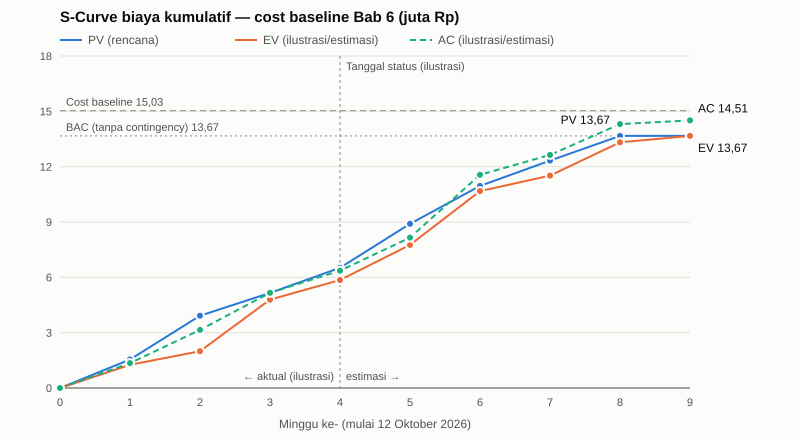

# BAB 7 — S-CURVE DAN EARNED VALUE MANAGEMENT (EVM)

> **Keterangan penanda** (sama dengan bab sebelumnya)
>
> - **[USULAN]** = usulan penyusun. **[ILUSTRASI]** = data simulasi untuk menunjukkan cara pemantauan, **bukan** data nyata.

Bab ini menunjukkan **bagaimana biaya proyek direncanakan dari waktu ke waktu** (_Planned Value_ / S-Curve) dan **bagaimana kinerja dipantau** selama proyek berjalan (EVM). Masukannya adalah jadwal baseline (Bab 5.6), biaya per WP dan cost baseline (Bab 6), serta aturan pengukuran per control account (Bab 4.3.2).

> **Catatan modul (bagian 11).** Pada tahap proposal, yang dapat dibuat dengan data nyata hanya kurva **PV**. Kurva **EV** dan **AC** baru ada setelah proyek berjalan. Agar cara pemantauannya terlihat, EV dan AC pada bab ini dibuat sebagai **simulasi berlabel [ILUSTRASI]** sampai tanggal status, lalu **diteruskan sebagai estimasi** sampai proyek selesai.

---

## 7.1 Besaran dan Rumus EVM

| Besaran | Arti | Rumus |
| ------- | ---- | ----- |
| **PV** (_Planned Value_) | Nilai biaya pekerjaan yang **direncanakan** selesai sampai tanggal tertentu | dari cost baseline yang dibagi per periode |
| **EV** (_Earned Value_) | Nilai anggaran dari pekerjaan yang **benar-benar selesai** | aturan 0/100 dan 50/50 per WP (4.3.2) |
| **AC** (_Actual Cost_) | Biaya yang **benar-benar dikeluarkan** | dicatat per WP |
| **BAC** (_Budget at Completion_) | Anggaran total pekerjaan (tanpa contingency) | Σ biaya WP + biaya tidak langsung |
| SV / CV | Selisih jadwal / selisih biaya | SV = EV − PV; CV = EV − AC |
| **SPI** / **CPI** | Indeks kinerja jadwal / biaya | SPI = EV ÷ PV; CPI = EV ÷ AC |
| EAC | Perkiraan biaya total di akhir proyek | EAC = BAC ÷ CPI |
| ETC | Perkiraan biaya sisa | ETC = EAC − AC |
| VAC | Selisih anggaran di akhir proyek | VAC = BAC − EAC |
| TCPI | Efisiensi biaya yang diperlukan untuk sisa pekerjaan agar tetap sesuai BAC | TCPI = (BAC − EV) ÷ (BAC − AC) |

---

## 7.2 Periodisasi Biaya (Planned Value)

**Cara menyusun** (modul bagian 11):

1. Biaya harapan setiap WP (Bab 6.5) **disebar merata** sepanjang durasinya, dari ES sampai EF pada jadwal baseline (Bab 5.6).
2. Biaya tidak langsung (kuota koordinasi) disebar merata sepanjang proyek.
3. Biaya dijumlahkan per minggu (5 hari kerja), lalu dikumulatifkan.
4. **Contingency reserve (Rp1.366.712) tidak disebar.** Cadangan ini dikelola PM dan ditambahkan di akhir, sehingga **cost baseline = Rp15.033.837** tampil sebagai garis batas pada S-Curve. Management reserve berada di luar baseline dan tidak digambar.

**BAC = Rp13.667.125**, direncanakan selama **8 minggu** (39,17 hari kerja). Pada skenario ilustrasi (7.3), proyek baru selesai di **minggu ke-9**, sehingga tabel diteruskan sampai minggu tersebut. PV tidak bertambah lagi setelah minggu ke-8.

| Minggu | Akhir minggu | PV mingguan | PV kumulatif | % BAC | EV kumulatif | AC kumulatif | Status EV/AC |
| ------ | ------------ | ----------- | ------------ | ----- | ------------ | ------------ | ------------ |
| 1 | 16-10-2026 | Rp1.542.796 | Rp1.542.796 | 11,3% | Rp1.259.812 | Rp1.351.165 | Aktual [ILUSTRASI] |
| 2 | 23-10-2026 | Rp2.377.085 | Rp3.919.881 | 28,7% | Rp1.995.989 | Rp3.147.357 | Aktual [ILUSTRASI] |
| 3 | 30-10-2026 | Rp1.234.772 | Rp5.154.654 | 37,7% | Rp4.793.032 | Rp5.159.178 | Aktual [ILUSTRASI] |
| 4 | 06-11-2026 | Rp1.363.598 | Rp6.518.252 | 47,7% | Rp5.853.637 | Rp6.361.630 | Aktual [ILUSTRASI] |
| 5 | 13-11-2026 | Rp2.385.231 | Rp8.903.483 | 65,1% | Rp7.761.084 | Rp8.156.407 | Estimasi |
| 6 | 20-11-2026 | Rp2.055.659 | Rp10.959.141 | 80,2% | Rp10.677.463 | Rp11.557.758 | Estimasi |
| 7 | 27-11-2026 | Rp1.369.821 | Rp12.328.962 | 90,2% | Rp11.516.530 | Rp12.639.711 | Estimasi |
| 8 | 04-12-2026 | Rp1.338.163 | Rp13.667.125 | 100,0% | Rp13.321.280 | Rp14.305.223 | Estimasi |
| 9 | 08-12-2026 | Rp0 | Rp13.667.125 | 100,0% | Rp13.667.125 | Rp14.507.542 | Estimasi |

---

## 7.3 Skenario Ilustrasi Pemantauan [ILUSTRASI]

Untuk menunjukkan cara membaca EVM, dibuat satu skenario yang **berasal dari risiko di register 4.5**. Tanggal status adalah akhir **minggu ke-4** (06-11-2026).

| Kejadian simulasi | Dasar | Akibat |
| ----------------- | ----- | ------ |
| Izin pengukuran (WP 1.2) terlambat **2 hari kerja** | Risiko R-05 (skor tinggi) | Semua WP sesudahnya ikut bergeser 2 hari |
| Biaya WP lapangan (1.2, 1.4–1.6, 3.4, 3.5) **15% di atas rencana** | Kunjungan tambahan akibat jadwal bergeser | AC lebih besar dari EV pada WP tersebut |

EV dihitung dengan aturan 4.3.2: **0/100** untuk WP yang selesai dalam satu minggu, **50/50** untuk WP yang melewati lebih dari satu minggu. Biaya tidak langsung diperlakukan sebagai _level of effort_ (EV = PV).

**Estimasi setelah tanggal status.** EV dan AC untuk minggu ke-5 sampai ke-9 diperkirakan dengan anggapan skenario **berlanjut tanpa tindakan korektif**: pergeseran 2 hari tetap terbawa sampai akhir, dan WP lapangan berikutnya (3.4, 3.5) juga 15% di atas rencana. Hasilnya adalah gambaran "apa yang terjadi bila tidak ada tindakan", sebagai pembanding untuk tindakan korektif pada 7.6.

---

## 7.4 S-Curve



_Gambar 7.1 — S-Curve biaya kumulatif (juta Rp). PV dari cost baseline Bab 6. EV dan AC adalah **data ilustrasi** sampai tanggal status (minggu ke-4) dan **estimasi** sesudahnya, sampai proyek selesai di minggu ke-9. Garis putus-putus mendatar = cost baseline (termasuk contingency); garis titik = BAC. Data lengkap ada pada tabel 7.2._

**Cara membaca:**

- Kurva **PV** naik paling curam di **minggu 2** (pengukuran lapangan 1.4–1.6 dikerjakan bersamaan dengan penulisan Bab 4–5) dan **minggu 5–6** (uji purwarupa dan uji lapangan bersama relawan, termasuk biaya konsumsinya). Kurva melandai di minggu 7–8 saat tinggal pekerjaan dokumen dan serah terima.
- Pada minggu ke-4, **EV berada di bawah PV**: pekerjaan yang selesai lebih sedikit dari rencana, artinya **terlambat**.
- **AC berada di atas EV**: biaya yang keluar lebih besar dari nilai pekerjaan yang selesai, artinya **boros**.
- Bila tidak ada tindakan (estimasi), **EV baru menyentuh BAC di minggu ke-9**, satu minggu setelah PV. Jarak mendatar antara kurva PV dan EV menunjukkan **keterlambatan**.
- **AC berakhir di Rp14.507.542**, di atas BAC tetapi **masih di bawah cost baseline**. Jarak tegak antara kurva EV dan AC di akhir menunjukkan **kelebihan biaya** yang harus ditutup contingency.

---

## 7.5 Indikator Kinerja pada Tanggal Status [ILUSTRASI]

| Indikator | Nilai | Penafsiran (batas toleransi 4.3.2) |
| --------- | ----- | ---------------------------------- |
| PV | Rp6.518.252 | 47,7% BAC direncanakan selesai |
| EV | Rp5.853.637 | 42,8% BAC benar-benar selesai |
| AC | Rp6.361.630 | Biaya yang sudah keluar |
| SV = EV − PV | −Rp664.615 | Negatif → terlambat |
| CV = EV − AC | −Rp507.993 | Negatif → boros |
| **SPI** | **0,898** | **< 0,9 — tindakan korektif** |
| **CPI** | **0,920** | **0,9–1,0 — dipantau** |
| **EAC** = BAC ÷ CPI | **Rp14.853.192** | Perkiraan biaya akhir; masih di bawah cost baseline Rp15.033.837 |
| ETC = EAC − AC | Rp8.491.562 | Biaya yang masih dibutuhkan |
| VAC = BAC − EAC | −Rp1.186.067 | Perkiraan kelebihan biaya di atas BAC; ditutup contingency |
| TCPI | 1,070 | Sisa pekerjaan harus 1,070× lebih efisien agar tetap sesuai BAC |
| Perkiraan durasi ≈ durasi rencana ÷ SPI | ±43,62 hari kerja | Perkiraan kasar; melewati target 40 hari kerja |

> SPI berbasis biaya cenderung kembali mendekati 1 di akhir proyek, karena pada akhirnya EV = PV = BAC. Karena itu, keterlambatan juga dipantau langsung dari **rantai kritis** pada Gantt (Bab 5.8).

**Kondisi akhir proyek bila tidak ada tindakan korektif (estimasi):**

| Indikator | Nilai | Penafsiran |
| --------- | ----- | ---------- |
| Selesai | Hari kerja ke-41,17 (08-12-2026), minggu ke-9 | Melewati target 40 hari kerja |
| EV akhir | Rp13.667.125 | Seluruh pekerjaan selesai (= BAC) |
| AC akhir | **Rp14.507.542** | Biaya akhir; masih di bawah cost baseline Rp15.033.837 (sisa Rp526.295) |
| CPI akhir = BAC ÷ AC | 0,942 | Lebih baik dari CPI minggu ke-4, karena sebagian besar WP sesudahnya bukan WP lapangan |
| VAC akhir = BAC − AC | −Rp840.418 | Kelebihan di atas BAC; tertutup contingency |
| SPI akhir | 1,000 | Selalu 1 saat selesai (keterbatasan SPI berbasis biaya); keterlambatan terlihat dari tanggal selesai |
| Selisih EAC minggu ke-4 dengan AC akhir | Rp345.649 | EAC = BAC ÷ CPI sedikit terlalu pesimis karena menganggap CPI minggu ke-4 berlaku untuk seluruh sisa pekerjaan |

---

## 7.6 Tindakan Korektif pada Skenario Ilustrasi [USULAN]

Sesuai kebijakan 4.3.2, **SPI < 0,9 memicu tindakan korektif**, sedangkan **CPI 0,9–1,0 dipantau**.

| Masalah | Tindakan | Penanggung jawab |
| ------- | -------- | ---------------- |
| Jadwal terlambat (SPI 0,898) | Kerjakan WP yang tidak saling bergantung secara paralel bila anggotanya berbeda (misalnya 3.1 lebih awal); majukan rekrutmen relawan untuk 3.4–3.5; ajukan izin AP uji sekaligus dengan izin pengukuran | Rizky (PM) bersama penanggung jawab CA |
| Biaya lapangan berlebih (CPI 0,920) | Gabungkan kunjungan lapangan pada hari yang sama dengan jadwal kuliah; tekan jumlah sesi relawan tanpa mengurangi data | Dzaky (CA-01), Vigie (CA-03) |
| EAC melebihi BAC | Selisih (−Rp1.186.067) ditutup **contingency reserve** (Rp1.366.712); management reserve belum perlu dipakai | Rizky (PM) |

---

## 7.7 Kode Python (matplotlib)

Kode berikut menghasilkan grafik yang sama dengan Gambar 7.1. Data diambil dari tabel 7.2 dalam satuan juta rupiah (minggu ke-0 sampai ke-9). Jalankan dengan `pip install matplotlib`, lalu `python s_curve.py`.

```python
import matplotlib.pyplot as plt

pv = [0.000, 1.543, 3.920, 5.155, 6.518, 8.903, 10.959, 12.329, 13.667, 13.667]          # PV kumulatif (rencana)
ev = [0.000, 1.260, 1.996, 4.793, 5.854, 7.761, 10.677, 11.517, 13.321, 13.667]          # EV kumulatif: ilustrasi s.d. minggu ke-4, estimasi sesudahnya
ac = [0.000, 1.351, 3.147, 5.159, 6.362, 8.156, 11.558, 12.640, 14.305, 14.508]          # AC kumulatif: ilustrasi s.d. minggu ke-4, estimasi sesudahnya
minggu = list(range(len(pv)))
status = 4             # tanggal status (akhir minggu ke-4)
cost_baseline = 15.034
bac = 13.667

fig, ax = plt.subplots(figsize=(9, 5))
ax.plot(minggu, pv, color="#2a78d6", lw=2, marker="o", label="PV (rencana)")
ax.plot(minggu, ev, color="#eb6834", lw=2, marker="o", label="EV (ilustrasi/estimasi)")
ax.plot(minggu, ac, color="#1baf7a", lw=2, marker="o", ls="--", label="AC (ilustrasi/estimasi)")
ax.axhline(cost_baseline, color="#8a8984", lw=1, ls="--")
ax.axhline(bac, color="#8a8984", lw=1, ls=":")
ax.text(0.1, cost_baseline + 0.2, f"Cost baseline {cost_baseline:.2f}", fontsize=9)
ax.text(0.1, bac + 0.2, f"BAC {bac:.2f}", fontsize=9)
ax.axvline(status, color="#8a8984", lw=1, ls=":")
ax.text(status + 0.08, 17, "Tanggal status (ilustrasi)", fontsize=9)
ax.text(status - 0.08, 0.4, "aktual (ilustrasi)", ha="right", fontsize=9)
ax.text(status + 0.08, 0.4, "estimasi", fontsize=9)
ax.set_xlabel("Minggu ke- (mulai 12 Oktober 2026)")
ax.set_ylabel("Biaya kumulatif (juta Rp)")
ax.set_title("S-Curve Biaya Proyek Optimasi Jaringan WiFi Kampus Viktor UNPAM")
ax.set_ylim(0, 18)
ax.grid(axis="y", color="#e1e0d9")
ax.spines[["top", "right"]].set_visible(False)
ax.legend(frameon=False, loc="upper left")
fig.tight_layout()
fig.savefig("s_curve.png", dpi=200)
plt.show()
```

---

## 7.8 Kesimpulan Bab

1. **PV (rencana)** menyebar BAC **Rp13.667.125** selama 8 minggu mengikuti jadwal baseline. **Cost baseline Rp15.033.837** (termasuk contingency) menjadi batas atas kurva.
2. EVM dipantau **mingguan** per control account dengan SPI dan CPI, memakai batas toleransi 0,9.
3. Skenario ilustrasi (izin terlambat 2 hari dan biaya lapangan +15%) menghasilkan **SPI 0,898** (perlu tindakan korektif) dan **CPI 0,920** (dipantau) pada minggu ke-4.
4. Bila tidak ada tindakan korektif, kurva EV dan AC diperkirakan berakhir di **minggu ke-9** (hari kerja ke-41,17, melewati target 40 hari) dengan **biaya akhir Rp14.507.542**. Biaya akhir ini masih tertutup cost baseline. Jadi skenario ini lebih mengancam **jadwal** daripada biaya, dan risiko R-05 (izin) adalah risiko yang paling perlu dicegah sejak awal.
5. Setelah proyek berjalan, kolom EV dan AC pada tabel 7.2 diganti dengan data nyata setiap minggu, lalu grafik digambar ulang.
