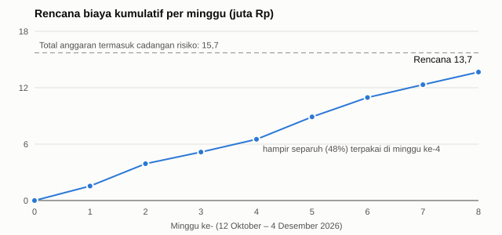

# EXECUTIVE SUMMARY

**Optimasi Jaringan WiFi Kampus Viktor UNPAM agar Dosen Dapat Mengisi Presensi dengan Lancar**
Kelompok 2 — Teknik Informatika, Universitas Pamulang · Oktober 2026

> _Catatan penyusunan: ringkasan ini ditulis paling akhir, tetapi diletakkan di **halaman awal** proposal (modul bagian 12). Seluruh angka berasal dari Bab 5–7._

---

**1. Masalah.** Dosen di Kampus Viktor sering tidak bisa membuka presensi dan validasi kegiatan mahasiswa dengan lancar dari dalam kelas. WiFi kampus putus-nyambung dan lambat pada jam kuliah, karena satu titik pancar WiFi melayani sekitar 100 mahasiswa. Pelanggan WiFi berbayar pun hanya mendapat ½–⅓ kecepatan paketnya. Akibatnya, presensi ditunda atau dicatat manual lalu diketik ulang, sehingga waktu mengajar terpotong.

**2. Solusi.** Kami **mengatur ulang jaringan WiFi yang sudah ada**, bukan membeli perangkat atau membuat aplikasi baru:

- menata kapasitas dan saluran titik pancar WiFi agar koneksi tidak putus;
- mendahulukan lalu lintas portal akademik saat jaringan padat.

Setiap perubahan diuji dulu di komputer, di router uji milik tim, dan bersama mahasiswa relawan. Hasilnya diserahkan kepada pengelola jaringan UNPAM sebagai **panduan pengaturan siap pakai**, tanpa mengganggu jaringan yang sedang berjalan.

**3. Hasil dan manfaat.**

- **Dosen:** halaman presensi terbuka dalam ±3 detik, dan koneksi tidak putus selama satu sesi kuliah (target).
- **Mahasiswa pelanggan:** kecepatan mendekati paket yang dibayar.
- **Pengelola jaringan:** memperoleh data kondisi jaringan yang terukur dan pengaturan yang sudah teruji.
- **Kampus:** mengetahui apakah perlu menambah perangkat, berdasarkan data, bukan perkiraan.

**4. Waktu: 8 minggu, 12 Oktober – 4 Desember 2026.**

| Tahap                                               | Selesai           |
| --------------------------------------------------- | ----------------- |
| Pengukuran kondisi jaringan di lantai sampel        | 28 Oktober 2026   |
| Rancangan perbaikan jaringan                        | 10 November 2026  |
| Uji coba dan penyempurnaan rancangan                | 24 November 2026  |
| Serah terima panduan ke pengelola dan laporan akhir | 1–3 Desember 2026 |

Peluang selesai tepat dalam 40 hari kerja sekitar **67%**. Agar aman, kami mengusulkan tenggat **42 hari kerja (8 Desember 2026)**.

**5. Biaya: total Rp15,7 juta (sudah termasuk cadangan risiko).**

| Kelompok biaya                                              | Nilai           |
| ----------------------------------------------------------- | --------------- |
| Tenaga kerja tim (dihitung dari UMK Tangerang Selatan 2026) | Rp11,4 juta     |
| Kegiatan lapangan: bensin, konsumsi relawan, cetak          | Rp1,8 juta      |
| Komunikasi tim                                              | Rp0,4 juta      |
| Cadangan risiko                                             | Rp2,1 juta      |
| **Total**                                                   | **Rp15,7 juta** |

Uang yang **benar-benar keluar hanya sekitar Rp2,2 juta**. Sisanya adalah nilai kerja anggota tim. Perangkat uji dan laptop milik anggota, sehingga **tidak ada pembelian**. Setelah panduan diterapkan, **tidak ada biaya bulanan baru**. Bila hasil kajian menyarankan tambahan titik pancar WiFi, keputusan pembeliannya dibuat terpisah oleh kampus.

**6. Rencana pengeluaran.**

_Pengeluaran naik bertahap selama 8 minggu dan tetap di bawah total anggaran. Hampir separuh terpakai di minggu ke-4._

**7. Rekomendasi dan langkah berikutnya.**

1. **Setujui proposal dan anggaran Rp15,7 juta** (uang tunai ±Rp2,2 juta).
2. **Berikan izin pengukuran dan uji coba di lantai sampel sejak minggu pertama.** Izin adalah faktor yang paling menentukan ketepatan waktu proyek.
3. **Tetapkan tenggat 42 hari kerja** bila memungkinkan, agar hasil tidak dikejar waktu.
