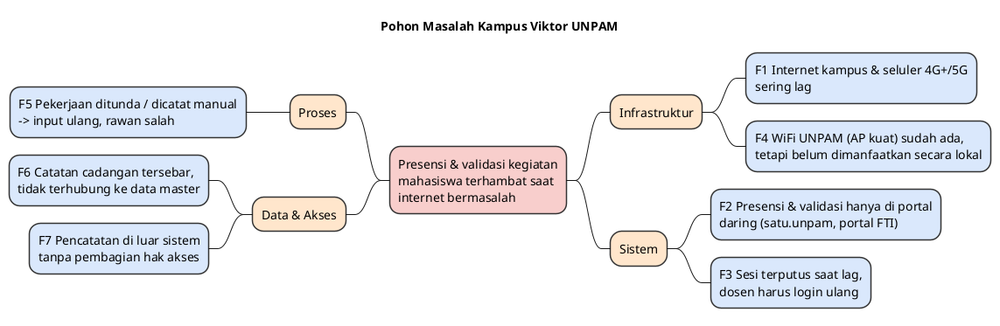
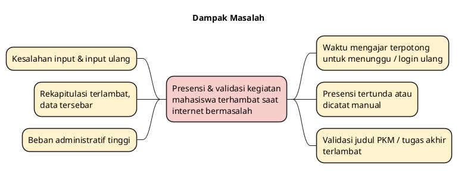

# BAB 1 — ANALISIS MASALAH

|                   |                                                                                                                                                                      |
| ----------------- | -------------------------------------------------------------------------------------------------------------------------------------------------------------------- |
| **Judul Proyek**  | Rancang Bangun Sistem Presensi dan Validasi Kegiatan Mahasiswa Berbasis Web Intranet On-Premise Menggunakan Metode Waterfall pada Jaringan Lokal Kampus Viktor UNPAM |
| **Kelompok**      | Kelompok 2                                                                                                                                                           |
| **Anggota**       | 1. Dzaky Alfareza 2. Rizky Zehan's Onassis 3. Muhammad Zirlda Prairi 4. Vigie Afrilza Wibowo                                                                |
| **Program Studi** | Teknik Informatika, Fakultas Ilmu Komputer, Universitas Pamulang                                                                                                     |
| **Tahun**         | 2026                                                                                                                                                                 |

> **Keterangan penanda**
>
> - **[FAKTA-L]** = fakta lapangan, hasil pengamatan langsung anggota kelompok di Kampus Viktor UNPAM.
> - **[FAKTA-D]** = berasal dari dokumen identifikasi masalah Kelompok 2.
> - **[USULAN]** = usulan atau penafsiran penyusun, perlu disetujui tim.
> - **[ASUMSI]** = hal yang belum dapat dipastikan dan menjadi risiko proyek.
>
> _Catatan: judul proyek diperluas dari "Sistem Presensi" menjadi "Sistem Presensi dan Validasi Kegiatan Mahasiswa" sesuai keputusan tim **[USULAN]**._

---

## 1.1 Latar Belakang

Dosen di Kampus Viktor UNPAM menjalankan banyak tugas administrasi akademik melalui layanan daring. Dua tugas yang paling sering dilakukan adalah:

1. **Presensi perkuliahan**, yaitu mencatat kehadiran mahasiswa pada setiap pertemuan.
2. **Validasi kegiatan mahasiswa**, misalnya menyetujui judul kegiatan pengabdian kepada masyarakat, judul tugas akhir, dan pengajuan kegiatan lainnya **[FAKTA-L]**.

Universitas Pamulang sudah memiliki layanan daring yang terintegrasi, yaitu portal **MyUNPAM / satu.unpam.ac.id**, serta **portal FTI UNPAM** **[FAKTA-L]**. Namun, kedua portal tersebut berada di internet sehingga hanya dapat dipakai bila koneksi internet tersedia dan stabil.

Di Kampus Viktor, koneksi internet sering sulit dan tidak stabil **[FAKTA-L]**. Akibatnya:

- Halaman portal lama dimuat (_loading_ lama).
- Koneksi yang _lag_ membuat sesi akses terputus (_restart_), sehingga dosen **harus login kembali** dan mengulang pekerjaannya **[FAKTA-L]**.
- Semua ini terjadi **ketika dosen sedang mengajar di kelas**, sehingga waktu perkuliahan terpotong untuk urusan administrasi **[FAKTA-L]**.

Beralih ke data seluler juga tidak menyelesaikan masalah. Walaupun sinyal seluler di kampus sudah 4G+ hingga 5G, akses internet tetap sering _lag_ **[FAKTA-L]**. Jadi, menggunakan _hotspot_ pribadi bukan jalan keluar yang andal.

Saat internet bermasalah, ada dosen yang **menunda** presensi atau validasi hingga koneksi pulih, dan ada pula yang **mencatatnya secara manual** lalu menginput ulang ke portal **[FAKTA-L]**. Kondisi ini sejalan dengan temuan dokumen Kelompok 2, yaitu kesalahan input, rekapitulasi terlambat, data sulit dicari dan diperiksa, data tersebar, dan hak akses yang belum terpisah jelas **[FAKTA-D]**.

Di sisi lain, jaringan **WiFi UNPAM** sudah terpasang dan sinyal _access point_ (AP) di kampus kuat **[FAKTA-L]**. Artinya, yang bermasalah adalah jalur keluar ke internet, bukan jaringan lokalnya. Perangkat dosen dan mahasiswa tetap dapat terhubung dengan baik ke AP walaupun internet sedang lambat atau terputus.

Dari kondisi tersebut muncul gagasan: **jika jaringan WiFi UNPAM sudah ada dan sinyal AP-nya lancar, mengapa tidak memanfaatkannya untuk layanan web yang berjalan secara lokal (intranet), tanpa bergantung pada internet?** Server ditempatkan di dalam kampus (_on-premise_). Dosen dan mahasiswa cukup terhubung ke WiFi UNPAM, membuka alamat web lokal, lalu melakukan presensi atau validasi kegiatan. Karena lalu lintasnya tidak keluar ke internet, halaman dimuat cepat dan sesi login tidak terputus akibat _lag_. Data tersimpan di basis data server lokal kampus.

Informasi tentang API portal satu.unpam.ac.id maupun portal FTI **tidak tersedia** bagi kelompok **[FAKTA-L]**. Karena itu, sistem ini dibangun sebagai **sistem baru yang berdiri sendiri** (_standalone_) dan tidak bergantung pada portal yang sudah ada. Agar data tetap dapat sampai ke pusat, sistem menyediakan **ekspor rekap (Excel/CSV)** dan dirancang **siap sinkronisasi**. Di kemudian hari, sistem ini dapat dilengkapi **API khusus** yang dipasang di **server pusat UNPAM**. Server pusat memiliki koneksi internet khusus yang lebih andal **[FAKTA-L]**, sehingga server lokal Kampus Viktor cukup mengirim data ke API tersebut ketika koneksi tersedia **[USULAN]**.

Berdasarkan hal tersebut, Kelompok 2 mengusulkan pembangunan **Sistem Presensi dan Validasi Kegiatan Mahasiswa Berbasis Web Intranet On-Premise** di jaringan lokal Kampus Viktor UNPAM dengan metode pengembangan **Waterfall** (Analisis Kebutuhan → Perancangan → Implementasi → Pengujian → Pemeliharaan). Sistem ini **bukan pengganti** portal satu.unpam.ac.id maupun portal FTI, melainkan **pendamping** agar pekerjaan dosen di kelas tetap berjalan saat internet bermasalah **[USULAN]**.

---

## 1.2 Identifikasi Masalah

Faktor penyebab masalah:

| Kode | Faktor Penyebab                                                                                                                                          | Sumber                |
| ---- | -------------------------------------------------------------------------------------------------------------------------------------------------------- | --------------------- |
| F1   | Koneksi internet di Kampus Viktor sering sulit dan tidak stabil, baik lewat WiFi kampus maupun data seluler 4G+/5G.                                      | [FAKTA-L]             |
| F2   | Presensi dan validasi kegiatan mahasiswa hanya tersedia di portal daring (satu.unpam.ac.id, portal FTI) yang wajib internet; tidak ada alternatif lokal. | [FAKTA-L]             |
| F3   | Koneksi yang _lag_ membuat sesi portal terputus sehingga dosen harus login ulang dan mengulang pekerjaan, di tengah waktu mengajar.                      | [FAKTA-L]             |
| F4   | Jaringan WiFi UNPAM dengan sinyal AP yang kuat sudah tersedia, tetapi belum dimanfaatkan untuk layanan lokal.                                            | [FAKTA-L]             |
| F5   | Saat gangguan, presensi/validasi ditunda atau dicatat manual lalu diinput ulang, sehingga rawan salah catat dan rekap terlambat.                         | [FAKTA-L] + [FAKTA-D] |
| F6   | Catatan cadangan tersebar dan tidak terhubung dengan data mahasiswa, dosen, mata kuliah, kelas, dan jadwal.                                              | [FAKTA-D]             |
| F7   | Pencatatan di luar sistem tidak memiliki pembagian hak akses yang jelas antara mahasiswa, dosen, dan admin.                                              | [FAKTA-D]             |

Pengelompokan faktor penyebab **[USULAN]**:

| Kelompok      | Uraian                                                              | Faktor |
| ------------- | ------------------------------------------------------------------- | ------ |
| Infrastruktur | Internet tidak stabil; WiFi lokal belum dimanfaatkan                | F1, F4 |
| Sistem        | Layanan hanya daring; sesi mudah terputus saat _lag_                | F2, F3 |
| Proses        | Pekerjaan ditunda atau dicatat manual, input ulang, rekap terlambat | F5     |
| Data & Akses  | Data cadangan tersebar, tidak terhubung, tanpa hak akses            | F6, F7 |

---

## 1.3 Prioritas Masalah

Prioritas disusun ulang dari dokumen Kelompok 2 **[FAKTA-D]** dengan menyesuaikan fakta lapangan **[FAKTA-L]**. Penyesuaian urutan adalah **[USULAN]**.

| No  | Prioritas | Masalah                                                                                                                                        | Faktor     |
| --- | --------- | ---------------------------------------------------------------------------------------------------------------------------------------------- | ---------- |
| M1  | Tinggi    | Presensi perkuliahan tidak dapat dilakukan dengan lancar ketika internet bermasalah; dosen harus menunggu atau login ulang di tengah mengajar. | F1, F2, F3 |
| M2  | Tinggi    | Presensi yang ditunda/dicatat di luar sistem tidak terstruktur, sehingga rawan salah dan rekap terlambat.                                      | F5, F6     |
| M3  | Tinggi    | Validasi kegiatan mahasiswa (judul pengabdian kepada masyarakat, judul tugas akhir, dll.) oleh dosen sering terhambat _lag_ dan sesi terputus. | F1, F2, F3 |
| M4  | Sedang    | Data dari sistem lokal harus dapat diteruskan ke pusat tanpa input ulang dari nol (ekspor sekarang, API khusus di server pusat nantinya).      | F2, F5     |
| M5  | Sedang    | Data master (mahasiswa, dosen, mata kuliah, kelas, jadwal) harus terhubung ke presensi dan kegiatan mahasiswa.                                 | F6         |
| M6  | Rendah    | Akses sistem lokal perlu dibatasi hanya dari WiFi/intranet kampus dan sesuai hak akses per peran.                                              | F4, F7     |

Makna prioritas untuk proyek:

- **M1, M2, M3** adalah inti sistem: modul **presensi** dan modul **validasi kegiatan mahasiswa** yang tetap berjalan tanpa internet, didukung basis data lokal yang terstruktur. Ketiganya menjadi pertimbangan utama pada penentuan jalur kritis serta bobot risiko.
- **M4, M5** adalah fitur pendukung inti: **ekspor rekap & kesiapan sinkronisasi ke pusat** serta manajemen data master.
- **M6** dipenuhi melalui konfigurasi jaringan, deployment on-premise, serta autentikasi dan otorisasi.

---

## 1.4 Analisis Kesenjangan (Gap Analysis)

Kesenjangan utama: UNPAM sudah memiliki layanan daring yang terintegrasi, tetapi **belum ada layanan presensi dan validasi kegiatan yang tetap berjalan lancar ketika internet di Kampus Viktor bermasalah**, padahal infrastruktur WiFi lokal sudah tersedia dan memadai **[FAKTA-L]**. Akibatnya, pekerjaan administrasi dosen terganggu saat mengajar, dan data pada saat gangguan tidak terpusat sehingga beban administratif bertambah **[FAKTA-D]**.

Perbandingan kondisi saat ini dan kondisi yang diharapkan **[USULAN, disusun dari fakta]**:

| Aspek                   | Kondisi Saat Ini (As-Is)                                             | Kondisi Harapan (To-Be)                                                            |
| ----------------------- | -------------------------------------------------------------------- | ---------------------------------------------------------------------------------- |
| Ketergantungan          | Presensi & validasi hanya lewat portal daring, wajib internet        | Presensi & validasi lewat web lokal di WiFi UNPAM, tidak wajib internet            |
| Kecepatan & sesi        | _Loading_ lama; sesi terputus saat _lag_, harus login ulang          | Halaman dimuat dari server lokal; sesi stabil selama terhubung ke WiFi             |
| Pemanfaatan jaringan    | WiFi/AP kuat, tetapi hanya dipakai sebagai jalur ke internet         | WiFi/AP dipakai langsung untuk mengakses server lokal                              |
| Pekerjaan saat gangguan | Ditunda atau dicatat manual, rawan salah catat                       | Tetap tercatat di sistem, ada bukti presensi/validasi berhasil                     |
| Validasi kegiatan       | Dosen menunggu koneksi untuk menyetujui judul PKM, tugas akhir, dll. | Dosen memvalidasi pengajuan mahasiswa langsung dari jaringan lokal                 |
| Penyimpanan data        | Catatan cadangan tersebar                                            | Satu basis data relasional di server kampus                                        |
| Pengiriman ke pusat     | Input ulang manual ke portal                                         | Ekspor rekap Excel/CSV; siap disinkronkan ke API khusus di server pusat (tahap lanjut) |
| Rekapitulasi            | Manual, lambat                                                       | Rekap otomatis per mahasiswa, kelas, mata kuliah                                   |
| Hak akses               | Catatan cadangan tanpa kontrol akses                                 | Login & otorisasi per peran (Mahasiswa, Dosen, Admin)                              |
| Lingkup akses           | —                                                                    | Hanya dari intranet/WiFi Kampus Viktor (on-premise)                                |

---

## 1.5 Rumusan Masalah

**[USULAN, diturunkan dari M1–M6]**

1. **RM1.** Bagaimana merancang sistem presensi berbasis web yang berjalan di jaringan lokal WiFi UNPAM sehingga presensi tetap lancar saat internet terputus atau _lag_? _(M1, M2)_
2. **RM2.** Bagaimana merancang modul validasi kegiatan mahasiswa (judul pengabdian kepada masyarakat, judul tugas akhir, dll.) yang dapat diproses dosen melalui jaringan lokal? _(M3)_
3. **RM3.** Bagaimana merancang basis data terstruktur di server lokal yang menghubungkan data mahasiswa, dosen, mata kuliah, kelas, jadwal, presensi, dan kegiatan mahasiswa? _(M2, M5)_
4. **RM4.** Bagaimana merancang sistem yang berdiri sendiri, tetapi datanya dapat diekspor sekarang dan siap disinkronkan ke API khusus di server pusat UNPAM di kemudian hari, tanpa data ganda atau hilang? _(M4)_
5. **RM5.** Bagaimana menerapkan autentikasi, pembagian hak akses per peran, dan pembatasan akses hanya dari intranet kampus? _(M6)_
6. **RM6.** Berapa estimasi waktu dan biaya yang layak untuk membangun sistem tersebut dengan metode Waterfall? _(kebutuhan manajemen proyek)_

---

## 1.6 Tujuan

1. **T1.** Menghasilkan modul presensi web intranet yang tetap dapat digunakan tanpa koneksi internet, cukup melalui WiFi UNPAM.
2. **T2.** Menghasilkan modul validasi kegiatan mahasiswa sehingga dosen dapat menyetujui, menolak, atau meminta revisi pengajuan tanpa terhambat koneksi internet.
3. **T3.** Menghasilkan rancangan basis data relasional di server lokal yang menjaga konsistensi data antarentitas.
4. **T4.** Menyediakan ekspor rekap (Excel/CSV) dan rancangan data yang siap disinkronkan ke API khusus di server pusat UNPAM.
5. **T5.** Menerapkan login, otorisasi per peran, dan pembatasan akses hanya dari intranet kampus.
6. **T6.** Menyusun estimasi waktu dan biaya proyek dengan beberapa teknik estimasi, lengkap dengan cost baseline dan S-Curve.

---

## 1.7 Batasan Masalah (Ruang Lingkup)

**Termasuk dalam lingkup:**

- **B1.** Pengguna sistem: Mahasiswa, Dosen, dan Admin **[FAKTA-D]**. Pihak akademik memperoleh laporan melalui peran Admin/fitur laporan **[FAKTA-D]**.
- **B2.** Entitas data: Mahasiswa, Dosen, Mata Kuliah, Kelas, Jadwal Perkuliahan, Presensi, Pengguna & Hak Akses **[FAKTA-D]**, ditambah Pembimbingan (dosen pembimbing), Pengajuan Kegiatan Mahasiswa, dan Riwayat Validasi **[USULAN]**. Data master **bersumber dari pusat** dan diimpor ke sistem lokal **[FAKTA-L]**.
- **B3.** Modul presensi perkuliahan **[FAKTA-D]**.
- **B4.** Modul validasi kegiatan mahasiswa: mahasiswa mendaftarkan kegiatan dan calon judul, lalu **dosen pembimbing (dospem)** memvalidasinya (setuju/tolak/revisi). Presensi dicatat oleh dosen pengampu **[FAKTA-L]**. Jenis kegiatan awal: judul pengabdian kepada masyarakat dan judul tugas akhir **[FAKTA-L] + [USULAN]**.
- **B5.** Sistem dibangun sebagai **sistem baru yang berdiri sendiri** (_standalone_). Data presensi dan hasil validasi dapat **diekspor (Excel/CSV)** oleh Admin. Struktur data dirancang **siap sinkronisasi**, misalnya penanda status kirim dan ID unik per catatan **[USULAN]**.
- **B6.** Sistem berjalan on-premise di Kampus Viktor dan diakses melalui jaringan WiFi UNPAM/intranet yang sudah ada **[FAKTA-D] + [FAKTA-L]**.
- **B7.** Metode pengembangan Waterfall **[FAKTA-D]**.

**Asumsi yang menjadi risiko [ASUMSI]:**

- **A1.** Server pusat UNPAM memiliki koneksi internet khusus yang andal **[FAKTA-L]**, dan pengelolanya bersedia memasang API khusus sistem ini pada tahap lanjut **[ASUMSI]**. Sampai saat itu, data diteruskan melalui ekspor file oleh Admin.
- **A2.** Kampus menyediakan lokasi dan perangkat server di dalam jaringan WiFi UNPAM, serta izin dari pengelola jaringan.
- **A3.** Pusat menyediakan **file ekspor data master** (mahasiswa, dosen, mata kuliah, kelas & peserta, jadwal, dosen pembimbing) setiap awal semester, karena API pusat tidak tersedia.

**Di luar lingkup [USULAN, perlu disetujui tim]:**

- **B8.** Tidak menggantikan portal satu.unpam.ac.id maupun portal FTI; sistem hanya pendamping saat internet bermasalah.
- **B8a.** Tidak membangun integrasi dengan API portal satu.unpam.ac.id atau portal FTI, karena informasi API-nya tidak tersedia **[FAKTA-L]**.
- **B8b.** Pembuatan dan pemasangan **API khusus di server pusat UNPAM** tidak dikerjakan pada proyek ini, tetapi menjadi **pengembangan lanjutan**. Proyek ini hanya menyiapkan rancangan datanya.
- **B9.** Tidak memindahkan atau menyalin seluruh portal FTI/satu.unpam ke intranet (alasan di bawah).
- **B10.** Tidak memperbaiki atau menambah infrastruktur internet/WiFi; sistem memakai AP yang sudah ada.
- **B11.** Tidak menggunakan perangkat biometrik (sidik jari/wajah) atau GPS.
- **B12.** Tidak mencakup aplikasi mobile native; akses melalui peramban web.

**Catatan tentang memindahkan seluruh portal ke intranet [USULAN]:**

Secara teknis, seluruh portal _bisa_ dijalankan di intranet. Namun, proyek ini hanya membangun **dua fungsi yang paling sering dipakai dosen di kelas** (presensi dan validasi kegiatan), bukan memindahkan seluruh portal, karena:

1. **Kepemilikan.** Portal FTI dan satu.unpam.ac.id dikelola pihak UNPAM/fakultas. Memindahkan seluruh portal membutuhkan kode sumber, salinan basis data, dan izin resmi dari pengelola.
2. **Sinkronisasi menyeluruh.** Seluruh isi portal (nilai, BAP, pengumuman, dll.) harus selalu sama antara versi lokal dan pusat. Ini jauh lebih rumit daripada menyinkronkan dua jenis data saja.
3. **Triple constraint.** Scope yang lebih besar berarti waktu, biaya, dan risiko naik, sementara metode Waterfall tidak luwes terhadap perubahan scope di tengah jalan.

Server on-premise dirancang agar **dapat menampung layanan lain di kemudian hari**. Pilihan **pengembangan lanjutan**:

- **Cache proxy lokal** (misalnya Squid/Nginx) agar file statis portal (CSS, JS, gambar) dimuat dari server kampus. Cara ini mempercepat _loading_, tetapi data dinamis tetap membutuhkan internet.
- **API khusus di server pusat UNPAM.** Server lokal Kampus Viktor mengirim data presensi dan validasi ke API ini ketika koneksi tersedia. Pengiriman memakai antrean dan coba ulang, sedangkan server pusat meneruskannya dengan internet khususnya.
- **Penambahan jenis kegiatan** lain pada modul validasi (misalnya magang, lomba, kerja praktik).

---

## 1.8 Manfaat

| Pihak     | Manfaat                                                                                                                         |
| --------- | ------------------------------------------------------------------------------------------------------------------------------- |
| Mahasiswa | Dapat melihat bukti kehadiran dan mengajukan kegiatan meskipun internet putus.              |
| Dosen     | Presensi dan validasi tidak lagi terhambat _lag_ atau login ulang; waktu mengajar di kelas tidak terpotong urusan administrasi. |
| Admin     | Data saat gangguan tetap terpusat di satu sistem; tidak perlu mengumpulkan catatan manual.                                      |
| Akademik  | Rekap tersedia dalam bentuk file siap olah, dan nantinya dapat dikirim otomatis ke server pusat.                                |
| Kampus    | Memaksimalkan infrastruktur WiFi UNPAM yang sudah ada tanpa harus menambah bandwidth internet.                                  |

---

## 1.9 Diagram Pohon Masalah (PlantUML)

> **Cara generate:** buka file ini di VS Code dengan ekstensi PlantUML, letakkan kursor di dalam blok kode, lalu tekan `Alt+D`. Alternatif: salin kode ke <https://www.plantuml.com/plantuml>.

### 1.9.1 Pohon Masalah (Penyebab)

### 1.9.2 Dampak Masalah (Akibat)

---

## 1.10 Kesimpulan Bab

UNPAM sudah memiliki layanan daring terintegrasi (satu.unpam.ac.id dan portal FTI), tetapi layanan tersebut sering tidak dapat digunakan dengan lancar saat internet di Kampus Viktor bermasalah. Dosen harus menunggu atau login ulang di tengah mengajar, baik untuk **presensi** (M1, M2) maupun **validasi kegiatan mahasiswa** seperti judul pengabdian kepada masyarakat dan tugas akhir (M3). Karena jaringan WiFi UNPAM sudah tersedia dengan sinyal AP yang kuat, solusi yang diusulkan adalah **sistem presensi dan validasi kegiatan mahasiswa berbasis web intranet on-premise** yang berjalan di jaringan lokal kampus tanpa bergantung pada internet. Sistem ini dilengkapi basis data relasional, pembagian hak akses per peran, dan ekspor rekap. Karena informasi API portal yang ada tidak tersedia, sistem dibangun sebagai **sistem baru yang berdiri sendiri** dan **siap dilengkapi API khusus di server pusat UNPAM** pada tahap pengembangan lanjutan. Rincian kebutuhan pengguna, data, dan sistem dibahas pada **Bab 2 (Analisis Kebutuhan)**.
