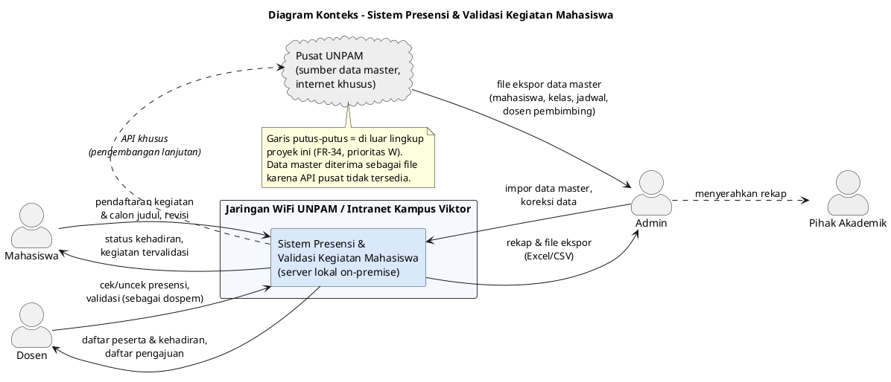

# BAB 2 — ANALISIS KEBUTUHAN

> **Keterangan penanda** (sama dengan Bab 1)
>
> - **[FAKTA-L]** = fakta lapangan, hasil pengamatan langsung anggota kelompok di Kampus Viktor UNPAM.
> - **[FAKTA-D]** = berasal dari dokumen identifikasi masalah Kelompok 2.
> - **[USULAN]** = usulan penyusun, perlu disetujui tim.
> - **[ASUMSI]** = belum dapat dipastikan; perlu data dari tim atau kampus.

Bab ini menerjemahkan masalah pada Bab 1 (M1–M6) menjadi kebutuhan sistem yang dapat diuji. Setiap kebutuhan diberi kode agar dapat ditelusuri ke masalah asalnya (Subbab 2.9) dan dipakai kembali pada Bab 3 (use case) serta Bab 6 (estimasi Use Case Points).

---

## 2.1 Sumber dan Cara Pengumpulan Kebutuhan

| Sumber                                                                          | Cara                         | Hasil                                                                                                   |
| ------------------------------------------------------------------------------- | ---------------------------- | ------------------------------------------------------------------------------------------------------- |
| Dokumen "Identifikasi Masalah serta Analisis Konteks dan Kebutuhan" Kelompok 2 | Studi dokumen                | Aktor, entitas data, kebutuhan fungsional & non-fungsional awal **[FAKTA-D]**                          |
| Pengalaman anggota kelompok di Kampus Viktor                                   | Observasi lapangan           | Internet tidak stabil, sesi terputus, validasi kegiatan terhambat, WiFi kuat, cara dosen mengabsen, data master dari pusat, validasi oleh dosen pembimbing **[FAKTA-L]** |
| Portal satu.unpam.ac.id dan portal FTI                                         | Pengamatan sebagai pengguna  | Gambaran alur presensi dan validasi yang sudah berjalan **[FAKTA-L]**                                   |

> **Saran [USULAN]:** sebelum fase Perancangan, lakukan wawancara singkat dengan 2–3 dosen dan 1 admin prodi untuk memastikan alur validasi kegiatan dan format rekap yang dibutuhkan. Hasilnya dipakai untuk menyetujui (_sign-off_) kebutuhan, karena metode Waterfall sulit menerima perubahan setelah fase ini.

---

## 2.2 Pemangku Kepentingan dan Aktor

| Aktor / Pihak                         | Jenis                    | Peran dalam sistem                                                                                                  | Sumber                |
| ------------------------------------- | ------------------------ | ------------------------------------------------------------------------------------------------------------------- | --------------------- |
| **Mahasiswa**                         | Aktor utama (pengguna)   | Melihat kehadirannya; mengajukan kegiatan (judul PKM, judul tugas akhir, dll.); melihat kegiatan yang sudah divalidasi | [FAKTA-D] + [FAKTA-L] |
| **Dosen**                             | Aktor utama (pengguna)   | **Mencatat presensi dengan cek/uncek** sambil mengabsen di kelas; memantau kehadiran; sebagai **dosen pembimbing (dospem)** memvalidasi calon judul/kegiatan mahasiswa bimbingannya | [FAKTA-L]             |
| **Admin**                             | Aktor utama (pengguna)   | **Mengimpor data master dari pusat**, mengoreksi data, mengelola pengguna; membuat rekap dan ekspor                  | [FAKTA-D] + [FAKTA-L] |
| Pihak akademik                        | Pemangku kepentingan     | Menerima laporan/rekap melalui Admin; tidak login langsung                                                          | [FAKTA-D]             |
| Pengelola jaringan / IT Kampus Viktor | Pemangku kepentingan     | Menyediakan lokasi server, alamat IP lokal, dan izin pada jaringan WiFi UNPAM                                       | [USULAN]              |
| Pusat UNPAM (server/bagian akademik)  | Sumber data              | **Sumber data master**: mahasiswa, dosen, mata kuliah, kelas & peserta, jadwal, dosen pembimbing. Diterima sebagai file ekspor (Excel/CSV) karena API tidak tersedia. Kelak juga menerima data melalui API khusus (pengembangan lanjutan) | [FAKTA-L] + [ASUMSI]  |

**Sumber data:** data yang dipakai untuk absensi (mahasiswa, kelas, peserta, jadwal, dosen pengampu) dan data dosen pembimbing **berasal dari pusat** **[FAKTA-L]**. Sistem lokal tidak membuat data master sendiri; Admin mengimpornya dari file ekspor pusat setiap awal semester **[ASUMSI: pusat bersedia menyediakan file ekspor]**.

**Jumlah pengguna:** pengguna terdaftar (mahasiswa dan dosen) mencapai **puluhan ribu orang** **[FAKTA-L]**. Dampaknya pada kapasitas dibahas di NFR-05 dan Subbab 2.8.

---

## 2.3 Kebutuhan Pengguna (User Requirements)

Kebutuhan dinyatakan dalam bentuk _user story_ sederhana: "Sebagai …, saya ingin …, agar …".

### 2.3.1 Mahasiswa

| Kode  | Kebutuhan                                                                                                                                            |
| ----- | ---------------------------------------------------------------------------------------------------------------------------------------------------- |
| UR-M1 | Sebagai mahasiswa, saya ingin melihat status kehadiran saya per pertemuan setelah dosen mencatatnya, sebagai bukti kehadiran saya tercatat. **[FAKTA-D] + [FAKTA-L]** |
| UR-M2 | Sebagai mahasiswa, saya ingin melihat rekap kehadiran saya per mata kuliah, agar saya tahu jumlah dan persentase kehadiran saya. **[FAKTA-L]**        |
| UR-M3 | Sebagai mahasiswa, saya ingin **mendaftarkan** kegiatan dan calon judul (PKM, tugas akhir, dll.), lalu pengajuan otomatis diteruskan ke dosen pembimbing saya, tanpa terhambat internet. **[FAKTA-L]** |
| UR-M4 | Sebagai mahasiswa, saya ingin melihat status dan catatan validasi dari dosen, agar dapat segera merevisi bila diminta. **[USULAN]**                  |
| UR-M5 | Sebagai mahasiswa, saya ingin melihat daftar kegiatan saya yang **sudah divalidasi**. **[FAKTA-L]**                                                  |

### 2.3.2 Dosen

| Kode  | Kebutuhan                                                                                                                                                                       |
| ----- | ------------------------------------------------------------------------------------------------------------------------------------------------------------------------------- |
| UR-D1 | Sebagai dosen, saya ingin mencatat presensi dengan **mencentang/menghapus centang** nama mahasiswa sambil memanggilnya di kelas, agar saya memastikan orangnya benar-benar hadir. **[FAKTA-L]** |
| UR-D2 | Sebagai dosen, saya ingin proses pencatatan itu tidak terhambat _loading_ lama atau login ulang, agar waktu mengajar tidak terpotong. **[FAKTA-L]**                            |
| UR-D3 | Sebagai dosen, saya ingin melihat kehadiran per mata kuliah, per kelas, dan per pertemuan (hadir/tidak hadir). **[FAKTA-D]**                                                    |
| UR-D4 | Sebagai dosen, saya ingin menandai mahasiswa yang izin atau sakit, dan mengoreksi presensi bila ada kesalahan. **[USULAN]**                                                    |
| UR-D5 | Sebagai **dosen pembimbing**, saya ingin memvalidasi (setuju/tolak/minta revisi) calon judul atau calon kegiatan mahasiswa bimbingan saya dari jaringan lokal kampus, disertai catatan. **[FAKTA-L] + [USULAN]** |

### 2.3.3 Admin

| Kode  | Kebutuhan                                                                                                                             |
| ----- | ------------------------------------------------------------------------------------------------------------------------------------- |
| UR-A1 | Sebagai admin, saya ingin memakai data mahasiswa, dosen, mata kuliah, kelas, jadwal, dan dosen pembimbing **dari pusat**, agar datanya sama dengan data resmi. **[FAKTA-L]** |
| UR-A2 | Sebagai admin, saya ingin mengelola akun pengguna dan perannya, agar setiap orang hanya mengakses data sesuai haknya. **[FAKTA-D]**  |
| UR-A3 | Sebagai admin, saya ingin membuat rekap presensi dan hasil validasi, lalu mengekspornya ke Excel/CSV. **[FAKTA-D] + [USULAN]**       |
| UR-A4 | Sebagai admin, saya ingin mengimpor data dari pusat secara massal, karena jumlah mahasiswa mencapai puluhan ribu, dan mengetahui baris mana yang gagal diimpor. **[FAKTA-L] + [USULAN]** |

---

## 2.4 Kebutuhan Fungsional (Functional Requirements)

Prioritas memakai metode **MoSCoW** **[USULAN]**:
**M** = _Must have_ (wajib), **S** = _Should have_ (sebaiknya ada), **C** = _Could have_ (boleh ada bila waktu cukup), **W** = _Won't have_ (tidak dikerjakan pada proyek ini).

### 2.4.1 Autentikasi, Dashboard, dan Hak Akses

| Kode  | Kebutuhan Fungsional                                                                                    | Aktor | Prioritas | Sumber    |
| ----- | ------------------------------------------------------------------------------------------------------- | ----- | --------- | --------- |
| FR-01 | Sistem menyediakan login dengan NIM/NIDN/username dan kata sandi.                                      | Semua | M         | [FAKTA-D] |
| FR-02 | Sistem mengarahkan pengguna ke halaman sesuai perannya (Mahasiswa, Dosen, Admin) setelah login.        | Semua | M         | [FAKTA-D] |
| FR-03 | Sistem membatasi setiap menu dan data sesuai peran; pengguna tidak dapat membuka data di luar kewenangannya. | Semua | M     | [FAKTA-D] |
| FR-04 | Pengguna dapat mengganti kata sandi sendiri; Admin dapat mengatur ulang kata sandi pengguna.           | Semua | S         | [USULAN]  |
| FR-05 | Pengguna dapat logout; sesi berakhir otomatis setelah tidak aktif dalam waktu tertentu (lihat NFR-06). | Semua | M         | [USULAN]  |
| FR-36 | Setelah login, setiap peran melihat **dashboard** berisi ringkasan: Mahasiswa (persentase kehadiran, status pengajuan), Dosen (jadwal hari ini, pengajuan menunggu validasi), Admin (jumlah data, impor terakhir). | Semua | M         | [USULAN]  |

### 2.4.2 Presensi Perkuliahan (dicatat oleh Dosen)

Presensi **dicatat oleh dosen**, bukan diisi sendiri oleh mahasiswa. Dosen memanggil nama mahasiswa di kelas, lalu mencentang (hadir) atau menghapus centang (tidak hadir) pada daftar peserta. Cara ini memastikan orangnya benar-benar ada di kelas **[FAKTA-L]**.

| Kode  | Kebutuhan Fungsional                                                                                                                                  | Aktor     | Prioritas | Sumber               |
| ----- | ----------------------------------------------------------------------------------------------------------------------------------------------------- | --------- | --------- | -------------------- |
| FR-06 | Dosen memilih jadwal yang diampu dan membuka **pertemuan** (pertemuan ke-, tanggal).                                                                  | Dosen     | M         | [USULAN]             |
| FR-07 | Sistem menampilkan daftar peserta kelas dengan **kotak centang**; dosen mencentang/menghapus centang setiap mahasiswa sambil mengabsen.                | Dosen     | M         | [FAKTA-L]            |
| FR-08 | Dosen menyimpan presensi; sistem menampilkan **konfirmasi tersimpan** beserta jumlah hadir dan tidak hadir.                                          | Dosen     | M         | [FAKTA-D] + [USULAN] |
| FR-09 | Sistem menyimpan **satu** catatan per mahasiswa per pertemuan; menyimpan ulang memperbarui catatan, bukan menggandakannya.                           | Sistem    | M         | [USULAN]             |
| FR-10 | Dosen dapat menandai status **Izin** atau **Sakit** dengan keterangan, selain Hadir/Tidak Hadir.                                                       | Dosen     | S         | [USULAN]             |
| FR-11 | Dosen dapat mengoreksi presensi pertemuan yang sudah disimpan; setiap koreksi mencatat alasan, pelaku, dan waktu.                                    | Dosen     | S         | [USULAN]             |
| FR-12 | Dosen melihat daftar kehadiran per mata kuliah, per kelas, dan per pertemuan.                                                                        | Dosen     | M         | [FAKTA-D]            |
| FR-13 | Mahasiswa melihat status kehadirannya per pertemuan dan rekap persentase per mata kuliah (sebagai bukti kehadiran tercatat).                          | Mahasiswa | M         | [FAKTA-D] + [FAKTA-L] |

### 2.4.3 Validasi Kegiatan Mahasiswa

| Kode  | Kebutuhan Fungsional                                                                                                                                | Aktor     | Prioritas | Sumber               |
| ----- | --------------------------------------------------------------------------------------------------------------------------------------------------- | --------- | --------- | -------------------- |
| FR-14 | Mahasiswa **mendaftarkan** kegiatan: memilih jenis kegiatan (pengabdian kepada masyarakat, tugas akhir, dll.), mengisi calon judul dan deskripsi singkat. Sistem **otomatis meneruskan** pengajuan ke dosen pembimbing (dospem) mahasiswa untuk jenis kegiatan tersebut. | Mahasiswa | M         | [FAKTA-L]            |
| FR-15 | Mahasiswa dapat melampirkan satu berkas pendukung (misalnya proposal singkat dalam PDF).                                                            | Mahasiswa | C         | [USULAN]             |
| FR-16 | Dosen pembimbing melihat daftar pengajuan dari mahasiswa bimbingannya, beserta status masing-masing.                                                | Dosen     | M         | [FAKTA-L]            |
| FR-17 | Dosen pembimbing memberi keputusan validasi: **Disetujui**, **Ditolak**, atau **Perlu Revisi**, disertai catatan.                                              | Dosen     | M         | [FAKTA-L] + [USULAN] |
| FR-18 | Mahasiswa memperbaiki pengajuan berstatus "Perlu Revisi" dan mengirimkannya kembali.                                                                | Mahasiswa | M         | [USULAN]             |
| FR-19 | Sistem menyimpan **riwayat validasi** (siapa, kapan, keputusan, catatan) untuk setiap pengajuan.                                                   | Sistem    | M         | [USULAN]             |
| FR-20 | Mahasiswa melihat status terkini, riwayat validasi, dan **daftar kegiatan yang sudah divalidasi**.                                                  | Mahasiswa | M         | [FAKTA-L]            |
| FR-21 | Admin mengelola daftar **jenis kegiatan** (menambah jenis baru tanpa mengubah program).                                                             | Admin     | S         | [USULAN]             |

### 2.4.4 Data Master (dari Pusat) dan Pengguna

Data master **berasal dari pusat** **[FAKTA-L]**. Admin tidak membuat data master dari nol; Admin **mengimpor** file ekspor dari pusat dan hanya mengoreksi bila ada perbedaan.

| Kode  | Kebutuhan Fungsional                                                                                                                              | Aktor  | Prioritas | Sumber               |
| ----- | ------------------------------------------------------------------------------------------------------------------------------------------------- | ------ | --------- | -------------------- |
| FR-22 | Admin mengimpor data dari pusat (Excel/CSV): mahasiswa, dosen, mata kuliah, kelas & peserta, jadwal & dosen pengampu, serta **dosen pembimbing**. | Admin  | M         | [FAKTA-L] + [USULAN] |
| FR-23 | Sistem memeriksa file impor (format, data ganda, relasi yang tidak cocok) dan menampilkan laporan baris yang berhasil dan gagal.                  | Sistem | M         | [USULAN]             |
| FR-24 | Impor ulang (misalnya awal semester) **memperbarui** data tanpa menggandakan dan tanpa menghapus presensi atau pengajuan yang sudah ada.          | Sistem | M         | [USULAN]             |
| FR-25 | Admin melihat dan mencari data master (mahasiswa, dosen, mata kuliah, kelas, jadwal, dosen pembimbing).                                           | Admin  | M         | [FAKTA-D]            |
| FR-26 | Admin mengoreksi data master secara manual (tambah, ubah, nonaktifkan) bila berbeda dengan kondisi nyata; setiap koreksi tercatat.                | Admin  | S         | [FAKTA-D] + [USULAN] |
| FR-27 | Sistem membuat **akun pengguna otomatis** dari data impor (NIM untuk mahasiswa, NIDN untuk dosen) dengan peran yang sesuai.                        | Sistem | M         | [USULAN]             |
| FR-28 | Admin mengelola akun pengguna: menonaktifkan akun, mengatur ulang kata sandi, dan menetapkan akun Admin.                                          | Admin  | M         | [FAKTA-D]            |
| FR-29 | Admin dapat mengoreksi data presensi bila ada kesalahan, dan setiap koreksi tercatat.                                                             | Admin  | S         | [FAKTA-D]            |

### 2.4.5 Rekap, Laporan, dan Ekspor

| Kode  | Kebutuhan Fungsional                                                                                                               | Aktor        | Prioritas | Sumber                            |
| ----- | ---------------------------------------------------------------------------------------------------------------------------------- | ------------ | --------- | --------------------------------- |
| FR-30 | Sistem menghasilkan rekap presensi per mahasiswa, per kelas, dan per mata kuliah (jumlah dan persentase kehadiran).                | Dosen, Admin | M         | [FAKTA-D]                         |
| FR-31 | Sistem menghasilkan rekap pengajuan kegiatan per jenis, per dosen, dan per status.                                                 | Admin        | S         | [USULAN]                          |
| FR-32 | Admin mengekspor rekap presensi dan hasil validasi ke **Excel/CSV**, untuk diteruskan ke pihak akademik/portal pusat.              | Admin        | M         | [USULAN]                          |
| FR-33 | Setiap catatan presensi dan validasi memiliki **ID unik** dan **status kirim** (belum/sudah dikirim) agar siap disinkronkan kelak. | Sistem       | S         | [USULAN]                          |
| FR-34 | Sinkronisasi otomatis ke API khusus di server pusat UNPAM.                                                                         | Sistem       | **W**     | [USULAN] — pengembangan lanjutan  |
| FR-35 | Mahasiswa melihat tugas dan nilai perkuliahan.                                                                                     | Mahasiswa    | **W**     | [FAKTA-L] — tetap di portal resmi |

> **Catatan FR-35:** mahasiswa terbiasa melihat presensi, tugas, nilai, dan lainnya dari akun mahasiswanya **[FAKTA-L]**. Dalam proyek ini, akun mahasiswa hanya menampilkan **presensi** dan **kegiatan mahasiswa yang sudah divalidasi**. Tugas dan nilai tetap diakses di portal resmi karena datanya dimiliki portal tersebut (lihat Bab 1, B8a).

**Ringkasan jumlah kebutuhan fungsional:**

| Prioritas          | Jumlah | Kode                                         |
| ------------------ | ------ | -------------------------------------------- |
| M (wajib)          | 25     | FR-01–03, 05–09, 12–14, 16–20, 22–25, 27, 28, 30, 32, 36 |
| S (sebaiknya)      | 8      | FR-04, 10, 11, 21, 26, 29, 31, 33                    |
| C (boleh)          | 1      | FR-15                                        |
| W (tidak kali ini) | 2      | FR-34, 35                                    |
| **Total**          | **36** |                                              |

---

## 2.5 Kebutuhan Non-Fungsional (Non-Functional Requirements)

| Kode   | Kategori       | Kebutuhan                                                                                                                                                  | Sumber               |
| ------ | -------------- | ---------------------------------------------------------------------------------------------------------------------------------------------------------- | -------------------- |
| NFR-01 | Ketersediaan   | Sistem tetap berfungsi penuh **tanpa koneksi internet**; semua fungsi cukup melalui WiFi UNPAM/intranet.                                                  | [FAKTA-L]            |
| NFR-02 | Akses jaringan | Sistem hanya dapat diakses dari jaringan intranet Kampus Viktor; permintaan dari luar jaringan ditolak.                                                   | [FAKTA-D]            |
| NFR-03 | Aset lokal     | Seluruh aset halaman (CSS, JavaScript, font, ikon) disimpan di server lokal, **tidak** memuat dari CDN/internet.                                          | [USULAN]             |
| NFR-04 | Kinerja        | Halaman utama dan penyimpanan presensi satu kelas selesai dalam **≤ 2 detik** di jaringan lokal pada beban puncak (NFR-05).                                | [USULAN] target      |
| NFR-05 | Kapasitas      | Sistem menampung **puluhan ribu** pengguna terdaftar dan melayani beban puncak tanpa gagal. Rincian asumsi beban ada di bawah tabel ini.                    | [FAKTA-L] + [ASUMSI] |
| NFR-06 | Sesi           | Sesi login **tidak terputus** selama pengguna aktif di jaringan lokal; sesi berakhir otomatis setelah **120 menit** tidak aktif.                           | [FAKTA-L] + [USULAN] |
| NFR-07 | Keamanan       | Kata sandi disimpan dalam bentuk _hash_ (bcrypt); otorisasi diperiksa di sisi server untuk setiap permintaan.                                              | [FAKTA-D] + [USULAN] |
| NFR-08 | Keamanan       | Sistem terlindung dari serangan umum web (SQL injection, XSS, CSRF) dan percobaan login berulang (_rate limiting_).                                       | [USULAN]             |
| NFR-09 | Integritas     | Basis data relasional dengan relasi antarentitas terjaga (kunci asing); tidak ada presensi ganda pada pertemuan yang sama.                                | [FAKTA-D]            |
| NFR-10 | Jejak audit    | Setiap perubahan status presensi dan keputusan validasi mencatat pelaku dan waktu.                                                                        | [USULAN]             |
| NFR-11 | Kemudahan      | Dosen mencatat presensi satu kelas dalam **satu halaman** (cek/uncek tanpa pindah halaman); mahasiswa melihat kehadirannya dalam ≤ 2 klik setelah login. | [FAKTA-L] + [USULAN] |
| NFR-12 | Responsif      | Tampilan dapat dipakai dengan nyaman di ponsel dan laptop melalui peramban web.                                                                            | [USULAN]             |
| NFR-13 | Cadangan data  | Basis data dicadangkan otomatis minimal **1 kali sehari** ke media terpisah.                                                                               | [USULAN]             |
| NFR-14 | Pemeliharaan   | Kode terstruktur (pola MVC) dan terdokumentasi, sehingga modul baru (misalnya API pusat) dapat ditambahkan tanpa merombak sistem.                         | [USULAN]             |
| NFR-15 | Keamanan       | Komunikasi memakai **HTTPS** dengan sertifikat lokal kampus, agar kata sandi tidak terbaca di jaringan WiFi bersama.                                       | [USULAN]             |

### Asumsi beban untuk NFR-05 [ASUMSI]

Angka di bawah adalah **asumsi kerja** untuk menentukan spesifikasi server. Angka ini wajib dibuktikan dengan **uji beban** pada fase Pengujian.

| Parameter                               | Nilai asumsi                 | Keterangan                                                               |
| --------------------------------------- | ---------------------------- | ------------------------------------------------------------------------ |
| Pengguna terdaftar                      | 20.000                       | Titik tengah "puluhan ribu" **[FAKTA-L]**                                |
| Pengguna aktif serentak saat puncak     | 5–10% → 1.000–2.000          | Puncak terjadi di awal jam kuliah dan saat mahasiswa mengecek kehadiran |
| Rata-rata permintaan per pengguna aktif | 1 permintaan / 30 detik      | Pengguna membaca halaman sebelum klik berikutnya                         |
| **Beban puncak**                        | **± 33–67 permintaan/detik** | 1.000/30 dan 2.000/30                                                    |
| Mata kuliah per mahasiswa per semester  | 8                            | Asumsi                                                                   |
| Pertemuan per mata kuliah               | 16                           | Asumsi                                                                   |
| **Baris presensi per semester**         | **± 2.560.000**              | 20.000 × 8 × 16                                                          |
| Ukuran data presensi per semester       | ± 0,64 GB                    | ± 250 byte per baris termasuk indeks                                     |

Kesimpulan asumsi: beban tersebut masih wajar untuk **satu server** yang dikonfigurasi dengan baik (lihat 2.8). Data presensi beberapa tahun pun masih muat di SSD ratusan GB.

> **Catatan risiko:** kapasitas jumlah perangkat yang dapat terhubung ke setiap access point WiFi UNPAM berada di luar kendali proyek (B10). Jika ribuan perangkat terhubung bersamaan, hambatan bisa terjadi di AP, bukan di server.

---

## 2.6 Kebutuhan Data

Data master (nomor 2–6 dan 11) **bersumber dari pusat** dan masuk melalui impor. Entitas berikut menjadi dasar ERD dan class diagram pada Bab 3. Atribut ditulis sebagai **atribut minimum**.

| No  | Entitas                  | Atribut minimum                                                                                                              | Sumber               |
| --- | ------------------------ | ---------------------------------------------------------------------------------------------------------------------------- | -------------------- |
| 1   | Pengguna                 | id, username, kata_sandi (hash), peran, status_aktif                                                                         | [FAKTA-D]            |
| 2   | Mahasiswa                | NIM, nama, program studi, angkatan, id_pengguna                                                                              | [FAKTA-D]            |
| 3   | Dosen                    | NIDN, nama, id_pengguna                                                                                                      | [FAKTA-D]            |
| 4   | Mata Kuliah              | kode_mk, nama_mk, SKS                                                                                                        | [FAKTA-D]            |
| 5   | Kelas                    | kode_kelas, nama_kelas, semester, daftar peserta (mahasiswa)                                                                 | [FAKTA-D]            |
| 6   | Jadwal Perkuliahan       | id, mata kuliah, kelas, dosen pengampu, hari, jam mulai, jam selesai, ruang                                                  | [FAKTA-D]            |
| 7   | Pertemuan                | id, jadwal, pertemuan ke-, tanggal, status (draf/tersimpan), dicatat oleh (dosen), waktu simpan                              | [USULAN]             |
| 8   | Presensi                 | id unik, mahasiswa, pertemuan (→ mata kuliah, kelas, tanggal), status kehadiran, keterangan, waktu dicatat, status kirim     | [FAKTA-D] + [USULAN] |
| 9   | Riwayat Koreksi Presensi | id, presensi, status lama, status baru, alasan, pelaku, waktu                                                                | [USULAN]             |
| 10  | Jenis Kegiatan           | id, nama jenis (pengabdian kepada masyarakat, tugas akhir, dll.)                                                             | [USULAN]             |
| 11  | Pembimbingan             | id, mahasiswa, dosen pembimbing, jenis kegiatan, periode, status aktif — **diimpor dari pusat**                              | [FAKTA-L] + [USULAN] |
| 12  | Pengajuan Kegiatan       | id unik, mahasiswa, jenis kegiatan, calon judul, deskripsi, lampiran (opsional), pembimbingan (→ dospem), status, tanggal ajuan, status kirim | [FAKTA-L] + [USULAN] |
| 13  | Riwayat Validasi         | id, pengajuan, dosen, keputusan, catatan, waktu                                                                              | [USULAN]             |
| 14  | Log Impor                | id, jenis data, nama file, waktu, jumlah berhasil, jumlah gagal, admin                                                       | [USULAN]             |

Nilai yang sudah ditentukan **[USULAN]**:

- **Peran:** Mahasiswa, Dosen, Admin.
- **Status kehadiran:** Hadir, Izin, Sakit, Tidak Hadir. Kotak dicentang = Hadir; tidak dicentang = Tidak Hadir.
- **Status pengajuan:** Diajukan, Perlu Revisi, Disetujui, Ditolak.
- **Status kirim:** Belum Dikirim, Sudah Dikirim (dipakai saat API pusat tersedia).

---

## 2.7 Aturan Bisnis

| Kode  | Aturan                                                                                                                  | Sumber    |
| ----- | ----------------------------------------------------------------------------------------------------------------------- | --------- |
| BR-01 | Satu mahasiswa hanya memiliki **satu** catatan presensi untuk satu pertemuan.                                          | [USULAN]  |
| BR-02 | Presensi **hanya dicatat oleh dosen** pengampu jadwal tersebut (atau dikoreksi Admin); mahasiswa hanya dapat melihat.  | [FAKTA-L] |
| BR-03 | Dosen hanya dapat membuka pertemuan dan melihat kehadiran pada jadwal yang ia ampu.                                    | [FAKTA-D] |
| BR-04 | Daftar centang hanya berisi mahasiswa yang terdaftar sebagai peserta kelas tersebut.                                   | [USULAN]  |
| BR-05 | Koreksi presensi setelah disimpan wajib mencatat alasan, pelaku, dan waktu.                                            | [USULAN]  |
| BR-06 | Pengajuan kegiatan otomatis diteruskan ke, dan **hanya dapat divalidasi oleh, dosen pembimbing** mahasiswa untuk jenis kegiatan tersebut. | [FAKTA-L] |
| BR-07 | Pengajuan berstatus "Disetujui" atau "Ditolak" bersifat final dan tidak dapat diubah mahasiswa.                        | [USULAN]  |
| BR-08 | Keputusan "Ditolak" dan "Perlu Revisi" wajib disertai catatan dari dosen.                                              | [USULAN]  |
| BR-09 | Data yang sudah memiliki presensi atau pengajuan tidak dapat dihapus permanen; Admin hanya dapat menonaktifkannya.     | [USULAN]  |
| BR-10 | Mahasiswa yang **belum memiliki dosen pembimbing** untuk suatu jenis kegiatan tidak dapat mengajukan kegiatan tersebut; sistem menampilkan pesan agar menghubungi admin prodi. | [USULAN]  |
| BR-11 | **Pusat adalah sumber data master.** Koreksi manual oleh Admin bersifat sementara dan akan ditimpa oleh impor berikutnya bila data pusat sudah diperbaiki. | [FAKTA-L] + [USULAN] |

---

## 2.8 Kebutuhan Pendukung (Perangkat Keras dan Perangkat Lunak)

Spesifikasi di bawah adalah **usulan awal** yang disesuaikan dengan asumsi beban NFR-05. Harga dan jumlah dihitung pada Bab 6 (Estimasi Biaya).

### 2.8.1 Perangkat Keras

| Komponen                | Spesifikasi minimum usulan                                  | Keterangan                                                  | Sumber    |
| ----------------------- | ----------------------------------------------------------- | ----------------------------------------------------------- | --------- |
| Server lokal            | CPU 8 core, RAM 16 GB, 2 × SSD 512 GB (RAID 1), LAN 1 Gbps | Rak/tower server; RAID 1 agar data aman jika satu SSD rusak | [USULAN]  |
| Media cadangan          | NAS / HDD eksternal ≥ 2 TB                                  | Untuk NFR-13                                                | [USULAN]  |
| UPS                     | ≥ 1500 VA                                                   | Menjaga server saat listrik padam                           | [USULAN]  |
| Access point WiFi UNPAM | Sudah ada                                                   | Tidak ada pengadaan baru (B10)                              | [FAKTA-L] |
| Switch/port LAN         | Port kosong pada jaringan kampus                            | Perlu izin pengelola jaringan                               | [ASUMSI]  |
| Perangkat pengguna      | Ponsel/laptop milik dosen dan mahasiswa                     | Tidak ada pengadaan                                         | [USULAN]  |

### 2.8.2 Perangkat Lunak

| Komponen           | Usulan                                     | Alasan                                                                    | Sumber        |
| ------------------ | ------------------------------------------ | ------------------------------------------------------------------------- | ------------- |
| Sistem operasi     | Linux server (Ubuntu Server LTS)           | Gratis, stabil, dukungan keamanan jangka panjang                          | [USULAN]      |
| Web server         | Nginx + PHP-FPM                            | Ringan dan cepat melayani banyak koneksi serentak                         | [USULAN]      |
| Bahasa & framework | PHP + **Laravel**                          | Sudah dikenal tim; pola MVC; fitur keamanan bawaan (lihat di bawah)       | Disetujui tim |
| Basis data         | **MySQL**/MariaDB                          | Relasional, gratis, didukung Laravel, mampu menampung jutaan baris        | Disetujui tim |
| Cache & sesi       | Redis                                      | Sesi dan cache di memori, sehingga beban basis data saat puncak berkurang | [USULAN]      |
| Tampilan           | Bootstrap/Tailwind yang **disimpan lokal** | Responsif (NFR-12) tanpa CDN (NFR-03)                                     | [USULAN]      |
| Alat pengembangan  | VS Code, Git, PlantUML                     | Gratis                                                                    | [USULAN]      |

**Apakah Laravel + MySQL aman dan ringan untuk intranet kampus?**

- **Aman, bila dikonfigurasi dengan benar.** Laravel sudah menyediakan perlindungan bawaan:
  - _hash_ kata sandi bcrypt (NFR-07);
  - token CSRF pada setiap formulir;
  - _escaping_ otomatis pada tampilan untuk mencegah XSS;
  - _query_ berparameter lewat Eloquent untuk mencegah SQL injection;
  - _rate limiting_ login (NFR-08).

  Keamanan tetap bergantung pada penerapannya, misalnya mematikan mode _debug_ di server, memakai HTTPS (NFR-15), memeriksa otorisasi di setiap _controller_, dan memperbarui versi secara berkala.
- **Cukup ringan, dengan optimasi.** Laravel bukan framework PHP yang paling ringan. Namun, dengan _config/route/view cache_, OPcache, Redis, dan indeks basis data yang tepat, beban puncak ± 33–67 permintaan/detik (NFR-05) masih wajar untuk satu server dengan spesifikasi di 2.8.1.
- **Bukti kinerja** diperoleh melalui uji beban pada fase Pengujian. Jika hasilnya kurang, langkah pertama adalah menambah RAM atau memisahkan server basis data, bukan mengganti framework.

---

## 2.9 Matriks Keterlacakan (Masalah → Kebutuhan)

| Masalah (Bab 1)                                | Prioritas | Kebutuhan Fungsional    | Kebutuhan Non-Fungsional |
| ---------------------------------------------- | --------- | ----------------------- | ------------------------ |
| M1 Presensi terhambat saat internet bermasalah | Tinggi    | FR-06, 07, 08, 09, 36   | NFR-01, 03, 04, 06, 11   |
| M2 Presensi di luar sistem tidak terstruktur   | Tinggi    | FR-10, 11, 12, 13       | NFR-05, 09, 10           |
| M3 Validasi kegiatan terhambat                 | Tinggi    | FR-14 s.d. FR-21, 36    | NFR-01, 06, 10           |
| M4 Data harus dapat diteruskan ke pusat        | Sedang    | FR-30, 31, 32, 33, (34) | NFR-14                   |
| M5 Data master harus terhubung                 | Sedang    | FR-22 s.d. FR-29        | NFR-09, 10               |
| M6 Akses dibatasi intranet dan per peran       | Rendah    | FR-01 s.d. FR-05        | NFR-02, 07, 08, 15       |

Setiap masalah sudah memiliki minimal satu kebutuhan fungsional dan satu kebutuhan non-fungsional.

---

## 2.10 Diagram Konteks Sistem (PlantUML)

Diagram ini menunjukkan batas sistem dan pihak yang berinteraksi dengannya. Diagram UML rinci (use case, activity, sequence, class) dibuat bertahap di Bab 3.

> **Cara generate:** letakkan kursor di dalam blok kode lalu tekan `Alt+D` di VS Code.

---

## 2.11 Kesimpulan Bab

Kebutuhan sistem dirumuskan menjadi **36 kebutuhan fungsional** (25 wajib, 8 sebaiknya ada, 1 boleh ada, 2 tidak dikerjakan sekarang) dan **15 kebutuhan non-fungsional**. Inti kebutuhannya adalah:

1. Presensi yang **dicatat dosen dengan cek/uncek** sambil mengabsen, berjalan penuh di intranet.
2. Akun mahasiswa untuk melihat kehadiran dan kegiatan yang sudah divalidasi.
3. Pendaftaran kegiatan oleh mahasiswa yang **otomatis diteruskan ke dosen pembimbing** untuk divalidasi, dengan riwayat keputusan.
4. Data master **dari pusat** (termasuk dosen pembimbing) yang diimpor massal untuk puluhan ribu pengguna.
5. Ekspor rekap yang siap disinkronkan ke server pusat kelak.

Kebutuhan ini menjadi masukan **Bab 3 (Perancangan Solusi)**, dimulai dari **use case diagram**.

**Asumsi yang perlu dipastikan ke pihak kampus:**

- Pusat bersedia menyediakan **file ekspor data master** (termasuk data dosen pembimbing) setiap awal semester, dalam format Excel/CSV.
