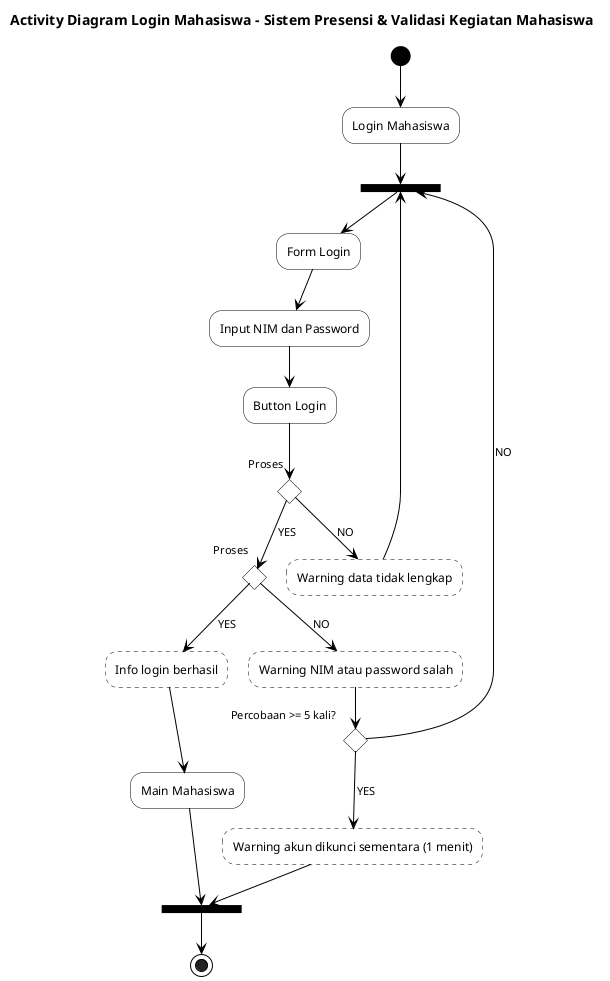

# BAB 3.2 — ACTIVITY DIAGRAM AKTOR MAHASISWA

> Bagian dari `BAB_03_Perancangan_Solusi.md`. Aturan penggambaran ada di subbab **3.2.1** file tersebut:
>
> - satu panah masuk dan satu panah keluar per aktivitas (lebih dari satu → bar);
> - keputusan **Proses [YES/NO]**;
> - pesan **Info/Warning** berupa kotak region putus-putus pada panah.
>
> **Cara generate:** letakkan kursor di dalam blok kode lalu tekan `Alt+D` di VS Code.

| No  | Use Case (Mahasiswa)                       | Status               |
| --- | ------------------------------------------ | -------------------- |
| 1   | Login                                      | **Draf — diperiksa** |
| 2   | Logout                                     | Belum                |
| 3   | Dashboard                                  | Belum                |
| 4   | Mengelola Data Akun                        | Belum                |
| 5   | Mengelola Data Presensi (melihat)          | Belum                |
| 6   | Mengelola Data Validasi Kegiatan (melihat) | Belum                |
| 7   | Mengelola Data Pengajuan Kegiatan          | Belum                |

---

## 3.2.M.1 Activity Diagram — Login Mahasiswa (UC-01)

**Kebutuhan:** FR-01, FR-02, FR-03, NFR-06, NFR-07, NFR-08

**Penjelasan alur:**

| Langkah | Aktivitas                                               | Keterangan                                                                                                                               |
| ------- | ------------------------------------------------------- | ---------------------------------------------------------------------------------------------------------------------------------------- |
| 1       | Login Mahasiswa → bar B1 → Form Login                   | Mahasiswa membuka alamat web sistem dari WiFi UNPAM. Bar B1 menggabungkan alur awal dengan alur kembali dari Warning.                    |
| 2       | Input NIM dan Password → Click Btn Login                | Username mahasiswa = NIM (FR-01).                                                                                                        |
| 3       | **Proses** pertama                                      | Memeriksa kelengkapan isian. **NO** → region _Warning data tidak lengkap_ → kembali ke B1 (Form Login).                                  |
| 4       | **Proses** kedua                                        | Mencocokkan NIM dan kata sandi (hash bcrypt, NFR-07) serta memastikan akun aktif. **NO** → region _Warning NIM atau password salah_.     |
| 5       | **Percobaan ≥ 5 kali?**                                 | Pembatasan percobaan login (NFR-08). **NO** → kembali ke B1. **YES** → region _Warning akun dikunci sementara (1 menit)_ → bar B2 → END. |
| 6       | **YES** → region _Info login berhasil_ → Main Mahasiswa | Sistem membuat sesi (berakhir setelah 120 menit tidak aktif, NFR-06) dan membuka halaman utama mahasiswa sesuai peran (FR-02, FR-03).    |
| 7       | Main Mahasiswa → bar B2 → END                           | Bar B2 menggabungkan dua jalur akhir sebelum END.                                                                                        |

**Pemeriksaan aturan:**

| Elemen                                                                               | Panah masuk | Panah keluar | Sesuai aturan       |
| ------------------------------------------------------------------------------------ | ----------- | ------------ | ------------------- |
| Login Mahasiswa, Form Login, Input NIM dan Password, Click Btn Login, Main Mahasiswa | 1           | 1            | Ya                  |
| Bar B1                                                                               | 3           | 1            | Ya (bar penggabung) |
| Bar B2                                                                               | 2           | 1            | Ya (bar penggabung) |
| Keputusan Proses / Percobaan                                                         | 1           | 2            | Ya (cabang YES/NO)  |

**Asumsi [USULAN]:** batas 5 kali percobaan dan penguncian 1 menit mengikuti pengaturan bawaan _throttle_ login Laravel. Nilai ini dapat diubah tim.
