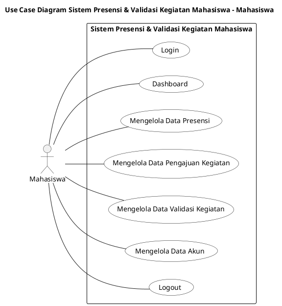
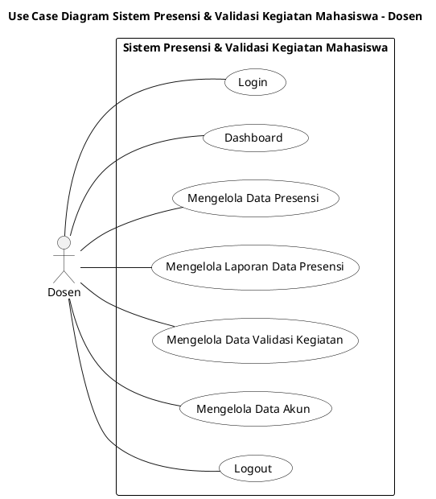
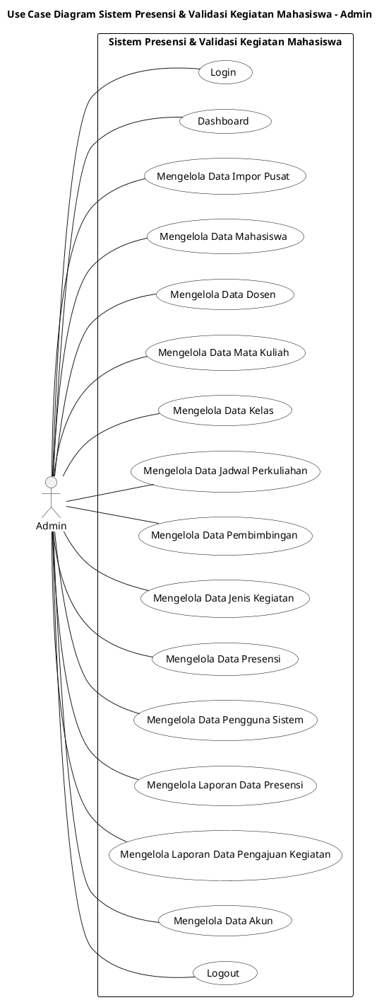

# BAB 3 — PERANCANGAN SOLUSI

> **Keterangan penanda** (sama dengan Bab 1–2): **[FAKTA-L]**, **[FAKTA-D]**, **[USULAN]**, **[ASUMSI]**.
>
> Bab ini dikerjakan **bertahap**. Setiap diagram diperiksa dan disetujui sebelum lanjut ke diagram berikutnya:
>
> 1. 3.1 Use Case Diagram ✔ _(disetujui, dengan perbaikan dari tim)_
> 2. **3.2 Activity Diagram** ← _sedang dikerjakan, satu per satu_
> 3. 3.3 Sequence Diagram
> 4. 3.4 Class Diagram
> 5. 3.5 ERD / Skema Basis Data
> 6. 3.6 Arsitektur & Deployment Diagram
> 7. 3.7 Rancangan Antarmuka (Wireframe)

---

## 3.1 Use Case Diagram

### 3.1.1 Aturan Penggambaran

Use case diagram dibuat **sederhana**, mengikuti format yang dipakai di perkuliahan:

1. **Satu diagram per aktor** (Mahasiswa, Dosen, Admin), masing-masing satu halaman.
2. **Satu kotak batas sistem** saja, tanpa kotak/paket di dalamnya.
3. Nama use case berbentuk **kata kerja + objek data**, misalnya "Mengelola Data Mahasiswa" atau "Mengelola Laporan Data Presensi".
4. Setiap aktor **wajib** memiliki **Login**, **Dashboard**, dan **Logout**, ditambah **Mengelola Data Akun** (ganti kata sandi).
5. Aktor dihubungkan ke use case dengan **garis asosiasi biasa**, tanpa «include»/«extend».
6. Urutan dari atas ke bawah: Login → Dashboard → use case utama → Mengelola Data Akun → Logout.

Istilah **"Mengelola"** berarti aktor dapat melihat, mencari, menambah, mengubah, dan/atau menonaktifkan data sesuai haknya. Rincian aksi setiap use case ada di tabel 3.1.3 dan akan digambarkan alurnya pada 3.2 Activity Diagram.

### 3.1.2 Aktor

| Aktor     | Deskripsi                                                                                                                                     |
| --------- | --------------------------------------------------------------------------------------------------------------------------------------------- |
| Mahasiswa | Melihat kehadirannya, mendaftarkan kegiatan dan calon judul, serta melihat hasil validasi dari dosen pembimbing.                              |
| Dosen     | Mencatat presensi dengan cek/uncek saat mengabsen di kelas, melihat laporan presensi, dan sebagai **dosen pembimbing** memvalidasi pengajuan. |
| Admin     | Mengimpor data dari pusat, mengelola data master dan pengguna, mengoreksi presensi, serta membuat dan mengekspor laporan.                     |

- **Dosen pembimbing** bukan aktor terpisah, melainkan Dosen yang memiliki relasi _Pembimbingan_ dengan mahasiswa (data dari pusat).
- **Pusat UNPAM** bukan aktor, karena datanya masuk melalui Admin (impor file).

### 3.1.3 Daftar Use Case

| Kode  | Use Case                                  | Aktor        | Kebutuhan (FR)    | Rincian aksi                                                                                                                                                             |
| ----- | ----------------------------------------- | ------------ | ----------------- | ------------------------------------------------------------------------------------------------------------------------------------------------------------------------ |
| UC-01 | Login                                     | Semua        | FR-01, 02, 03     | Masuk dengan NIM/NIDN/username dan kata sandi; diarahkan sesuai peran.                                                                                                   |
| UC-02 | Dashboard                                 | Semua        | FR-36             | Melihat ringkasan sesuai peran.                                                                                                                                          |
| UC-03 | Mengelola Data Akun                       | Semua        | FR-04             | Melihat profil dan mengganti kata sandi sendiri.                                                                                                                         |
| UC-04 | Logout                                    | Semua        | FR-05             | Keluar dari sistem (sesi juga berakhir otomatis setelah 120 menit tidak aktif).                                                                                          |
| UC-05 | Mengelola Data Presensi                   | Mahasiswa    | FR-13             | (Hanya melihat) Melihat status kehadiran per pertemuan dan persentase per mata kuliah.                                                                                   |
| UC-06 | Mengelola Data Pengajuan Kegiatan         | Mahasiswa    | FR-14, 15, 18     | Mendaftarkan kegiatan dan calon judul, melampirkan berkas (opsional), merevisi pengajuan "Perlu Revisi".                                                                 |
| UC-07 | Mengelola Data Validasi Kegiatan          | Mahasiswa    | FR-20             | (Hanya melihat) Melihat status, catatan dosen pembimbing, riwayat validasi, dan kegiatan yang sudah divalidasi.                                                          |
| UC-08 | Mengelola Data Presensi                   | Dosen, Admin | FR-06–12, 29      | **Dosen:** membuka pertemuan, cek/uncek peserta, menandai izin/sakit, menyimpan, mengoreksi, melihat kehadiran kelas. **Admin:** mengoreksi presensi bila ada kesalahan. |
| UC-09 | Mengelola Laporan Data Presensi           | Dosen        | FR-30             | Melihat rekap jumlah dan persentase kehadiran per mahasiswa, kelas, dan mata kuliah yang diampu.                                                                         |
| UC-10 | Mengelola Data Validasi Kegiatan          | Dosen        | FR-16, 17, 19     | Melihat pengajuan mahasiswa bimbingan; memberi keputusan Disetujui/Ditolak/Perlu Revisi dengan catatan.                                                                  |
| UC-11 | Mengelola Data Impor Pusat                | Admin        | FR-22, 23, 24, 27 | Mengunggah file ekspor pusat, melihat laporan baris berhasil/gagal, memperbarui data, membuat akun otomatis.                                                             |
| UC-12 | Mengelola Data Mahasiswa                  | Admin        | FR-25, 26         | Melihat, mencari, dan mengoreksi data mahasiswa.                                                                                                                         |
| UC-13 | Mengelola Data Dosen                      | Admin        | FR-25, 26         | Melihat, mencari, dan mengoreksi data dosen.                                                                                                                             |
| UC-14 | Mengelola Data Mata Kuliah                | Admin        | FR-25, 26         | Melihat, mencari, dan mengoreksi data mata kuliah.                                                                                                                       |
| UC-15 | Mengelola Data Kelas                      | Admin        | FR-25, 26         | Melihat, mencari, dan mengoreksi data kelas beserta pesertanya.                                                                                                          |
| UC-16 | Mengelola Data Jadwal Perkuliahan         | Admin        | FR-25, 26         | Melihat, mencari, dan mengoreksi jadwal dan dosen pengampu.                                                                                                              |
| UC-17 | Mengelola Data Pembimbingan               | Admin        | FR-25, 26         | Melihat, mencari, dan mengoreksi relasi mahasiswa–dosen pembimbing per jenis kegiatan.                                                                                   |
| UC-18 | Mengelola Data Jenis Kegiatan             | Admin        | FR-21             | Menambah dan mengubah jenis kegiatan (PKM, tugas akhir, dll.).                                                                                                           |
| UC-19 | Mengelola Data Pengguna Sistem            | Admin        | FR-28             | Menonaktifkan akun, mengatur ulang kata sandi, menetapkan akun Admin.                                                                                                    |
| UC-20 | Mengelola Laporan Data Presensi           | Admin        | FR-30, 32         | Melihat rekap presensi dan mengekspornya ke Excel/CSV.                                                                                                                   |
| UC-21 | Mengelola Laporan Data Pengajuan Kegiatan | Admin        | FR-31, 32         | Melihat rekap pengajuan per jenis/dosen/status dan mengekspornya ke Excel/CSV.                                                                                           |

**Kebutuhan yang tidak menjadi use case tersendiri:**

| Kebutuhan    | Alasan                                                                                                  |
| ------------ | ------------------------------------------------------------------------------------------------------- |
| FR-33        | ID unik dan status kirim diberikan otomatis oleh sistem pada setiap catatan; tidak ada interaksi aktor. |
| FR-34, FR-35 | Prioritas **W** (tidak dikerjakan pada proyek ini).                                                     |

Aturan bisnis (BR-01 s.d. BR-11, Bab 2) tidak ditulis di diagram agar diagram tetap sederhana. Aturan tersebut diterapkan pada activity diagram (3.2) dan sequence diagram (3.3).

> **Cara generate:** letakkan kursor di dalam blok kode lalu tekan `Alt+D` di VS Code. Setiap blok menghasilkan satu gambar (satu halaman).

---

### 3.1.4 Use Case Diagram — Aktor Mahasiswa

---

### 3.1.5 Use Case Diagram — Aktor Dosen

---

### 3.1.6 Use Case Diagram — Aktor Admin

---

### 3.1.7 Ringkasan Use Case per Aktor

| Aktor                   | Use case                             | Jumlah |
| ----------------------- | ------------------------------------ | ------ |
| Mahasiswa               | UC-01, 02, 05, 06, 07, 03, 04        | 7      |
| Dosen                   | UC-01, 02, 08, 09, 10, 03, 04        | 7      |
| Admin                   | UC-01, 02, 11–19, 08, 20, 21, 03, 04 | 16     |
| **Total use case unik** |                                      | **21** |

Daftar 21 use case ini akan dipakai untuk:

- **3.2 Activity Diagram:** alur kerja setiap use case.
- **Bab 6 Use Case Points:** bobot tiap use case ditentukan dari jumlah transaksinya.

---

### 3.1.8 Catatan Persetujuan

Use case diagram telah diperiksa dan diperbaiki oleh tim. Nama use case di diagram menjadi acuan; tabel 3.1.3 sudah disesuaikan. Catatan: pada aktor Mahasiswa, "Mengelola Data Presensi" dan "Mengelola Data Validasi Kegiatan" bersifat **hanya melihat** (BR-02).

---

## 3.2 Activity Diagram

Activity diagram **dipisah per aktor** ke file tersendiri. Setiap file berisi satu diagram per use case milik aktor tersebut.

| Aktor     | File                                  |
| --------- | ------------------------------------- |
| Mahasiswa | `BAB_03_2_Activity_Mahasiswa.md`      |
| Dosen     | `BAB_03_2_Activity_Dosen.md`          |
| Admin     | `BAB_03_2_Activity_Admin.md`          |

### 3.2.1 Aturan Penggambaran (gaya Sparx Enterprise Architect)

1. **Satu activity diagram per use case per aktor**, satu halaman. Alur dimulai dari aktor, misalnya **Login Mahasiswa → … → Main Mahasiswa**.
2. Tanpa _swimlane_. Interaksi ditulis seperti di layar: **Form …**, **Input …**, **Pilih Data**, **Click Btn …**, **Save/Cancel**.
3. **Setiap aktivitas hanya boleh memiliki satu panah masuk dan satu panah keluar.** Jika lebih dari satu, panah digabung atau dipecah melalui **bar** (fork/join).
4. Pemeriksaan sistem digambarkan sebagai keputusan **Proses** dengan cabang **[YES]/[NO]**.
5. Pesan pop-up **Info …** (berhasil) dan **Warning …** (gagal) digambar sebagai **kotak region bergaris putus-putus** yang berada **pada panah YES/NO**. Kotak ini bukan aktivitas, hanya penanda pesan yang muncul.
6. Akhir alur memakai satu END. Jika ada beberapa jalur menuju END, jalurnya digabung dengan bar terlebih dahulu.
7. Aturan bisnis (BR) dan kebutuhan non-fungsional (NFR) dicantumkan pada tabel di bawah setiap diagram.

**Catatan teknis:** diagram memakai sintaks activity PlantUML klasik (`(*)`, `===bar===`, `if … then`), karena sintaks ini mendukung bar penggabung dan panah kembali ke titik mana pun, seperti di Sparx EA. Kotak region dibuat dengan stereotip `<<region>>` bergaris putus-putus.

### 3.2.2 Urutan Pengerjaan

Activity diagram dikerjakan satu per satu, dari yang paling sederhana. Setiap diagram diperiksa sebelum lanjut.

| No  | Aktor     | Use Case                                  | Tingkat   | Status                |
| --- | --------- | ----------------------------------------- | --------- | --------------------- |
| 1   | Mahasiswa | Login                                     | Sederhana | **Draf — diperiksa**  |
| 2   | Mahasiswa | Logout                                    | Sederhana | Belum                 |
| 3   | Mahasiswa | Dashboard                                 | Sederhana | Belum                 |
| 4   | Mahasiswa | Mengelola Data Akun                       | Sederhana | Belum                 |
| 5   | Mahasiswa | Mengelola Data Presensi (melihat)         | Sederhana | Belum                 |
| 6   | Mahasiswa | Mengelola Data Validasi Kegiatan (melihat) | Sederhana | Belum                |
| 7   | Mahasiswa | Mengelola Data Pengajuan Kegiatan         | Kompleks  | Belum                 |
| 8   | Dosen     | Login, Logout, Dashboard, Mengelola Data Akun | Sederhana | Belum (pola sama dengan Mahasiswa) |
| 9   | Dosen     | Mengelola Laporan Data Presensi           | Menengah  | Belum                 |
| 10  | Dosen     | Mengelola Data Validasi Kegiatan          | Kompleks  | Belum                 |
| 11  | Dosen     | Mengelola Data Presensi                   | Kompleks  | Belum                 |
| 12  | Admin     | Login, Logout, Dashboard, Mengelola Data Akun | Sederhana | Belum (pola sama dengan Mahasiswa) |
| 13  | Admin     | Mengelola Data Jenis Kegiatan             | Menengah  | Belum                 |
| 14  | Admin     | Mengelola Data Mahasiswa, Dosen, Mata Kuliah, Kelas, Jadwal Perkuliahan, Pembimbingan | Menengah | Belum |
| 15  | Admin     | Mengelola Data Pengguna Sistem            | Menengah  | Belum                 |
| 16  | Admin     | Mengelola Data Presensi (koreksi)         | Menengah  | Belum                 |
| 17  | Admin     | Mengelola Laporan Data Presensi           | Menengah  | Belum                 |
| 18  | Admin     | Mengelola Laporan Data Pengajuan Kegiatan | Menengah  | Belum                 |
| 19  | Admin     | Mengelola Data Impor Pusat                | Kompleks  | Belum                 |
