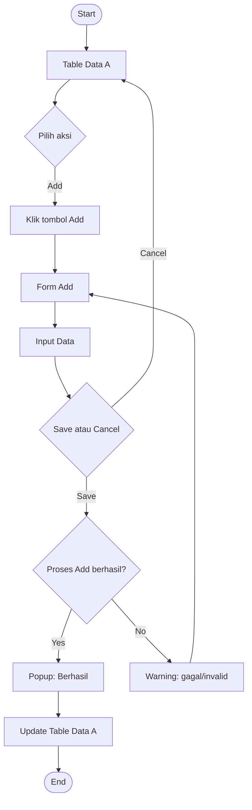
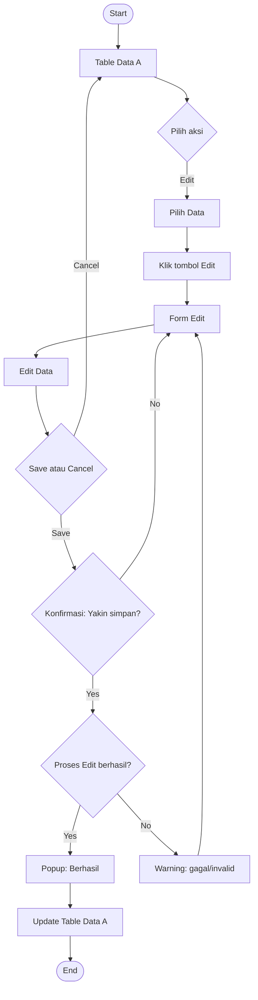
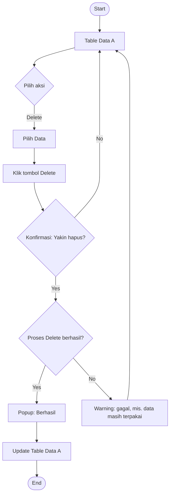

# Referensi Activity Diagram — Pola CRUD Umum (Add / Edit / Delete)

Dokumen ini merapikan dan menstandarkan pola activity diagram yang biasa dipakai untuk fitur "mengelola data" (misal: mengelola Data A) di aplikasi web/app. Bisa dipakai sebagai referensi/template saat mendokumentasikan modul CRUD baru.

---

## 1. Legenda Simbol (Notasi UML Activity Diagram)

| Simbol                | Arti                                                                                                                                                         |
| --------------------- | ------------------------------------------------------------------------------------------------------------------------------------------------------------ |
| ⬤ (Initial Node)      | **Start** — titik awal alur                                                                                                                                  |
| ⬤◯ (Final Node)       | **End** — titik akhir alur                                                                                                                                   |
| ▭ (Rounded Rectangle) | **Action/Activity** — sebuah aktivitas/proses                                                                                                                |
| ◇ (Diamond)           | **Decision** — percabangan berdasarkan kondisi (yes/no, valid/invalid)                                                                                       |
| ▤ (Bar hitam)         | **Fork/Join** — percabangan paralel atau titik pertemuan alur (dipakai di sini untuk representasikan pilihan aksi seperti Add/Edit/Delete, atau Save/Cancel) |
| ⬜ (Note/Comment)     | Keterangan tambahan (mis. "popup berhasil", "warning")                                                                                                       |

> Catatan: dalam praktiknya, banyak tim memakai _Decision_ untuk merepresentasikan pilihan aksi user (Add/Edit/Delete) alih-alih _Fork_ murni, karena user hanya memilih satu jalur, bukan menjalankan paralel. _Fork_ sejati (paralel + _Join_ wajib) lebih tepat dipakai kalau dua proses benar-benar berjalan bersamaan. Dokumen ini tetap memakai istilah "Fork" mengikuti istilah yang kamu pakai, tapi perlakukan sebagai _branch point_ pilihan.

---

## 2. Pola Umum (Generic Pattern)

Semua operasi CRUD mengikuti struktur dasar yang sama:

```
Start
  → Buka Halaman/Modul (Table Data)
  → Branch: pilih aksi (Add / Edit / Delete / dst.)
  → Form / Konfirmasi
  → Input / Ubah data
  → Branch: Save atau Cancel
      Cancel → kembali ke Table Data
      Save   → Decision: proses berhasil?
          Yes → popup sukses → update Table Data → End
          No  → tampilkan warning/error → kembali ke Form
```

Pola ini berlaku hampir sama untuk Add, Edit, Delete, View — bedanya cuma di titik: (a) apakah ada Form input, (b) apakah butuh dialog konfirmasi tambahan sebelum proses, (c) apa isi validasi di Decision.

---

## 3. Flow: Add (Tambah Data)

### Deskripsi Alur

1. **Start**
2. Masuk ke modul "Mengelola Data A"
3. Tampilkan **Table Data A**
4. User memilih aksi **Add**
5. Klik tombol **Add**
6. Sistem menampilkan **Form Add**
7. User **input data**
8. User memilih: **Save** atau **Cancel**
   - Jika **Cancel** → kembali ke **Table Data A**
   - Jika **Save** → lanjut ke Decision
9. **Decision: Proses Add**
   - **Yes** (data valid & berhasil disimpan) → tampilkan **popup berhasil** → **update Table Data A** → **End**
   - **No** (data tidak valid/gagal) → tampilkan **warning** → kembali ke **Form Add**

### Diagram (Mermaid)



### Catatan Implementasi

- **Validasi** idealnya terjadi di dua level: client-side (langsung di Form, sebelum submit) dan server-side (di titik Decision, sebagai validasi final/otoritatif). Jangan andalkan validasi client-side saja.
- **Popup berhasil** sebaiknya auto-dismiss atau ada tombol close eksplisit — jangan blocking modal tanpa jalan keluar.
- Setelah **Update Table Data A**, pertimbangkan apakah tabel di-refresh penuh (reload data) atau di-update secara lokal (optimistic update) — untuk data yang sering berubah dari user lain, refresh dari server lebih aman.

---

## 4. Flow: Edit (Ubah Data)

Bedanya dari Add: ada **dialog konfirmasi (warning confirm yes/no)** sebelum masuk ke Decision proses — karena Edit mengubah data yang sudah ada, biasanya butuh konfirmasi eksplisit dari user sebelum benar-benar disimpan.

### Deskripsi Alur

1. **Start**
2. Masuk ke modul "Mengelola Data A"
3. Tampilkan **Table Data A**
4. User memilih aksi **Edit**
5. User **pilih data** (baris tertentu di tabel)
6. Klik tombol **Edit**
7. Sistem menampilkan **Form Edit** (terisi data eksisting)
8. User **edit data**
9. User memilih: **Save** atau **Cancel**
   - Jika **Cancel** → kembali ke **Table Data A**
   - Jika **Save** → tampilkan **dialog konfirmasi (Yes/No)** "Apakah yakin ingin menyimpan perubahan?"
     - **No** → kembali ke **Form Edit** (batal konfirmasi, data belum hilang)
     - **Yes** → lanjut ke Decision
10. **Decision: Proses Edit**
    - **Yes** (berhasil) → tampilkan **popup berhasil** → **update Table Data A** → **End**
    - **No** (gagal) → tampilkan **warning** → kembali ke **Form Edit**

### Diagram (Mermaid)



### Catatan Implementasi

- **Kenapa Edit butuh confirm dialog, Add tidak?** Secara UX, Add itu aksi "menambah" yang risikonya rendah (kalau salah, tinggal dihapus/diedit lagi), sedangkan Edit **menimpa data eksisting** — ada risiko kehilangan histori data lama. Confirm dialog jadi _safety net_. Kalau modul kamu butuh audit trail, ini titik yang tepat untuk mencatat _before/after value_.
- Kalau field yang diedit banyak dan sensitif (misal data finansial), pertimbangkan menampilkan **diff** (apa yang berubah) di dalam confirm dialog, bukan cuma "yakin simpan?" generik.
- Sama seperti Add: validasi client + server tetap berlaku sebelum Decision.

---

## 5. Flow: Delete (Hapus Data)

Pola Delete mirip Edit (butuh konfirmasi), tapi **tanpa Form** — cukup konfirmasi langsung.

### Deskripsi Alur

1. **Start**
2. Masuk ke modul "Mengelola Data A"
3. Tampilkan **Table Data A**
4. User memilih aksi **Delete**
5. User **pilih data**
6. Klik tombol **Delete**
7. Sistem menampilkan **dialog konfirmasi (Yes/No)** "Apakah yakin ingin menghapus data ini?"
   - **No** → kembali ke **Table Data A** (batal)
   - **Yes** → lanjut ke Decision
8. **Decision: Proses Delete**
   - **Yes** (berhasil) → tampilkan **popup berhasil** → **update Table Data A** → **End**
   - **No** (gagal, mis. data terkunci relasi FK) → tampilkan **warning** → kembali ke **Table Data A**

### Diagram (Mermaid)



### Catatan Implementasi

- **Kegagalan Delete** paling sering karena **foreign key constraint** (data masih dipakai/direferensikan tabel lain). Pesan warning idealnya spesifik, bukan generik — misal "Data tidak bisa dihapus karena masih dipakai di transaksi X".
- Pertimbangkan **soft delete** (flag `is_deleted` / `deleted_at`) alih-alih hard delete kalau data perlu bisa dipulihkan atau untuk keperluan audit — terutama untuk data transaksional/finansial.
- Untuk data kritikal, sebagian tim menambah proteksi ekstra: input ulang nama data atau ketik "DELETE" sebelum tombol konfirmasi aktif — bukan cuma klik Yes/No biasa.

---

## 6. Flow Tambahan yang Sering Dibutuhkan (di luar 3 di atas)

Pola yang sama bisa diperluas untuk aksi lain — strukturnya konsisten:

| Aksi                                          | Ada Form?            | Butuh Confirm Dialog?       | Catatan                                                                                                 |
| --------------------------------------------- | -------------------- | --------------------------- | ------------------------------------------------------------------------------------------------------- |
| **View/Detail**                               | Tidak (read-only)    | Tidak                       | Table → pilih data → tampilkan detail → End (tanpa Decision, karena tidak ada proses tulis)             |
| **Search/Filter**                             | Tidak (input filter) | Tidak                       | Table → input filter → Decision (ada hasil/tidak) → update Table (hasil filter)                         |
| **Bulk Action** (mis. hapus banyak sekaligus) | Tidak/kadang         | Ya, wajib                   | Table → pilih multiple data (checkbox) → klik aksi → confirm → Decision → loop proses per item          |
| **Import/Export**                             | Ya (upload file)     | Kadang, tergantung validasi | Table → upload/pilih format → validasi file → Decision → hasil (partial success perlu ditangani khusus) |
| **Approve/Reject** (workflow)                 | Kadang (form alasan) | Ya                          | Mirip Edit, tapi Decision-nya branching ke status berbeda (approved/rejected), bukan cuma yes/no        |

---

## 7. Prinsip Umum yang Berlaku di Semua Flow

1. **Selalu ada jalan keluar dari Form** — user harus bisa Cancel tanpa terjebak, dan Cancel harus benar-benar tidak menyimpan perubahan apa pun (tidak ada side effect).
2. **Decision = validasi, bukan cuma "berhasil/gagal" abstrak** — di implementasi nyata, breakdown Decision jadi kondisi konkret: validasi field wajib, format data, duplikasi, constraint relasi, dll. Setiap kondisi gagal idealnya punya pesan error spesifik, bukan satu warning generik untuk semua kasus.
3. **State loading di antara Save → Decision** — activity diagram sering melewatkan ini, tapi secara UX wajib ada indikator loading/disable tombol saat proses berjalan, supaya user tidak klik Save berkali-kali (mencegah duplicate submit).
4. **Update Table Data A** sebaiknya konsisten: pilih salah satu strategi (full refresh dari server vs optimistic local update) dan pakai itu di semua modul, jangan campur-campur antar fitur dalam satu aplikasi.
5. **Idempotency untuk Save** — terutama kalau ada retry otomatis atau koneksi lambat, pastikan submit ganda (misal user klik Save dua kali karena lag) tidak menghasilkan data duplikat.
6. **Audit trail** — untuk Edit dan Delete, pertimbangkan mencatat siapa yang melakukan perubahan dan kapan (created_by/updated_by/deleted_by + timestamp), terutama untuk data yang dipakai multi-role (admin/seller/buyer, dst.).
7. **Confirm dialog hanya untuk aksi berisiko** — jangan taruh confirm dialog di semua aksi (termasuk Add yang risikonya rendah), supaya user tidak "dialog fatigue" (asal klik Yes tanpa baca).

---

## 8. Ringkasan Perbedaan Add vs Edit vs Delete

```
Add    : Table → Form (kosong) → Input → Save → Decision → End
Edit   : Table → Pilih Data → Form (terisi) → Edit → Save → Confirm(Y/N) → Decision → End
Delete : Table → Pilih Data → Confirm(Y/N) → Decision → End   (tanpa Form)
```

Pola dasarnya identik di semua kasus: **Table → Branch aksi → (Form opsional) → Confirm opsional → Decision → Popup + Update Table → End**. Yang bervariasi hanya ada/tidaknya Form dan Confirm Dialog, tergantung tingkat risiko aksinya.
